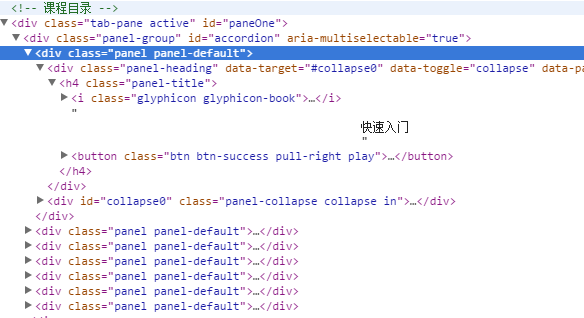
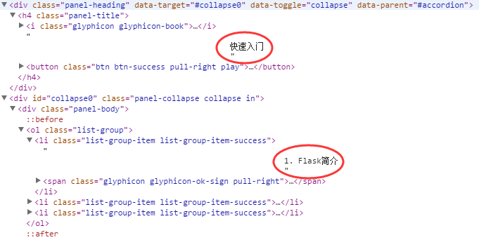

# Cheerio

<!-- TOC  -->

- [Cheerio](#cheerio)
- [1  简介](#1--简介)
    - [1.1  认识cheerio](#11--认识cheerio)
    - [1.2  快速开始](#12--快速开始)
    - [1.3  载入 html 方法](#13--载入-html-方法)
    - [1.4 小结](#14-小结)
- [2  cheerio API（一）](#2--cheerio-api一)
    - [2.1  选择器（selectors）](#21--选择器selectors)
    - [2.2  属性操作（attr）](#22--属性操作attr)
    - [2.3  class操作](#23--class操作)
    - [2.4  添加 DOM（一）](#24--添加-dom一)
    - [2.5  添加 DOM（二）](#25--添加-dom二)
    - [2.6  删除和替换](#26--删除和替换)
    - [2.7  清空和获取](#27--清空和获取)
- [3  cheerio API（二）](#3--cheerio-api二)
    - [3.1  过滤 DOM（一）](#31--过滤-dom一)
    - [3.2  过滤 DOM（二）](#32--过滤-dom二)
    - [3.3  过滤 DOM（三）](#33--过滤-dom三)
    - [3.4  遍历 DOM](#34--遍历-dom)
    - [3.5  .clone 和  $.root](#35--clone-和--root)
- [4  利用 cheerio 做爬虫](#4--利用-cheerio-做爬虫)
    - [4.1  准备](#41--准备)
    - [4.2  引入 cheerio](#42--引入-cheerio)
    - [4.3  分析 html](#43--分析-html)
    - [4.4  爬取数据](#44--爬取数据)
    - [4.5  处理数据](#45--处理数据)
    - [4.6  输出数据](#46--输出数据)

<!-- /TOC  -->

# 1  简介

## 1.1  认识cheerio
### 什么是cheerio？

cheerio 是nodejs特别为 *服务端* 定制的，能够快速灵活的对JQuery核心进行实现。它工作于 *DOM模型* 上，且解析、操作、呈送都很高效。

#### 安装

 *npm install cheerio*

#### 特征

 **熟悉的语法** ：cheerio实现了jQuery核心的一个 *子集* 。 cheerio删除了从jQuery库中和不同浏览器不一致的东西，揭示其真正华丽的API。

 **极快** ：cheerio适用于一个非常简单的，一致的DOM模型。 这样解析，操作和呈现是令人难以置信的 *高效率* 。

 **灵活性** ：cheerio可以 *解析几乎所有* 的HTML或XML文档。

## 1.2  快速开始
### hello world

为了更加直观的学习 cheerio ，我们开始  *hello world* ：

```javascript
//模块引用
var cheerio = require('cheerio'),
    $ = cheerio.load('<h2 class="title">Hello world</h2>');

$('.title').text('Hello there!');
$('.title').addClass('Welcome');
//输出
console.log($.html());
```

 **输出** ： *Hello there!*

 **解析** ： *.load()*  引入我们要解析的html。text() 设置 h2 中的文本。addClass() 给 h2 添加新的class。

> 在右侧代码框中第8行中输入  *console.log($.html());*  查看我们解析之后的html。

## 1.3  载入 html 方法
### 载入 html

要想 *解析html* ，首先我们需要加载html。这一步在jQuery是自动完成的，因为jQuery的运行在一个即时的DOM环境中。我们需要将HTML文档传入Cheerio中，那么如何加载呢？

 **这是需要加载的html** ：

```javascript
<ul id="fruits">
    <li class="apple">Apple</li>
    <li class="orange">Orange</li>
    <li class="pear">Pear</li>
</ul>
```

PS: 在后文示例中加载的 html，都将是上述中的这段代码。

 **首选** ：

```javascript
var cheerio = require('cheerio'),
$ = cheerio.load(html);
```

**将HTML作为字符串参数传入** :

```javascript
$ = require('cheerio');
$('ul', html);
```

**或者作为根结点** ：

```javascript
$ = require('cheerio');
$('li', 'ul', html);
```

## 1.4 小结
### 小结

本章我们简单的认识了 cheerio 和 如何载入需要解析的 html 的几种方法。

之后的章节内容：

-  **cheerio API**
-  **结合 node-crawler 完成一个爬虫**

> PS:cheerio 的 API 和jQuery是非常相似的，可以说是服务器端的jQuery。

# 2  cheerio API（一）

## 2.1  选择器（selectors）
### selectors

 **语法：**

 *$( selector, [context], [root] )*

 **语法讲解：**  selector 是 *目标选择器* ， context 是目标选择器的上下文， root 是上下文 context 的上下文。 selector 和 context 可以是 字符串表达式 、 dom元素 、 dom元素集合 、 cheerio对象 ，而 root 一般都是 *html文档字符串* 。

PS: 通常参数context和root都会省略。

这个方法一般用于遍历和处理DOM。像jQuery中，它是对DOM中选择目标选择器的主要方法，但又不同于jQuery是建立在顶部的 * CSSSelect * 库，它实现了大部分的Sizzle选择器。

PS:Sizzle是一个纯javascript CSS选择器引擎。jquery1.3开始使用sizzle。感兴趣的同学可以自己了解一下。

示例：

```javascript
$('.apple')
// 选择器定位到class 为apple的目标

$('ul .pear')
// 选择器定位到 ul 中 class 为 pear 的目标

$('li[class=orange]')
// 选择器定位到 li 中 class 为arange的目标
```

看到上述中的选择器的API是不是和jQuery中很相似。

## 2.2  属性操作（attr）
### attribute

在应用中我们经常会遇到需要对属性进行 *获取和修改* ，现在我们来讲解一下都有哪些方法。

 **.attr(name[, value])**

这个方法可以获取和设置属性，第二个参数是 *可选的* 。当第二个参数不存在时表示获取属性的值，当有带有 *第二个参数* 时，表示 *设置属性* 的值。如果设置一个属性的值设置为null ，则删除该属性。如下示例：

```javascript
$('ul').attr('id')
//=> fruits

$('.apple').attr('id', 'favorite').html()
//=> <li class="apple" id="favorite">Apple</li>
```

 **.removeAttr(name)**

通过 name 移除某一个属性，同时返回被移除的这个元素。如下示例

```javascript
$('.pear').removeAttr('class').html();
//=> <li>Pear</li>
```

>

- 在右侧代码框中第8行中输入  *var id = $('ul').attr('id');*
- 在右侧代码框中第9行中输入  *console.log(id);*  。
- 点击<span style="margin:0px 5px;padding:5px;background:#333;color:white;border-
radius:3px;">提交运行  按钮

</div>

## 2.3  class操作
### class操作

 **.hasClass(className)**

判断某元素的 class 中 *是否包含*  className 。如下示例：

```javascript
$('.pear').hasClass('pear'); //=> true

$('apple').hasClass('fruit'); //=> false

$('li').hasClass('pear'); //=> true
```

 **.addClass(className)**

给某元素添加一个名为 * className * 的样式名。如下示例：

```javascript
$('.pear').addClass('fruit').html();
//=> <li class = "pear fruit">Pear</li>

$('.apple').addClass('fruit red').html();
//=> <li class = "apple fruit red">Apple</li>
```

 **.removeClass(className)**

将某元素上名为 className 的样式名移除。如果不存在 className ，则移除所有的样式名。如下示例：

```javascript
$('.pear').removeClass('pear').html();
//=> <li class="">Pear</li>

$('.apple').addClass('red').removeClass().html();
//=> <li class="">Apple</li>
```

## 2.4  添加 DOM（一）
### 添加 DOM

cheerio提供一系列 *修改dom结构* 的方法。

 **.append(content, [content, ...])**

将 content 插入到某元素中作为该元素的 最后一个子元素 。

```javascript
$('ul').append('<li class = "plum">Plum</li>');
$.html();
//=> <ul id = "fruits">
//     <li class = "apple">Apple</li>
//     <li class = "orange">Orange</li>
//     <li class = "pear">Pear</li>
//     <li class = "plum">Plum</li>
// </ul>
```

 **.prepend(content, [content, ...])**

将 content 插入到某元素中作为该元素的 第一个子元素 。

```javascript
$('ul').prepend('<li class = "plum">Plum</li>');
$.html();
//=> <ul id = "fruits">
//     <li class = "plum">Plum</li>
//     <li class = "apple">Apple</li>
//     <li class = "orange">Orange</li>
//     <li class = "pear">Pear</li>
// </ul>
```

>

- 在右侧代码框中第8行中输入:<br/>  *$('ul').prepend('<li class = "plum">Plum');*
- 在右侧代码框中第9行中输入  *console.log($.html());*  。
- 点击<span style="margin:0px 5px;padding:5px;background:#333;color:white;border-
radius:3px;">提交运行  按钮

</div>

## 2.5  添加 DOM（二）
### 添加 DOM

 **.after(content, [content, ...])**

将 content 插入到某元素的后面，并作为其后面第一个兄弟节点。

```javascript
$('.apple').after('<li class = "plum">Plum</li>');
$.html();
//=> <ul id = "fruits">
//     <li class = "apple">Apple</li>
//     <li class = "plum">Plum</li>
//     <li class = "orange">Orange</li>
//     <li class = "pear">Pear</li>
// </ul>
```

 **.before(content, [content, ...])**

将 content 插入到某元素的前面，并作为其前面的第一个兄弟节点。

```javascript
$('.apple').before('<li class = "plum">Plum</li>');
$.html();
//=> <ul id = "fruits">
//     <li class = "plum">Plum</li>
//     <li class = "apple">Apple</li>
//     <li class = "orange">Orange</li>
//     <li class = "pear">Pear</li>
// </ul>
```

## 2.6  删除和替换
### 删除和替换

 **.remove([selector])**

移除某一个节点以及他们的孩子节点。

```javascript
$('.pear').remove();
$.html();
//=> <ul id = "fruits">
//     <li class = "apple">Apple</li>
//     <li class = "orange">Orange</li>
// </ul>
```

 **.replaceWith(content)**

替换匹配的节点。

```javascript
var plum = $('<li class = "plum">Plum</li>');
$('.pear').replaceWith(plum);
$.html();
//=> <ul id = "fruits">
//    <li class = "apple">Apple</li>
//    <li class = "orange">Orange</li>
//    <li class = "plum">Plum</li>
// </ul>
```

>

- 在右侧代码框中第8行中输入:<br/>  *var plum = $('<li class = "plum">Plum');*
- 在右侧代码框中第9行中输入  *$('.pear').replaceWith(plum);*  。
- 在右侧代码框中第10行中输入  *console.log($.html());*  。
- 点击<span style="margin:0px 5px;padding:5px;background:#333;color:white;border-
radius:3px;">提交运行  按钮

</div>

## 2.7  清空和获取
### 清空和获取 DOM

 **.empty()**

 *清空* 一个节点，移除其 *所有* 的孩子节点。

```javascript
$('ul').empty();
$.html();
//=> <ul id = "fruits"></ul>
```

 **.html([htmlString])**

获取某节点的html字符串。如果 *传入参数* ，则 *设置该元素* 的html结构。

```javascript
$('.orange').html(); //=> Orange

$('#fruits').html('<li class = "mango">Mango</li>').html();
//=> <li class="mango">Mango</li>
```

 **.text([textString])**

获取某节点的纯文本。

```javascript
$('.orange').text();
//=> Orange

$('ul').text();
//=>  Apple
//    Orange
//    Pear
```

# 3  cheerio API（二）

## 3.1  过滤 DOM（一）
### find

cheerio 亦可以同jQuery那样，通过某一个元素来 *查找* 它的父元素、子元素、兄弟元素，并 *进行操作* 。

 **.find(selector)**

在某元素下查询满足选择条件的元素。

 *$('#fruits').find('li').length;*   //=> 3

 **.parent()**

获取某元素的父元素。

 *$('.pear').parent().attr('id');*   //=> fruits

 **.next()**

获取某元素的下一个兄弟元素。

 *$('.apple').next().hasClass('orange');*   //=> true

 **.perv()**

获取某元素的上一个兄弟元素。

 *$('.orange').prev().hasClass('apple');*   //=> true

>

- 在右侧代码框中第8行中输入:<br/>  *var node = $('#fruits').find('li');*
- 在右侧代码框中第9行中输入  *console.log(node.length);*  。
- 点击<span style="margin:0px 5px;padding:5px;background:#333;color:white;border-
radius:3px;">提交运行  按钮

</div>

## 3.2  过滤 DOM（二）
### 过滤

 **.siblings()**

获取某元素的所有同级元素。（当然除了它自己）

 *$('.pear').siblings().length;*    //=> 2

 **.children([selector])**

获取某元素的孩子节点。可以传入参数在所有的孩子节点中进行筛选。

```javascript
$('#fruits').children().length; //=> 3

$('#fruits').children('.pear').text(); //=> Pear
```

 **.filter(selector) &amp; .filter(function(index))**

在cheerio对象集合中进行条件筛选。

```javascript
$('li').filter('.orange').attr('class'); //=> orange

$('li').filter(function(i, el) {
  // this === el
  return $(this).attr('class') === 'orange';
}).attr('class') //=> orange
```

## 3.3  过滤 DOM（三）
### 过滤

 **.first()**

获取cheerio集合中的第一个cheerio对象。

 *$('#fruits').children().first().text();*   //=> Apple

 **.last()**

获取cheerio集合中的最后一个cheerio对象。

 *$('#fruits').children().last().text();*   //=> Pear

 **.eq(i)**

根据索引获取cheerio集合中的某一个对象。参数可以使负数，表示从尾部开始索引。

```javascript
$('li').eq(0).text(); //=> Apple

$('li').eq(-1).text(); //=> Pear
```

## 3.4  遍历 DOM
### 遍历

 **.each(function(index, element){...})**

和jquery类似的 each 迭代器，对每一个元素进行处理。

```javascript
var fruits = [];

$('li').each(function(i, elem) {
    fruits[i] = $(this).text();
});

fruits.join(', '); //=> Apple, Orange, Pear
```

 **.map(function(index, element){...})**

和jquery类似的 each 迭代器，对每一个元素进行处理并返回一个值。

```javascript
$('li').map(function(i, el) {
    // this === el
    return $(this).attr('class');
}).get().join(', '); //=> apple, orange, pear
```

>

- 在右侧代码框中第8行创建一个空数组： *var fruits = [];*
- 在右侧代码框中第9行对li进行遍历,且通过join方法利用 *, * 进行组装：

`$('li').each(function(i, elem) {
        fruits[i] = $(this).text();
    });
    var data = fruits.join(', ');`

- 然后输出： *console.log(data);*
- 点击<span style="margin:0px 5px;padding:5px;background:#333;color:white;border-
radius:3px;">提交运行  按钮

</div>

## 3.5  .clone 和  $.root
### .clone 和  $.root

 **.clone**

对 cheerio 中的对象进行复制

 *var moreFruit = $('#fruits').clone();*

 **$.root**

当你需要和顶级DOM一起完成任务时，我们就用到了 $.root。如下：

```javascript
$.root().append('<ul id="vegetables"></ul>').html();

//=> <ul id="fruits">...</ul><ul id="vegetables"></ul>
```

 **$.contains(container, contained)**

检查 container 中 *是否包含*  contained 元素。注意，container和contained
参数都应当是DOM元素：

```javascript
var c1 = $("#fruits")[0];
var c2 = $(".pear")[0];
var ret = $.contains(c1, c2);
console.log(ret); // => true
```

>

- 在右侧代码框中第8行开始练习一下上述中的示例
- 点击<span style="margin:0px 5px;padding:5px;background:#333;color:white;border-
radius:3px;">提交运行  按钮

</div>

# 4  利用 cheerio 做爬虫

## 4.1  准备
### 准备

 **数据源**

爬虫要想爬取数据首先提供爬取 *数据的路径* ，在这里我们爬取本课程的课程介绍页面。

url：<a href="http://www.hubwiz.com/course/562427361bc20c980538e26f">http://www.hubwiz.com/course/562427361bc20c980538e26f</a>

 **爬虫目标**

课程介绍页面中最重要的信息就是每一章节的标题及其中小节的 *标题名称* 。我们的目标就是把它爬取出来，然后输出。

 **小爬虫**

提供了爬取路径之后，我们首先利用 http 模块中 *get 和 request*  爬取路径页面中的内容。

```javascript
var http = require('http');
var url = 'http://www.hubwiz.com/course/5437538a032c781670afddbe/';

http.get(url, function(res){
    var html = '';

    res.on('data', function(data){
        html += data;
    })
    res.on('end',function(){
        console.log(html);
    })
}).on('error', function(){
    console.log('爬取页面错误');
});
```

解析：示例中首先引用了 nodejs 的核心模块 http 和提供了爬取路径，然后通过 http 中的 get 接口给 url 发送 get 请求，最回调函数中对请求回来的数据进行处理。

> 在右侧代码框中第11行中输入  *console.log(html);*  查看我们需要爬取的页面。
</div>

完成示例后，可以看到我们把请求路径中的 html 代码全部输出了。这不是我们需要的效果，所以我们要对数据进行解析。那么如何解析呢？

## 4.2  引入 cheerio
### 引入 cheerio

对 html 进行解析，这个时候就用到了 cheerio 这个模块了。

 **使用方法** ： *var cheerio = require('cheerio');*

现在来看一下我们路径中的 html 目标代码：



 **分析** ：上述代码中每一个章节都是被包含在 class 为 panel 的标签中。所以我们要对 class 为 panel 的标签进行遍历。

> 在右侧代码框中第3行中输入  *var cheerio = require('cheerio');*  这样我们就可以应用cheerio模块了。
</div>

## 4.3  分析 html
### 分析 html

在上节中我们说要对 class 为 panel 的集合进行 *遍历* ，但是我们的目标只是每一章的 *标题* 和小节的标题。



分析：在上图中的两个红色圆圈中就是我们要爬取的目标，第一个是我们章的标题，第二个是小节的标题。那么我们应该怎样去获取这些标签中内容呢？

 **获取章标题** ： *$('.panel').find('h4').text()* ;

 **获取节标题** ： *$('.panel').find('li').text()* ;

## 4.4  爬取数据
### 爬取数据

在前面的小节中我们把准备工作和 html 代码分析都完成了。现在开始 *爬取数据* 。

把对 html 解析的工作封成一个方法，如下：

```javascript
function crawlerChapter(html) {
    var $ = cheerio.load(html);
    var chapters = $('.panel');
    var data = [];

    chapters.map(function (node) {
        var chapters = $(this);
        var chapterTitle = chapters.find('h4').text().trim();
        var sections = chapters.find('li');
        var chapterData = {
            chapterTitle: chapterTitle,
            section: []
        };
        sections.map(function (node) {
            var section = $(this).text().trim();
            chapterData.section.push(section);
        });
        data.push(chapterData);
    });
    console.log(data);
};
```

解析：首先通过 *cheerio* 的 load 方法把html加载；然后对 *.panel* 通过 map 进行遍历。之后我们在 * map * 中 组装 要数据格式，如上述中  *chapterData* 。再对 小节 li 进行遍历，把 section 通过 push 方法 添加到 chapterData.section 的数组中。再把组装好的数据 push 到
我们创建的空数组 data 中。最后通过console.log进行输出。

输出数据之后，我们看到数据中除了第一章中有section有值，其他的章没有值，不要担心，就是这样的。因为我们汇智网对其进行了限制，所以只能爬取到第一章中的小节标题。

> 在右侧代码框中第12行中调用  *crawlerChapter(html)*  方法，查看我们爬取出来的数据。
</div>

## 4.5  处理数据
### 处理数据

在大多数情况下我们爬取出来的数据，可能不是我们最终想要的东西比如说：数据中 *空值或者空格* 等等。

如果你细心的话，不难发现我们在上一个小节中在获取在通过 text 获取内容的后面跟随着一个 trim 的方法。这个方法的作用就是处理数据中空格和换行符。

如果你想验证一下效果你可以把右边练习环境中应用到 trim 方法的地方去掉trim方法。

空值的情况，在上一小节我们输出的数据中存在一个空的数组对象，那么我们通过什么方法去处理它呢？这时我们就用到了 * filter * 方法。

PS：filter方法我们在 *cheerio API(二) 过滤DOM小节*  中已经讲解到了。

 **代码** ：

```javascript
data.filter(function(obj){
    return obj.chapterTitle ? true : false;
});
```

PS:上面的方法我们将在下一小节中用到

## 4.6  输出数据
### 输出数据

现在把我们在  *crawlerChapter*  方法中得到的数据 data 组装，进行输出：

```javascript
function printInfo(data) {
    data = data.filter(function filterByID(obj) {
        return obj.chapterTitle ? true : false;
    });
    data.map(function (item) {
        var chapterTitle = item.chapterTitle;
        console.log('【' + chapterTitle + '】\n');
        item.section.map(function (section) {
            console.log('   【' + section + '】\n');
        });
    })
};
```

方法解析：在 printInfo 方法中的参数 data ，这个参数需要 crawlerChapter 方法 return 给printInfo。然后就是 data 参数调用 filter 方法把数据为空的去掉。最后就是把章节拼接字符串进行输出。

> 在右侧代码框中第36行中把 *console.log(data)*  替换成  *return data* ，。
</div>

> 下面开始我们的任务：

- 在右侧代码框中第37行中把 *console.log(data)*  替换成  *return data*
- 在右侧代码框中第12行中把 *crawlerChapter(html)*  替换成  *var chapter = crawlerChapter(html);*
- 在右侧代码框中第13行中输入 *printInfo(chapter);*
- 最后在点击 提交运行 按钮
