# Meteor开发平台入门

<!-- TOC -->

- [Meteor开发平台入门](#meteor开发平台入门)
- [1 Meteor简介](#1-meteor简介)
    - [1.1 全栈开发平台 - 不仅仅是前端](#11-全栈开发平台---不仅仅是前端)
    - [1.2 初识Meteor](#12-初识meteor)
    - [1.3 模板文件 - test.html](#13-模板文件---testhtml)
    - [1.4 样式文件 - test.css](#14-样式文件---testcss)
    - [1.5 代码文件 - test.js](#15-代码文件---testjs)
    - [1.6 前端代码 - 模板实例对象](#16-前端代码---模板实例对象)
    - [1.7 前端代码 - 模板标签标识符解析/helper](#17-前端代码---模板标签标识符解析helper)
    - [1.8 前端代码 - 模板事件绑定](#18-前端代码---模板事件绑定)
    - [1.9 前端代码 - 全局字典/Session](#19-前端代码---全局字典session)
    - [1.10 后端代码](#110-后端代码)
    - [1.11 应用目录结构](#111-应用目录结构)
    - [1.12 内容小结](#112-内容小结)
- [2 实时通信平台](#2-实时通信平台)
    - [2.1 分布式数据协议 - DDP](#21-分布式数据协议---ddp)
    - [2.2 远程过程调用 - RPC](#22-远程过程调用---rpc)
    - [2.3 RPC - 前端stub](#23-rpc---前端stub)
    - [2.4 数据发布/订阅 - Pub/Sub](#24-数据发布订阅---pubsub)
- [3 反应式编程](#3-反应式编程)
    - [3.1 反应式编程 - RP](#31-反应式编程---rp)
    - [3.2 函数反应式编程 - FRP](#32-函数反应式编程---frp)
    - [3.3 Meteor的FRP实现 - Tracker模块](#33-meteor的frp实现---tracker模块)
    - [3.4 反应式变量 - ReactiveVar](#34-反应式变量---reactivevar)
    - [3.5 反应式字典 - ReactiveDict](#35-反应式字典---reactivedict)
    - [3.6 发应式数据集 - LocalCollection](#36-发应式数据集---localcollection)
    - [3.7 反应式UI引擎 - Blaze](#37-反应式ui引擎---blaze)
    - [3.8 UI计算过程](#38-ui计算过程)
- [4 模板开发](#4-模板开发)
    - [4.1 模板](#41-模板)
    - [4.2 数据上下文](#42-数据上下文)
    - [4.3 模板helper](#43-模板helper)
    - [4.4 在模板中使用helper参数](#44-在模板中使用helper参数)
    - [4.5 模板中的路径解析](#45-模板中的路径解析)
    - [4.6 模板事件处理](#46-模板事件处理)
    - [4.7 模板逻辑控制 - 条件](#47-模板逻辑控制---条件)
    - [4.8 模板逻辑控制 - 循环](#48-模板逻辑控制---循环)
    - [4.9 动态调用模板](#49-动态调用模板)
    - [4.10 模板中的注释](#410-模板中的注释)
    - [4.11 模板标签的位置限制](#411-模板标签的位置限制)
- [5 数据存储管理](#5-数据存储管理)
    - [5.1 数据集合 - Collection](#51-数据集合---collection)
    - [5.2 插入文档 - Collection.insert](#52-插入文档---collectioninsert)
    - [5.3 更新文档 - Collection.update](#53-更新文档---collectionupdate)
    - [5.4 删除文档 - Collection.remove](#54-删除文档---collectionremove)
    - [5.5 查找文档 - Collection.find](#55-查找文档---collectionfind)
    - [5.6 查询结果 - 游标/Cursor](#56-查询结果---游标cursor)

<!-- /TOC -->

# 1 Meteor简介

## 1.1 全栈开发平台 - 不仅仅是前端
### 全栈开发平台 - 不仅仅是前端

Meteor和那些名声如雷贯耳的前端框架，比如Angular, React等都不一样，它是一个
采用单一开发语言的 **全栈开发** 的平台：开发者可以使用 **JavaScript** 同时
进行 **前端** 和 **后端** 的开发，然后交给Meteor运行这个包含了前后端的完整应用：

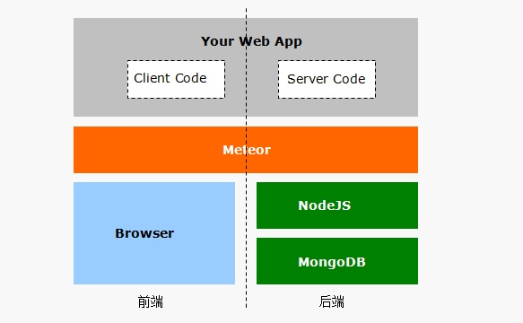

从图中你可以看到，Meteo在前端使用浏览器作为基础运行环境，在后端则是以NodeJS作为
基础运行环境，以MongoDB作为数据持久化系统。

Meteor提供了一个 **横跨** 前端和后端的 **中间层** 平台，预置封装了很多功能库，简化了
Web应用的开发：使用 *单一* 语言 *快速* 开发Web应用，这是Meteor的最重要诉求。


## 1.2 初识Meteor
### 初识Meteor

从构成来讲，可以认为Meteor开发平台由两部分构成：


-  *Meteor库*  - 以功能包的形式存在，封装了诸如实时通信、反应式编程之类的核心功能。当
一个Meteor应用启动时，Meteor会自动加载这些库，为应用提供了一个基础环境。


-  *Meteor工具*  - 可以理解为命令行方式的开发环境，它使我们可以轻松地管理整个应用
开发流程：从创建应用、调试应用、自动化测试到打包、部署、热升级。


现在，让我们让我们使用Meteor命令行工具 **meteor** 创建并启动第一个Meteor应用吧。

 **创建应用 —— meteor create [project]**

在终端中输入 *meteor create test* ,然后按回车：

```javascript
~$ meteor create test↵
```

这个命令将在当前目录下创建一个子文件夹 *test* ，Meteor将使用内置的应用模板
作为这个文件夹的内容。我们可以进入 *test* 文件夹，执行 *ls* 命令查看一下内容：

```javascript
~$ cd test↵
~/test$ ls -al↵
```

你可以看到Meteor创建了3个文件和1个目录。


-  *test.css*  - 前端的样式表文件
-  *test.html*  -前端的HTML文件
-  *test.js*  - 前端/后端共用的JavaScript文件。 *全栈* ，对吧O(∩_∩)O~
-  *.meteor*  - 这个子目录是Meteor应用必须的特殊子目录，由Meteor平台维护，我们不要动


先略过3个文件的具体内容，我们运行起来看看。

 **运行应用 —— meteor run**

执行 *meteor* 命令启动应用，在终端中输入 *meteor* ，这等价于运行 *meteor run* ：

```javascript
~/test$ meteor↵
```

当你看到终端中出现下面的提示信息：

```javascript
...
App running at: http://localhost:3000/
```

恭喜！我们的第一个Meteor应用已经运行起来了！

 **停止应用运行 —— Ctrl+C **

用鼠标左键点击一下终端区域，确保它获得键盘输入焦点（你应该可以看到一个
闪烁的光标），然后同时按 *Ctrl* 键和 *C* 键，即可停止应用运行：

```javascript
^C
~/test$
```

 **复位应用数据 —— meteor reset**

Meteor应用运行时会生成打包文件、创建应用数据库。可以使用下面命令
清理这些生成的文件和应用数据：

```javascript
~/test$ meteor rest↵
```

 *meteor reset* 命令不影响你的源代码文件。


> 这节课让我们熟悉一下学习环境中终端的使用方法，以及运行结果的查看。


- 使用 *meter create test* 命令， *创建* 一个新的应用 *test*
- 使用 *cd test* 命令，进入test目录， *运行* 新创建的test应用
- 点击<span style="margin:0px 5px;padding:5px;background:#333;color:white;border-radius:3px;">访问测试</span> 按钮，
    在新打开的浏览器窗口内，查看运行结果
- 按 *Ctrl+C* ， *停止* test应用的运行


## 1.3 模板文件 - test.html
### 模板文件 - test.html

打开 *test.html* ，你可能会略有不适：

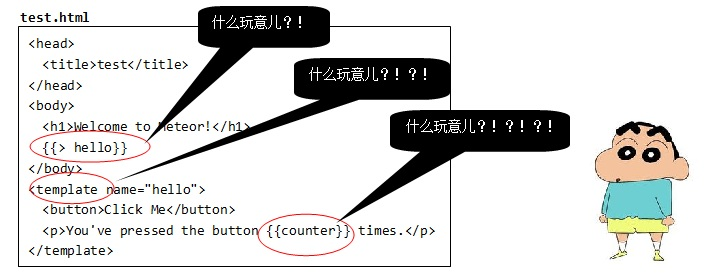

它不是一个标准的HTML文件：没有 *html* 顶层标签，奇怪的符号 *{{> hello}}* ...
不过，在Metoer中这样的文件却是合法的文件 ——  *模板* 文件。

 **模板顶层标签 —— head/body/template**

Meteor规定，在一个模板文件里，只能出现三种顶层标签： *head* 、 *body* 和 *template* 。
也就是说，模板文件只能包含以这三种标签为 *顶层标签* 的HTML片段。

这是因为，Meteor在运行应用之前有一个 *打包/bundle* 的过程，此时Meteor会提取所有
模板文件（一个应用中可以有多个模板文件）中的head、body和template片段，分别进行
 *合并* 、 *编译* 后才呈现给用户：


上图中，a.html和b.html中的head片段合并后作为最终的head内容，b.html和c.html中
的body片段合并后作为最终的body内容，至于c.html中的template的内容，则最终替换了
b.html中的{{> hello}}。

 **模板语言 —— Spacebars**

Meteor的模板使用的语言是私有的 *spacebars* 语言，它基于流行的 *handlebars* ，通过
在HTML片段中嵌入 *模板标签* （以两对大括号为边界）实现模板化。因此，Meteor的模板
其实就是HTML标签和模板标签的混合体。

 **{{> hello}}** 模板标签用来调用一个子模板，Meteor将在最终呈现给用户的HTML文档中，
使用子模板 *hello* 的内容进行原地替换。

特殊的 **template** 标签用来定义一个子模板。

 **{{counter}}** 模板标签执行插值工作，Meteror将在最终呈现给用户的HTML文档中，使用
标识符 *counter* 对应的值进行原地替换。


> 这节课我们熟悉一下学习环境中的文件编辑操作：


- 鼠标左键单击 <span style="margin:0px 5px;padding:5px;background:#333;color:white;border-radius:3px;">文件管理</span>
    按钮打开 *文件管理面板*
- 在 *文件管理面板* 中，双击鼠标左键打开test目录，找到 *test.html* 文件，双击鼠标左键在编辑器中 *打开*
- 在 *文件编辑器* 中修改test.html, 将 *Welcome to Meteor!* 修改为 *欢迎使用Meteor*
- 鼠标左键单击 <span style="margin:0px 5px;padding:5px;background:#333;color:white;border-radius:3px;">保存文件</span>按钮


现在，重新运行应用，并查看运行结果。


## 1.4 样式文件 - test.css
### 样式文件 - test.css

和模板文件类似，Meteor在打包过程中，会将所有的样式文件合并成一个大的样式文件，
然后在呈现给用户的HTML文档中引用这个样式文件：


上图中，a.css和b.css的内容将被合并为一个文件，并在最终呈现给用户的HTML文档中，
使用link标签引用这个文件。


> 现在，我们练习使用 *样式/CSS* 将模板中的 *h1* 元素字体颜色设置为红色（在练习
之前请确保已经 *停止* 了之前启动的Meteor应用）


- 修改并保存 *test.css* 文件，在其中添加样式定义： *h1{color:red}*
- 重新运行test应用，并在浏览器中查看运行结果

<br>


## 1.5 代码文件 - test.js
### 代码文件 - test.js

 *test.js* 是最有趣的文件，Meteor将在前端和后端同时运行这个文件。可以这样理解：


- 前端 - Meteor将在最终呈现给用户的HTML文档中使用script标签引用test.js
- 后端 - Meteor将通过NodeJS读入并运行test.js


毫无疑问，如果不做任何处理，谁也没法保证一段JS代码既可以在前端浏览器环境中运行，
也可以在后端NodeJS中运行。在test.js中，我们需要判断当前的具体运行环境，以便
执行相应的代码。

 **判断代码执行环境 —— Meteor.isClient/Meteor.isServer**

让同一个js文件即可以跑在前端，也可以跑在后端（比如NodeJS），已经有很多
应用了，只需要判断下在某个特定环境才存在的变量就可以了（比如，NodeJS有global，而
浏览器有window）。Meteor提供了一组更加清晰的API来实现这个判断：


- Meteor.isClient - 为真时，表示当前运行环境为前端
- Meteor.isServer - 为真时，表示当前运行环境为后端


你可以看到，在test.js中也是这么做的：

```javascript
//test.js
if(Meteor.isClient){
  //仅在前端执行的代码块
}
if(Meteor.isServer){
  //仅在后端执行的代码块
}
```

 **前后端都执行的代码**

很显然，如果在test.js中，不判断执行环境的代码将同时在前端和后端运行。比如：

```javascript
//test.js
console.log("Hello,Meteor!");
if(Meteor.isClient){...}
if(Meteor.isServer){...}
```

运行应用后，你将在后台的终端中看到 *Hello,Meteor!* ，也将在前台的调试台
中看到相同的输出。


> 这节课我们练习在同一个文件中如何编写分别应用于前端和后端的代码。请修改
test.js文件，达成如下目标：


- 在服务端启动后，在终端打印输出： *server starting...*
- 在使用<span style="margin:0px 5px;padding:5px;background:#333;color:white;border-radius:3px;">访问测试</span>按钮
  打开前端页面时，前端弹窗显示信息： *client starting...*


## 1.6 前端代码 - 模板实例对象
### 前端代码 - 模板实例对象

回忆下，在模板文件 *test.html* 中，我们定义了一个模板：

```javascript
<!--test.html-->
<template name="hello">
  <button>Click Me</button>
  <p>You've pressed the button {{counter}} times.

</template>
```

当Meteor运行这个应用时，将自动创建一个对应的模板实例对象: *Template.hello* 。
对模板的数据绑定和事件绑定，这些通常需要使用JavaScript实现的功能，就通过这
个对象来实现:

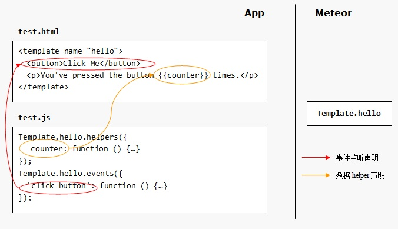

在hello模板中， *{{counter}}* 模板标签中的标识符 *couter* 的值，将由对应模板实例
对象的counter函数返回值决定，这个函数被称为模板的 *helper* 函数，使用模板实例的
 *helpers()* 方法声明模板标签中标识符对应的helper函数。

而通过模板实例对象的events方法，则为模板中的button元素挂接了click事件监听处理
函数。


## 1.7 前端代码 - 模板标签标识符解析/helper
### 前端代码 - 模板标签标识符解析/helper

使用 *Template.hello.helpers(helpers)* 方法声明 *hello* 模板中模板标签 *标识符*
的解析函数。参数 *helpers* 是一个JS对象，属性表示应用在模板标签中的 *标识符* ，值
通常是一个函数，被称为 *helper* ，大致是帮助Meteor解析模板中的 *标识符* 的值
这样的意思。

比如，在test.js中我们为hello模板中出现在 *{{counter}}* 模板标签中的 *counter* 表达
式声明其对应的 *helper* 函数：

```javascript
//test.js
Template.hello.helpers({
  'counter':function(){
    return Session.get('counter');
  }
});
```

每次当Meteor需要对模板标签 *{{counter}}* 进行计算时，都将调用其 *counter* 标识符
对应的 *helper* 函数进行计算：它简单地返回Session变量counter的当前值。

 **为helper函数设定参数**

 *helper* 函数可以接受参数，比如对于模板test中的 *displayName* 标识符：

```javascript
<template name="test">
  <h1>Hello,{{displayName "Jason" "Mr."}}!</h1>
</template>
```

声明如下的helper函数：

```javascript
Template.test.helpers({
  'displayName' : function(name,title){
    return title + ' ' + name;
  }
});
```

那么Meteor渲染后将获得如下的HTML结果：

```javascript
<h1>Hello,Mr. Jason!</h1>
```

 **使用常量helper**

当然，也可以将helper定义为一个常量：

```javascript
Template.test.helpers({
  displayName : "Mr. WHOAMI"
})
```

这时，模板标签{{displayName}}将永远地被设定为固定的值了。


> 修改test.js，使hello模板的counter helper返回值为实际点击量的10倍。


## 1.8 前端代码 - 模板事件绑定
### 前端代码 - 模板事件绑定

使用 *Template.hello.events(eventMap)* 方法声明 *hello* 模板中DOM对象的事件绑定。
参数 *eventMap* 是一个JS对象，属性表示要处理的事件，值表示事件处理函数。

比如，在test.js中我们为hello模板中的所有DOM对象挂接点击事件监听函数：

```javascript
Template.hello.events({
  'click':function(event,tpl){...}
})
```

也可以使用CSS选择符为指定的DOM对象挂接监听事件：

```javascript
Template.hello.events({
  'click button' : function(event,tpl){...}
});
```

还可以同时为多个事件指定同一个监听函数：

```javascript
Template.hello.events({
  'click button,keypress input':function(event,tpl){...}
});
```

监听函数触发时，Meteor将传入两个参数：event表示DOM事件对象，
而tpl则代表触发事件的DOM对象所属的模板实例。通过tpl对象的jQuery
操作符可以轻松地进行DOM操作：

```javascript
Template.hello.events({
  'click button#changetext':function(event,tpl){
      tpl.$("input").text("what are you doing!");
  }
});
```


> 修改test.js，实现以下功能：点击hello模板中的按钮时，弹窗提示： *clicked*


## 1.9 前端代码 - 全局字典/Session
### 前端代码 - 全局字典/Session

可能出乎你的意料，Meteor中的Session并不是我们通常在Web应用中的会话
对象，它仅仅是客户端的一个字典型全局变量。

使用 *set()* 方法，可以将值以指定名称保存在Session中;使用 *get()* 方法，
可以从Session中取出指定名称的值：

```javascript
//在Session中将counter的值设置为0
Session.set("counter",0);
//使用counter从Session中取出值
Session.get("counter");
```

 *setDefault()* 方法几乎与 *set()* 方法的作用几乎一致，唯一的差别在于，
对于某个指定的名称/键，只有第一次对setDefault的调用是有效的。因此
setDefault方法通常用于初始化代码。

 **反应式/Reactive对象**

Session与普通的全局变量的区别在于，它是 *反应式/Reactive* 变量。让我们回忆
一下test应用的逻辑，来尝试理解这个相当 *有档次* 的术语。

在test应用中，当你点击一下按钮，test.js中的代码只是简单地将Session中
的counter加1再存回去，并没有更新DOM的操作代码：

```javascript
  // increment the counter when button is clicked
  Session.set('counter', Session.get('counter') + 1);
```

但是，我们的确看到，在页面中的数字随着我们的点击在相应的增加 —— 看起来，Session
的变化 *自动* 引起了模板的变化 —— 这完全是因为Session是一个反应式变量，而这个计算
过程，被称为 *反应式计算/Reactive Computing* 或 *反应式编程/Reactive Programming* 。

我相信 *反应式计算* 有仿生的成分。想一想夏天的蚊子。当你试图悄悄靠近一只蚊子，迅速拍下
手掌时，你的手掌的快速运动导致了蚊子周围气流的异常变化，蚊子感受到了这个变化，拍拍翅膀
，飞了 —— 蚊子执行着一个相当成熟的反应式计算。

 **依赖关系与变化传播**

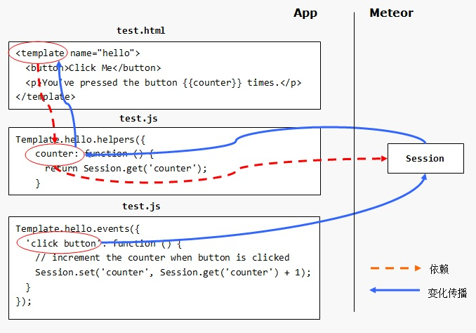

图中的虚线表示的是 *依赖关系* 链：hello模板 *依赖于* counter helper，而counter
helper *依赖于* Session对象。图中的实线表示的是反向的 *变换传播* 链：用户点击按
钮 *触发* 了对Session对象的变化，这 *触发* 了依赖于Session对象的counter helper的重新计算，
继而couner helper的变化又 *触发* 了依赖于counter helper的hello模板的重新计算，
于是我们看到了一个随动变化的用户界面。

这意味着，一旦声明了对象间的依赖关系，下游对象的变化将自动地沿着依赖关系链
 *反向传播* 给上游对象。这就是 *反应式/Reactive* 的核心理念。


> 修改test.js，设置Session中counter的初始值为1000.


## 1.10 后端代码
### 后端代码

在test.js中，后端代码几乎是空的，除了使用 *Meteor.startup(func)* 声明
了一个空的初始化函数。

 *Meteor.startup(func)* 方法在前端和后端都是可用的。参数 *func* 指定了
一个初始化函数，当平台 *就绪* 时，将调用这个初始化函数。

当在前端调用这个函数时，平台的就绪意味着DOM已经就绪，这时你可以进行DOM操作了：

```javascript
//client side
Meteor.startup(function(){
  //jQuery对象在Meteor前端总是可用的
  $("<h1>Hello,world</h1>").appendTo("body");
});
```

当在后端调用这个函数时，平台的就绪意味着Meteor平台的服务进程已经正常启动，可以
进行应用层级的初始化工作了，比如，为空的后端数据集填充一些数据：

```javascript
//server side
Meteor.startup(function(){
  var persons = new Mongo.Collection("persons");
  if(persons.find().count() === 0){
    persons.insert({...});
  }
});
```


> 修改test.js中服务端代码，在平台就绪时打印： *server is ready.*


## 1.11 应用目录结构
### 应用目录结构

一个Meteor应用由目录下的前端文件（HTML、CSS、脚本、资源文件等）和后端文件组成。
由于Meteor存在一个 *打包/bundle* 的阶段，因此，Meteor对应用的目录结构进行了约定，
以便其打包过程能够顺利完成。

默认情况下，Meteor会搜索应用目录（包括子目录）中的所有JavaScript文件，打包后分别
送往前端和后端运行，文件和子目录的名称会影响打包结果。Meteor对以下的子目录将特别处理：

 **client —— 参与打包的前端代码文件夹**

 *任何* 名称为 *client* 的目录，其文件都不会被送往后端运行。这类似于使用 *if(Meter.isClient){...}*
进行前端代码隔离的效果。

在 *生产模式* 下，client目录里的文件将被自动合并、压缩，但在 *开发模式* 下，JavaScript
文件和CSS文件并不进行压缩处理（CSS还是会合并，但JavaScript文件不进行合并处理），以便于
开发过程中的调试和错误定位。

Meteor会搜索目录中所有的模板文件中的三个顶层元素：head, body, template，其中所有
的head段会合并，body段和template段的声明都将转换为模板操作的JavaScript代码。

 **server —— 参与打包的后端代码文件夹**

 *任何* 名称为 *server* 的目录，其文件都不会送往前端运行。这类似于使用 *if(Meteor.isServer){...}*
进行后端代码隔离的效果，但不同的是， *server* 目录内的部分代码不会发送到前端，因此一些敏感的
代码（比如身份验证等）应当放在这个目录。

Meteor会收集除了client, public和private子目录之外的所有JS文件，然后交给后端NodeJS
运行。后端的JavaScript代码对每个请求将使用一个单独的线程来处理，这不同于通常NodeJS的异步
代码模式，因为Meter认为这种模式更适合Meteor应用场景。

 **public —— 不参与打包的前端资源文件夹**

应用 *根目录* 下 *public* 子目录中的文件仅用于前端，这些文件 *不会被打包* ，可视为http访问的虚拟根目录。
例如，public目录下的logo.jpg文件，可以通过url："/log.jpg"来访问。这个目录可以用来放置favicon.ico,
robots.txt，或者一些静态的HTM文件。

 **client/compatibility —— 不参与打包的前端兼容库目录**

有些前端JavaScript库依赖于使用var定义的全局变量。为了兼容这些库，这个目录里的文件在被送
往前端时，不会被嵌套在一个作用域中，并且会在其他前端JavaScript文件之前先执行。

 **tests —— 仅用于测试的文件夹**

任何名为 *test* 的目录内的文件仅用于测试，前端和后端都不会使用。


## 1.12 内容小结
### 内容小结

让我们简单回顾这个示例Meteor应用的开发过程（假装没有使用meteor工具）：


- 创建模板文件test.html，定义文档结构
- 创建样式文件test.css，定义文档样式
- 编写前端脚本test.js，实现模板、数据、事件的绑定
- 在这个示例中，我们基本不需要编写后端脚本


这些就绪后，扔给Meteor运行就可以了。

这有点像Apache+PHP或者IIS+ASP这些东西，Meteor提供一个基本的运行环境，你往
里面扔一个模板，立马就可以看到效果，你编写一段后端脚本，立马增强了服务器的
能力。那么，Meteor和它们的区别在哪里呢？

 **横跨前后端的中间层平台 **

在前面的课程中，我们看到，前端和后端同时都有一个 *Meteor* 对象作为API入口（当然，
前端的Meteor对象和后端的Meteor对象不是完全相同的实现），可以使用Meteor.isClient或
Meteor.isServer判断代码运行环境，可以使用同样的Meteor.startup()方法分别在
前端和后端注入初始化代码。这意味着什么？

让我把最开始的那张示意图中的Meteor层再细化一下：

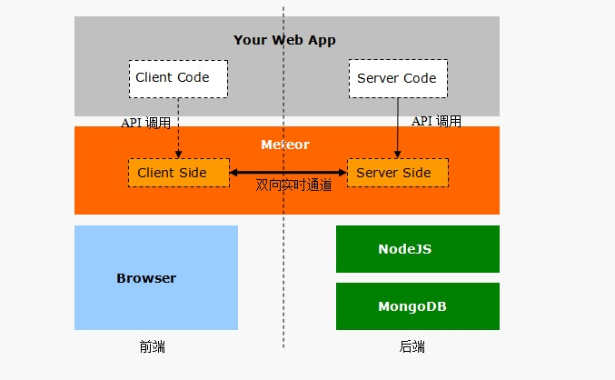

很显然，Meteor最 *与众不同* 的是，使用同一套代码，同时在前端和后端提供了应用运行的
 *基础环境* 。不得不提的是，Meteor平台在前端基础环境和后端基础环境之间，甚至已经基于
websocket建立了一个 *双向实时* 的通道！


> 在进入后续内容之前，让我们先在终端中执行以下命令下载课程示例代码：


`~/test$ cd↵
~$ git clone https&amp;#58;//github.com/hubwiz/meteor-lesson.git demos↵`

当你看到下面的提示信息，就表示示例代码已经成功下载到demos目录了：

`...
Checking connectivity... done.`


# 2 实时通信平台

## 2.1 分布式数据协议 - DDP
### 分布式数据协议 - DDP

Meteor平台基于websocket，在前端和后端之间建立了一条双向的实时数据通道。Meteor
将前后端之间的通信规约，定义为 **DDP**  - Distributed Data Protocol。

如果你开发过基于websocket或socket.io的实时应用，那么很容易理解 *DDP*  - 它对实时链路
上的JSON *报文格式* 和 *交互时序* 进行了 *规范化* 。

比如，在DDP中定义了两种心跳报文，用于探测链路的状态。发起方（可以是前端，也可以是后端）
发送ping报文，响应方回送pong报文，那么发起方就可以确认对端还活着：

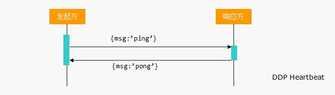

你看到，ping报文和pong报文就是两个具有预定义结构的JSON对象。

 *DDP* 的重点在于支持两种远程计算模式：远程过程调用、数据发布/订阅。

 **远程过程调用**

 *远程过程调用/RPC*  - Remote Procedure Call是一种历史相当久远的远程计算模式，它使客户端
调用者可以像调用本地过程一样来调用服务端的远程过程：

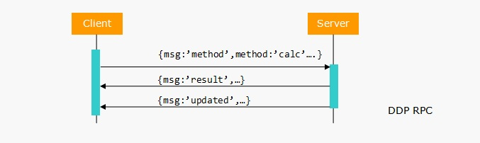

上图中，客户端利用DDP协议的 *method* 报文调用了服务端的 *calc* 过程，服务端通过 *result* 报文
返回结果。通常的RPC过程到这一步就结束了，而DDP RPC增加了一个 *updated* 报文用来通报由这个调
用引起的多点数据更新已经完成。

 **数据发布/订阅**

 *数据发布/订阅*  - Pub/Sub模型是另一种相当成熟的远程计算模式。客户端向服务端 *订阅* 一个 *主题* ，
然后，每当服务端的这个主题发生了变化，会主动地向客户端 *推送* 变化。当客户端取消了先前的订阅后，
服务端就不再推送关于该主题的变化了：

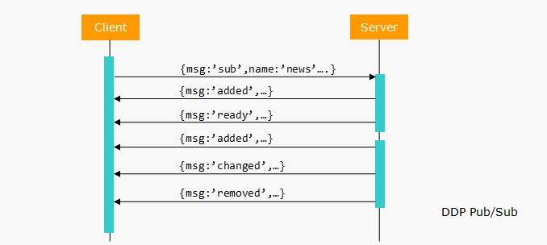

上图中，客户端利用DDP协议的 *sub* 报文订阅了服务端的 *news* 主题。服务端将初始的数据通过 *added*
报文发送给客户端后，使用 *ready* 报文通知客户端初始数据发送完毕。在随后的某个时刻，服务端添加
/修改/删除的数据，分别通过 *added* / *changed* / *removed* 报文发送给客户端。


## 2.2 远程过程调用 - RPC
### 远程过程调用 - RPC

Meteor平台已经预置了DDP协议的完整实现，因此我们只需要调用相应的API就可以实现
远程过程调用。

 **服务端/后端 —— 定义远程过程**

调用 *Meteor.methods(methods)* 方法进行服务端远程过程的定义。参数 *methods* 是一个
JS对象，其属性表示过程名，对应的值函数就是远程过程的实现函数。

下面的代码实现了一个用来计算员工薪酬的远程过程，尽管计算逻辑相当地不逼近实用系统，
但请关注我们将其抽象为服务端的一个远程服务的思路：

```javascript
//server side
Meteor.methods({
  'calcSalary':function(name){
    //喜欢的三个员工给多点
    if(name==='Mary') return 100000.00；
    if(name==='Linda') return 50000.00;
    if(name==='Tommy') return 78000.00;
    //其他员工都给一样的薪酬
    return 15000.00;
  }
});
```

 **客户端/前端 —— 调用远程过程**

在客户端调用 *Meteor.call(name,[arg1,arg2],[asyncCallback])* 方法调用远程过程：

```javascript
//client side
//异步调用，调用结果或错误将被传入回调函数
Meteor.call("calcSalary","Mary",function(error,result){
  $("body").html("result is " + result);
});
```

另一种调用方法是使用 *Meteor.apply()* 方法执行远程过程。 *apply()* 和 *call()* 的
用法差不多，只是参数需要以数组形式传入，并且有一些附加的调用选项。有兴趣的话可以
查阅<a href="http://docs.meteor.com/#/full/meteor_apply" target="_blank">文档</a>


>
执行以下命令复位test应用、删除源文件:


`~/test$ meteor reset↵
~/test$ rm -rf \*↵`

拷贝rpc示例代码，运行并查看运行结果：


`~/test$ cp ~/demos/rpc/* .↵
~/test$ meteor↵`

理解并修改rpc示例代码，通过练习掌握Meteor平台下RPC的使用方法。


## 2.3 RPC - 前端stub
### RPC - 前端stub

有趣的是，Meteor的RPC支持在客户端使用 *存根/stub* 方法。在客户端也使用 *Meteor.methods(methods)* ，
就可以定义与远程过程 *同名* 的存根方法了：

```javascript
if(Meter.isClient){
  //stub procedure
  Meteor.methods({
    "test",function(){...}
  });
}
if(Meteor.isServer){
  //remote procedure
  Meteor.methods({
    "test",function(){...}
  });
}
```

当应用代码使用 *Meteor.call(...)* 方进行RPC调用时，Meteor会检查是否存在本地同名的
 *存根/stub* 方法，如果存在的话将先调用本地 *存根/stub* 方法，然后再调用服务端的方法：

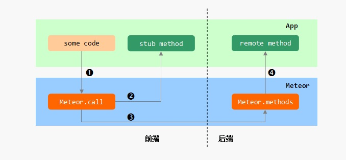

在Meteor中，本地 *存根/stub* 方法的最大的用途是进行网络调用的
 *延迟补偿/Latency Compensation* 。


> 执行以下命令复位test应用、删除源文件：


`~/test$ meteor reset↵
~/test$ rm -rf \*↵`

执行以下命令拷贝rpcstub示例代码，运行并查看运行结果：


`~/test$ cp ~/demos/rpcstub/* .↵
~/test$ meteor↵`

理解并修改rpcstub示例代码，通过练习掌握在Meteor应用中为远程过程添加
本地stub方法


## 2.4 数据发布/订阅 - Pub/Sub
### 数据发布/订阅 - Pub/Sub

 *发布/订阅* 模型是解决数据跟踪问题的一个有力武器，开发者避免了通过定期地轮询
来获取最新的数据。Meteor的DDP实现包含了Pub/Sub协议的实现。

 **服务端 —— 发布数据集**

在服务端，通过调用 *Meteor.publish(name,func)* 方法来发布一个 *数据集/RecordSet* 。

参数 *name* 声明数据集的名称，在客户端进行订阅时，需要使用相同的名称；
参数 *func* 是一个订阅初始化函数，每个客户端的订阅操作将相应在服务端将调用这个函数。

在 *func* 函数体内， *this* 指向 *发布句柄/Publish Handle* 对象，需要使用这个对象
的以下方面在数据集发生变化时通知客户端：


-  *added(c,id,data)*  - 通知客户端向名称为 *c* 的 *集合* 中插入编号为 *id* 的新数据 *data*
-  *changed(c,id,data)*  - 通知客户端使用 *data* 更新名称为 *c* 的 *集合* 中指定 *id* 的数据记录
-  *removed(c,id)*  - 通知客户端删除名称为 *c* 的 *集合* 中指定 *id* 的数据记录。


下面的代码发布了一个名为 *messages* 的数据集，初始为空，每隔两秒钟模拟一条新的消息：

```javascript
//server side
Meteor.publish("messages",function(){
  //保存发布句柄对象
  var self = this;
  //设置记录id初始值
  var id = 0;
  //向客户端声明数据集就绪 - 目前这是一个空数据集
  self.ready();
  //每隔2秒钟模拟一条新的消息
  setInterval(function(){
    self.added("msg",++id,{text:'fake message ' + id});
  },2000)
})
```

 **客户端 —— 订阅数据集**

客户端调用 *Meteor.subscribe(name,[arg1,arg2...])* 方法订阅服务端发布的数据集，
参数 *name* 就是服务端进行发布时定义的数据集名称。

客户端进行订阅后，服务端会自动将数据的变化发送过来。这些数据变化，客户端存储在本地
的同名 *集合/collection* 中。比如对于上面的 *messages* 数据集，其中的一个 *集合/collection*
名称为 *msg* ，那么客户端需要定义一个同名的本地 *集合/collection* ：

```javascript
var localMsg = new Mongo.Collection("msg",{connection:null});
Meteor.subscribe("messages");
```

如果进行订阅的时候，本地 *集合* 还不存在，那么Meteor会自动将数据变化保存下来，并在
本地 *集合* 就绪时提交。这意味着先进行订阅，再定义本地集合也是可行的：

```javascript
Meteor.subscribe("messages");
var localMsg = new Mongo.Collection("msg",{connection:null});
```


>
执行以下命令复位test应用、删除源文件:


```javascript
~/test$ meteor reset↵
~/test$ rm -rf \*↵
```

执行以下命令拷贝pubsub示例代码，运行并查看运行结果：


```javascript
~/test$ cp ~/demos/pubsub/* .↵
~/test$ meteor↵
```

理解并修改pubsub示例代码，通过练习掌握在Meteor应用中，服务端发布数据集的方法，
以及在客户端订阅、显示数据集的方法


# 3 反应式编程

## 3.1 反应式编程 - RP
### 反应式编程 - RP

 *反应式编程/Reactive Programming* 是面向数据流和变化传播的一种编程范式。反应式编程
最初提出的目的是建立交互式用户界面 - 当数据发生变化时，期望用户界面自动得到更新。

微软Excel软件是反应式编程的一个实现案例，如果一个单元格的值依赖于其他单元格，那么
当其他单元格的值变化时，这个单元格的值自动更新。在下面的图中，单元格E1的值被设定
为 *=C1+D1* ：

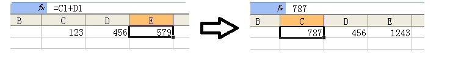

当单元格C1的值从123变成787时，你会看到单元格E1的值自动更新为新的值1234。
这看起来就是，输入数据——单元格C1和D1——的 *变化* ， *传播* 给了输出数据——单元格E1。

 **反应式编程的实现原理**

看一个最简单的数据流，数据A和数据B流入（输入）处理单元（计算输入的和）后，流出
（输出）数据C：

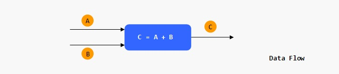

在JavaScript中要实现这个处理单元相当简单，一个表达式足够了：

```javascript
var C = A + B;
```

不过这可不是反应式编程！这个表达式是一次性计算而已。反应式编程要求输出数据 *自动响应*
输入数据的 *变化* ！这个简单的处理单元，没有办法保证在后续的时间里，当数据A或数据B的
值变化时，数据C的值也自动 *响应* 变化。

一个很朴素的想法是，每当（任一）输入数据变化时，如果能够自动的 *重新* 执行处理单元，那么
自然可以保证输出数据的新鲜：

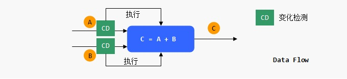

BINGO！这就是实现反应式编程的核心原理，说穿了一点也不神秘。


## 3.2 函数反应式编程 - FRP
### 函数反应式编程 - FRP

 *函数反应式编程/Functional Reactive Programming* 是指采用 *函数式编程/FP* 来实现
反应式计算。函数式编程是又一个相当有品位的术语，我们现在不需要过多深入，先记住，
函数式编程是以 *函数* 为核心的编程模式，它总是试图使用 *函数* 来实现一个具体的功能。

 **使用函数实现处理单元**

如果你和我一样，曾经念过初中，相信你还记得数学中的 *函数*  - 从自变量到因变量的 *映射* ：


没错，我们可以把处理单元看做一个函数，自变量是输入（A和B），因变量是输出（C）。使用
JavaScript的函数来实现数学中的函数很简单，JavaScript函数的参数就是自变量/输入，返回值
就是因变量/输出：

```javascript
var processor = function(A,B){
  return A + B;
}
```

任何时刻，我们向这个函数传入输入数据，就可以获得输出数据。现在，需要一种 *机制*
来 *检测* 输入数据的 *变化* ，这样，就可以在输入变化时 *触发* 对处理单元的调用了。

 **输入数据变化检测**

JavaScript没有内置的对任意变量进行变化检测的支持，所以我们需要 *跳出来* 思考一下。

如果，我们能够在 *其他代码/Mutation Code* 试图修改A和B时， *截获* 修改请求，是不是
就可以了：

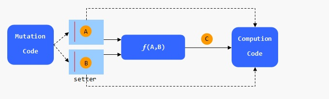

首先我们需要定义一个新的类 *ReactiveData* 来封装对原始数据的修改接口。ReactiveData对象
的 *value* 属性保存原始数据，任何代码都需要通过其 *set()* 方法才能修改原始数据，在 *set()* 方法内，
我们调用依赖于这个数据的计算过程（为了便于理解，先假设只有一个计算过程依赖于这个数据）：

```javascript
var ReactiveData = function(initVal){
  this.value = initVal;
  this.dependent = null;
};
ReactiveData.prototype.set = function(newVal){
  //修改原始数据
  this.value = newVal;
  //触发执行依赖于此数据的计算过程
  this.denendent &amp;&amp; this.dependent.call(null);
}
```

 **声明计算过程对数据的依赖 **

在 *什么时候* 声明一个计算过程依赖于ReactiveData有多种途径。一种方法是在计算过程
 *读取* 数据的时候进行设定 —— 如果一个计算过程需要读取一个数据，那可以断定这个计算
过程 *依赖于* 这个数据了。现在我们为ReactiveData类增加 *get()* 接口，在 *get()* 方法内部，
插入我们的登记行为：

```javascript
ReactiveData.prototype.get = function(){
  //登记依赖于此数据的计算过程
  this.dependent = computeContext;
  //返回原始数据
  return this.value;
}
```

你看到，为了避免给 *get()* 方法不符合人性地增加参数，我们使用一个全局变量
 *computeContext* 来表征当前的计算过程 —— 我们可以在启动一个反应式计算的时刻，
设定这个全局变量。现在让我们提供一个启动反应式计算的方法：

```javascript
var ReactiveRun = function(compution){
  //设定当前计算过程
  computeContext = compution;
  //初次调用
  compution.call(null);
}
```

 **测试我们的反应式计算小框架**

基本框架已经具备，现在我们可以定义两个ReactiveData对象ra和rb，以及依赖于ra和rb的处理单元processor：

```javascript
var ra = new ReactiveData(0),
    rb = new ReactiveData(0),
    processor = function(a,b){return a.get() + b.get();};
```

可以启动反应式计算了,在计算过程 *compution* 中，我们对输入变量ra和rb执行processor处理，
并打印计算结果：

```javascript
var compution = function(){
  var c = processor(ra,rb);
  console.log(c);
};
ReactiveRun(compution);
```

一旦反应式计算过程启动，那么对变量ra和rb的修改将自动触发重新计算。现在，
我们编写一段测试代码来不断的修改ra和rb的值：

```javascript
//mutation code
SetInterval(function(){
  var va = Math.random()*1000,
      vb = Math.random()*1000;
  a.set(va);
  b.set(vb);
},1000)
```


> 执行以下命令复位test应用、删除源文件:


`~/test$ meteor reset↵
~/test$ rm -rf \*↵`

执行以下命令拷贝frp示例代码，运行并查看运行结果：


`~/test$ cp ~/demos/frp/* .↵
~/test$ meteor↵`

阅读frp示例代码，理解反应式计算的实现原理


## 3.3 Meteor的FRP实现 - Tracker模块
### Meteor的FRP实现 - Tracker模块

Meteor平台的FRP实现是通过内置的 *Tracker* 包完成的。在Meteor平台上实现反应式
计算可分为三个步骤：


- 将原始数据使用getter/setter进行封装
- 编写依赖于反应式数据的计算过程
- 启动反应式计算过程


可以认为Meteor的FPR实现，一半是Tracker包中的代码，一半是对开发者编写代码的要求。
需要提醒的是， *Tracker* 包只可以用在 *前端* 。

 **封装反应式数据**

Tracker *要求* 对数据的存取通过 *getter/setter* 接口进行。使用 *getter* 接口
读取数据时，数据的封装者负责记录 *依赖* 于该数据的计算过程；使用 *setter* 接口
修改数据时，数据的封装者负责 *传播* 数据变化 - 即调用所有已经记录的依赖于该数据
的计算过程：

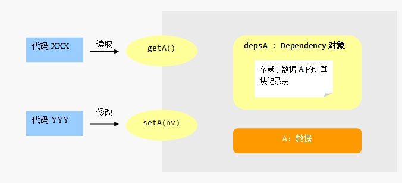

Tracker定义了一个类 *Tracker.Dependency* 来简化数据封装者在实现getter/setter
时要做的工作。对每一个需要进行封装的数据，我们创建一个对应的 *Dependency* 对象。
在getter里，使用Dependency对象的 *depend()* 方法登记依赖于此数据的计算过程；
在setter里，使用Dependency对象的 *changed()* 方法调用登记过的依赖于此数据的
计算过程。

```javascript
var A = 10;
var depsA = new Tracker.Dependency();

//getter
var getA = function(){
  despA.depend();
  return A;
};
//setter
var setA = function(nv){
  A = nv;
  despA.changed();
}
```

 **封装计算过程**

Tracker *要求* 我们使用 *无参函数* 来表示一个 *计算过程* ：

```javascript
//计算过程，Tracker使用这个函数创建计算块
var computeFunc = function(){
  //当调用getA或getB时，Tracker创建的计算块将被登记到depsA或depsB的依赖项记录表中
  var a = getA(),
      b = getB(),
      c = a + b;
  console.log(a + " + " + b + " = " + c);
};
```

 **启动反应式计算**

使用 *Tracker.autorun(computeFuc)* 方法来启动反应式计算：

```javascript
Tracker.autorun(computeFunc);
```

 **测试反应式计算**

现在我们就可以写一段测试代码了，记住，Tracker *要求* 我们必须通过 *setter*
接口来修改数据：

```javascript
var seq = 0;
setInterval(function(){
  if(seq % 2 === 0)
    setA(parseInt(Math.random()*1000));
  else
    setB(parseInt(Math.random()*1000));
  seq++;
},1000);
```


> 执行以下命令复位test应用、删除源文件:


`~/test$ meteor reset↵
~/test$ rm -rf \*↵`

执行以下命令拷贝frp-tracker示例代码，运行并查看运行结果：


`~/test$ cp ~/demos/frp-tracker/* .↵
~/test$ meteor↵`

理解并修改frp-tracker示例代码，通过练习掌握在Meteor应用中如何使用Tracker
实现反应式计算。


## 3.4 反应式变量 - ReactiveVar
### 反应式变量 - ReactiveVar

仅仅使用Tracker来实现反应式编程，对数据的封装还是有点繁琐：我们
需要创建Dependency对象，需要编写setter/getter，需要在getter里登记
依赖项，需要在setter里触发依赖项计算。

Meteor体贴地为我们编写了 *reactive-var* 包，提供了一个新的类 *ReactiveVar*
让我们一步到位创建反应式数据。ReactiveVar类可以视为我们之前数据封装过程
的 *面向对象/OO* 的实现，其原理是一致的。

 *reactive-var* 包没有预置在使用 *meter create* 创建的应用中，因此我们需要
使用 *meter add [package]* 命令，手工地为应用中添加这个包：

```javascript
~/test$ meteor add reactive-var↵
```

现在我们可以来试一试Meteor内置的反应式变量了。

 **创建反应式变量 - new ReactiveVar(initVal)**

使用new操作符创建一个ReactiveVar类的实例，我们就获得了一个反应式变量：

```javascript
var A = new ReactiveVar(10);
```

ReactiveVar构造函数的参数指定了这个响应式变量A的初始值。你可以想象到，
在构造函数内会创建一个 *Dependency* 对象。

 **反应式变量读写 - 内置的getter/setter方法**

ReactiveVar实例对象具有内置的 *getter/setter* 接口：使用 *get()* 方法读取
变量的值，使用 *set(newVal)* 方法修改变量的值。如你所料，对Dependency对象
的调用已经被封装进ReactiveVar的getter/setter方法中了。

```javascript
//读取数据
var a = a.get();
//修改数据
A.set(Math.random());
```


> 执行以下命令复位test应用、删除源文件：


`~/test$ meteor reset↵
~/test$ rm -rf \*↵`

执行以下命令拷贝frp-reactivevar示例代码、添加reactive-bar包、运行并
查看运行结果：


`~/test$ cp ~/demos/frp-reactivevar/* .↵
~/test$ meteor add reactive-var↵
~/test$ meteor↵`

理解并修改frp-reactivevar示例代码，通过练习掌握在Meteor应用中如何使用Tracker
和ReactiveVar来实现反应式计算。


## 3.5 反应式字典 - ReactiveDict
### 反应式字典 - ReactiveDict

ReactiveVar可以对 *单个* 数据进行响应式封装。不过有时我们希望对多个数据
构成的 *数据集* 统一进行封装，希望其中 *任何* 一个数据的变化都将传播给所有
依赖于这个数据集的计算过程。

Meteor提供了 *reactive-dict* 包来支持这样的需求， *ReactiveDict* 类使用
 *键/key* 来标识数据集中不同的数据。和 *reactive-var* 包一样，我们需要为
应用手工添加这个包：

```javascript
~/test$ meteor add reactive-dict↵
```

我们之前接触到的 *Session* 对象，就是一个ReactiveDict实例。

 **创建反应式字典 - new ReactiveDict(dictName)**

使用new操作符实例化ReactiveDict类，我们就获得了一个反应式字典：

```javascript
var dict = new ReactiveDict();
//可选的，可以在构造函数中设置字典名称
var dict2 = new ReactiveDict("contacts");
```

 **反应式字典读写 - 内置的getter/setter方法**

很明显，反应式字典的 *getter/setter* 需要指定 *键/key*  - 它相当于数据
集中的变量名。

```javascript
//初始化Kongka的数据
dict.setDefault("Konka","18611111111");
//读取Konka的数据
var tel = dict.get("Konka");
//需改Linda的数据
dict.set("Linda","13901234567");
```

 **初始化 - setDefault()**

除了 *set(key,newVal)* 方法，反应式字典还提供了一个额外的 *setDefault(key,newVal)*
方法，它 *仅仅* 用于对字典中指定键数据的初始化，也就是说，如果字典中指定的键已经存在，
那么它什么也不做，否则，就调用 *set(key,newVal)* 设置值：

```javascript
//初始化，ok
dict.setDefault("Konka","18611111111");
//再次初始化，没用啦
dict.setDefault("Konka","18622222222");
//tel值 ： 18611111111
var tel = dict.get("Konka");
```


> 执行以下命令复位test应用、删除源文件：


`~/test$ meteor reset↵
~/test$ rm -rf \*↵`

执行以下命令拷贝frp-reactivedict示例代码、添加reactive-dict包、
运行并查看运行结果：


`~/test$ cp ~/demos/frp-reactivedict/* .↵
~/test$ meteor add reactive-dict↵
~/test$ meteor↵`

理解并修改frp-reactivedict示例代码，通过练习掌握在Meteor应用中如何使用
Tracker和ReactiveDict实现反应式计算。


## 3.6 发应式数据集 - LocalCollection
### 反应式数据集 - LocalCollection

如果在前端需要比字典更强大的反应式数据，那么可以使用Meteor的 *minimongo*
包，它是一个使用JavaScript实现的内存数据库，遵循了 *MongoDB* 的API访问接口。
我们需要手工引入这个minimongo包：

```javascript
~/test$ meteor add minimongo↵
```

实例化minimongo包中定义的类 *LocalCollection* ，我们就得一个本地数据集，
，可以执行插入、删除、修改、查找等CRUD操作，具体的使用方法可参考对应的
MongoDB文档：

```javascript
//创建本地集合
var msgs = new LocalCollection("messages");
//插入 - Create
msgs.insert({name:"john",message:"who are you?",time:Date.now()});
//查找 - Retrieve
msgs.find({name:"john"});
//更新 - Update
msgs.update({name:"john"},{$set:{time:Date.now()}});
//删除 - Delete
msgs.remove({name:john});
```

LocalCollection对象最重要的特性是，它是一个反应式对象。可以这样理解，
 *insert/update/delete* 这些方法相当于数据集的 *setter* ，而 *find* 方法，则相
当于数据集的 *getter* 。因此，依赖于本地数据集的计算过程，可以使用
 *Tracker.autorun()* 方法启动为响应式计算：

```javascript
var msgs = new LocalCollection("messages");
Tracker.autorun(function(){
  var $msgs = $("#messages").html("");
  msgs.find().forEach(function(msg){
    var tpl = "<div><span>$1:</span>$2".replace(/\$1/,msg.name).replace(/\$2/,msg.message);
    $msgs.append(tpl);
  });
});
```


> 执行以下命令复位test应用、删除源文件:


`~/test$ meteor reset↵
~/test$ rm -rf \*↵`

执行以下命令拷贝frp-minimongo示例代码、添加minimongo包、
运行并查看运行结果：


`~/test$ cp ~/demos/frp-minimongo/* .↵
~/test$ meteor add monimongo↵
~/test$ meteor↵`

理解并修改frp-minimongo示例代码，通过练习掌握在Meteor应用中如何使用
Tracker和LocalCollection来建立反应式计算。


## 3.7 反应式UI引擎 - Blaze
### 反应式UI引擎 - Blaze

我们已经知道，一个依赖于反应式数据的计算过程，使用 *Tracker.autorun()* 就可以将其
启动为反应式计算，数据的变化会自动触发重新计算：

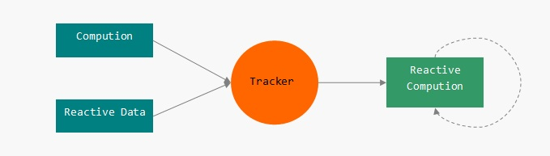

那么，如果这个计算过程是用来构造用户界面的，这个用户界面不就可以跟随数据的
变化而自动更新了吗？

没错，这正是Meteor模板引擎 *Blaze* 包设计的关键出发点 - 反应式UI：

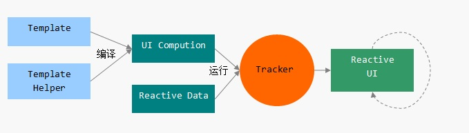

开发者编写的 *模板* （包括helpers、events），在运行之前的 *打包/Bundle* 过程中将
被编译为 *UI计算过程* ，然后与反应式数据一起，提交给Tracker运行，实现 *反应式UI* 。

你看到，我们并不需要 *手写* UI计算过程，Meteor的编译器自动地将 *模板* 转化为
对应的 *计算过程*  - 当我们了解手写一个UI计算的繁琐以后，就知道写模板有多幸福了。


## 3.8 UI计算过程
### UI计算过程

尽管Meteor平台体贴地为我们隐藏了UI计算的编写环节，看一眼Meteor生成的代码
还是很有好处的。下面的图揭示了Meteor *打包* 期间对模板文件demo.html进行的处理：

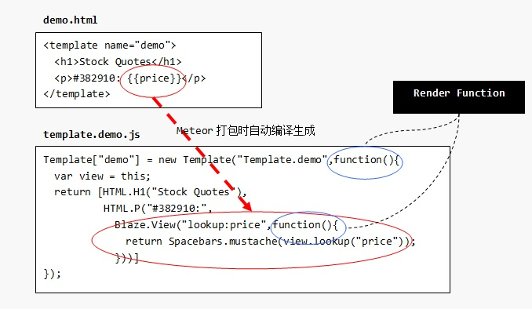

你看到，Meteor根据我们的模板定义，创建了一个Template对象：Template.demo。
请注意Template构造函数的第二个参数，被称为 *渲染函数/RenderFunc* ，这就是我们
提到的 *UI计算过程* 。

渲染函数要完成的工作就是 *构造* DOM元素组。HTML.H1()返回的是一个h1节点的
等价对象，HTML.P()返回的是一个p节点的等价对象。很显然， *声明式* 的模板在这里
已经转化为 *命令式* 的计算过程了。

注意下对 *Blaze.View()* 的调用，它对应于模板标签 *{{price}}* ，创建了一个 *子视图* 。
Blaze.View()的第二个参数也是一个函数，事实上，这个参数函数也是一个 *渲染函数/RenderFunc* 。
 *view.lookup("price")* 用来在当前模板的helpers中查找名为 *price* 的helper函数，
而 *Spacebars.mustache()* 则基本等价于对 *price helper* 函数的调用。最终，调用 *Blaze.View()*
将返回 *price helper* 函数的执行结果。

 **启动反应式UI —— Meteor.render(template,parentNode)**

启动反应式UI就是启动反应式UI计算过程。使用 *Meteor.render()* 方法将 *模板对象* 渲染
到DOM树中指定父元素之下，例如下面的示例将模板对象 *Template.demo* 返回的DOM元素组，
追加到 *document.body* 节点内：

```javascript
Meteor.render(Template.demo,document.body);
```

在Meteor.render()内部，会通过 *Tracker* 来启动反应式计算。这样，当数据变化
时，UI就将自动得到更新。


> 执行以下命令复位test应用、删除源文件：


`~/test$ meteor reset↵
~/test$ rm -rf \*↵`

执行以下命令拷贝frp-blaze示例代码、运行并查看运行结果：


`~/test$ cp ~/demos/frp-blaze/* .↵
~/test$ meteor↵`

阅读frp-blaze示例代码，理解Meteor的反应式UI渲染原理。


# 4 模板开发

## 4.1 模板
### 模板

在Meteor应用开发过程中，用户界面被 *切割* 为不同的组成模块 - 模板，
在运行期，Meteor动态的 *组合* 这些模板，构成最终呈现给用户的用户界面：

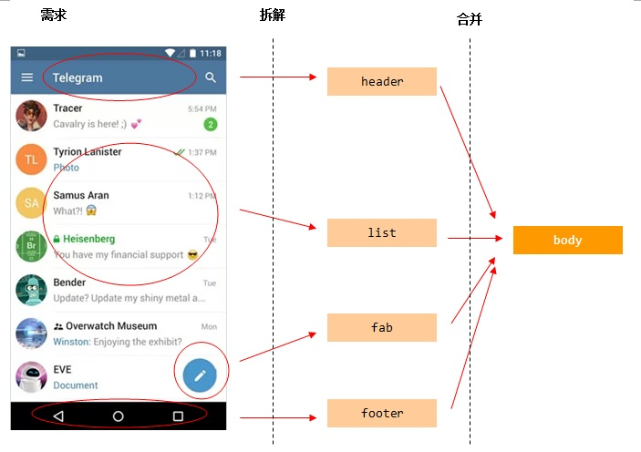

以telegram为例，主界面可以被分解为四个模板，最后的入口模板
看起来是这样：

```javascript
<body>
  {{> header}}
  {{> list}}
  {{> footer}}
  {{> fab}}
</body>

<template name="header">...</template>
<template name="list">...</template>
<template name="footer">...</template>
<template name="fab">...</template>
```


## 4.2 数据上下文
### 数据上下文

毫无疑问， *模板* 比单纯的HTML片段的优势就在于对数据的利用，这个与模板配套的数据
对象被称为模板的 *数据上下文* ：

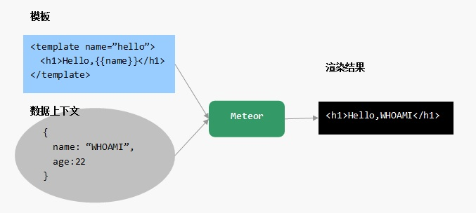

 **使用{{> template}}设置数据上下文**

在调用子模板时，可以使用 *关键字参数* 为子模板指定数据上下文。下面的示例
将为hello子模板设置数据上下文 *{name:"Linda",age:19}* ：

```javascript
<template name="entry">
  {{> hello name="Linda" age=19}}
</template>
```

 **使用{{#with data}}标签设置数据上下文**

如果想直接在一个模板的一部分片段设置数据上下文，除了将这部分作为子模板调用，
还可以使用 *{{#with}}* 标签设置模板片段的数据上下文。下面的示例为entry模板
的一部分设置了单独的数据上下文对象 *{name:"john",age:28}* ：

```javascript
<template name="entry">
  <h1>demo title</h1>
  {{#with name="John" age=28}}
  <p>{{name}} is {{age}} years old!

  {{/with}}
</template>
```


>
执行以下命令复位test应用、删除源文件：


`~/test$ meteor reset↵
~/test$ rm -rf \*↵`

执行以下命令拷贝tpl-datacontext示例代码、运行并查看运行结果：


`~/test$ cp ~/demos/tpl-datacontext/* .↵
~/test$ meteor↵`

理解并修改tpl-datacontext示例代码，通过练习掌握在Meteor应用中如何为一个
模板设置数据上下文。


## 4.3 模板helper
### 模板helper

模板 *helper* 是Blaze解析模板数据的另外一个方式。Blaze根据模板标签中的 *标识符* ，
查找对应名称的helper，并使用其 *返回值* 原地替换 *标识符* 。

 **使用父模板的helper为子模板建立数据上下文**

对于下面的模板：

```javascript
<template name="entry">
  {{> hello getProfile}}
</template>
```

可以为entry模板建立了对应的 *getProfile helper* 函数，这个helper函数
将根据系统的登陆状态，返回不同的值：

```javascript
Template.body.helpers({
  getProfile:function(){
    if(!loggedIn) return {name:"not logged in."}
    else return {name:currentUser}
  }
});
```

由于模板调用标签 *{{> hello getProfile}}* 需要的参数是一个JSON对象，因此我们的
 *getProfile helper* 应当返回一个JSON对象。

 **直接使用模板helper进行数据解析**

helper函数的返回数据类型取决于它在模板中的应用场景，比如在hello模板中我们使用了一个
插值模板标签 *{{name}}* ：

```javascript
<template name="hello">
  Hello,{{name}}
</template>
```

那么对于模板标签中的 *name* 标识符，我们直接为hello模板定义 *name helper* 函数也可以。
这样就不需要在调用这个模板时传入数据上下文了：

```javascript
Template.hello.helpers({
  name:function(){
    if(!loggedIn) return "not logged in."
    else return currentUser
  }
});
```


>
执行以下命令复位test应用、删除源文件：


`~/test$ meteor reset↵
~/test$ rm -rf \*↵`

执行以下命令拷贝tpl-helpers示例代码、运行并查看运行结果：


`~/test$ cp ~/demos/tpl-hepers/* .↵
~/test$ meteor↵`

理解并修改tpl-helpers示例代码，通过练习掌握在Meteor应用中如何为模板中
的标识符定义helper函数。


## 4.4 在模板中使用helper参数
### 在模板使用helper参数

当使用helper解析模板标签中的标识符时，可以为helper函数传入额外的参数。参数有
两种形式：按helper函数声明时在参数列表中的位置传入的参数，称为 *位置参数* ；使用
 *paramKey=paramValue* 方式传入的与位置无关的参数，称为 *关键字参数* 。

 **位置参数**

插值标签 *{{}}* 中的 *第一个* 标识符将被解析为helper函数，其后的标识符将被解析为
helper函数的参数，可以使用任意数量的 *位置参数* 。

例如模板标签 *{{calcSalary "jOHN" "2018-07"}}* ，其第一个标识符calcSalary将被解析
为同名的helper函数，后两个标识符"jOHN"和"2018-07"将被解析为helper函数的参数：

```javascript
calcSalary("jOHN","2018-07")
```

因此，应当在定义calcSalary helper函数时，声明两个参数：

```javascript
Template.demo.helpers({
  "calcSalary":function(name,month){...}
})
```

 **关键字参数 **

也可以在模板标签中为第一个标识符使用任意数量的 *关键字参数* ，所有相邻的
关键字参数将被合并为一个统一的 *Spacebars.kw* 对象传入helper函数。

例如模板标签 *{{calcSalary "jOHN" "2018-07" overtime=true gender="female"}}* ，
最后两个表达式都是关键字参数，Meteor进行helper调用时，它们将被转换为一个
 *Spacebars.kw* 对象：

```javascript
calcSalary("jOHN","2018-07",Spacebars.kw({overtime:true,gender:"female"}))
```

 *Spacebars.kw(...)* 创建了一个字典对象，可以在helper函数体内使用其 *hash*
属性访问原始的JSON数据：

```javascript
Template.demo.helpers({
  'calcSalaray' : function(name,month,kwp){
    if(kwp.hash.overtime){...}
    else{...}
  }
});
```


> 执行以下命令复位test应用、删除源文件：


`~/test$ meteor reset↵
~/test$ rm -rf \*↵`

执行以下命令拷贝tpl-helper-args示例代码、运行并查看运行结果：


`~/test$ cp ~/demos/tpl-heper-args/* .↵
~/test$ meteor↵`

理解并修改tpl-helper-args示例代码，通过练习掌握在Meteor应用中如何定义
并使用有参数的helper函数。


## 4.5 模板中的路径解析
### 模板中的路径解析

模板标签中的 *标识符* 通常就是有效的JavaScript标识符，一系列以 *.* 或 */* 连接的标识符，
称为 *路径* 。比如下面的模板标签中，foo, 'So wierd!', 12304, null都是有效的标识符，
而foo.bar, ./name都是有效的路径：

```javascript
{{foo}}
{{foo.bar}}
{{./name}}
{{'So wierd!'}}
{{12304}}
{{null}}
```

路径的 *第一个* 标识符，被Meteor用来在helpers中搜索同名的helper，以便将helper函数
的结果运用到模板中。这个搜索过程称为 *路径解析* 。

 **路径解析**

以模板标签 *{{title}}* 为例，Meteor优先使用标识符 *title* 对应的helper。如果找不到
helper，就使用当前 *数据上下文* 对象的title属性。对标识符title的解析流程如下图：

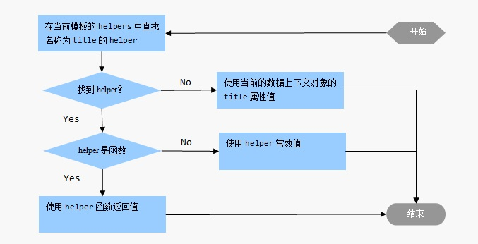

在路径解析时，从第二个标识符开始， *后面* 的标识符将被视为前一个标识符的 *属性* 。
以模板标签 *{{person.name}}* 为例，name将被视为person的属性，因此，这个标签可能会
被转化为以下调用： *person().name* ,  *person().name()* ,  *person.name*  或者
 *person.name()*

 **特殊标识符**

Spacesbars支持在模板标签中使用以下 *特殊标识符* ：


-  *this* 或 *.*  - 表示当前的数据上下文对象。例如下面的两个模板标签都将最终被
替换为当前数据上下文的name属性值： *{{this.name}}* ,  *{{./name}}*
-  *..*  - 表示 *外层/父* 模板的数据上下文对象。例如下面模板标签将最终被
替换为父模板的数据上下文的name属性值： *{{../name}}*


> 执行以下命令复位test应用、删除源文件：


`~/test$ meteor reset↵
~/test$ rm -rf \*↵`

执行以下命令拷贝tpl-path-resovle示例代码、运行并查看运行结果：


`~/test$ cp ~/demos/tpl-path-resolve/* .↵
~/test$ meteor↵`

理解并修改tpl-path-resolve示例代码，通过练习理解模板中的特殊标识符和路径解析过程。


## 4.6 模板事件处理
### 模板事件处理

我们已经了解，可以使用模板实例对象的 *events(eventMap)* 方法为模板声明 *事件
绑定* ：

```javascript
Template.hello.events({
  "click":function(event,tpl){...}
});
```

在事件处理函数体内，可以使用 *this* 访问模板实例对象的数据上下文，使用 *event*
参数获取DOM事件的详细信息，使用 *tpl* 参数操作DOM树。

 **事件处理函数中的this对象**

在事件处理函数体内， *this* 指向当前的 *数据上下文* 对象。例如，对于下面的模板：

```javascript
<template name="hello">
  {{#with name="jOHN" tel="114"}}
  <button>dial</button>
  {{/with}}
</template>
```

可以在button的click事件处理函数中通过 *this* 对象获得数据上下文的 *tel* 属性：

```javascript
Template.hello.events({
  "click button":function(event,tpl){
    var tel = this.tel; //114
    //拨号.....
  }
});
```

 **事件处理函数的tpl参数**

事件处理函数的 *tpl* 参数代表 *模板实例* 对象，可以利用其 *jquery/$* 对象
实现DOM操作。

下面的示例将在用户点击load按钮时，使用从后端载入的数据填充textarea元素：

```javascript
Template.hello.events({
  "click button#load" : function(event,tpl){
    var content;
    //从后端载入数据存入内容...
    tpl.$("textarea").text(content);
  }
});
```

 **事件处理函数的event参数**

事件处理函数的 *event* 参数是一个标准的 *DOM事件* 对象，可以使用event
参数获得事件的详细信息。

下面的示例中，当在用户名输入框中按回车键后，将切换输入焦点到密码输入框：

```javascript
Template.hello.events({
  "keypress input#user":function(event,tpl){
    if(event.keyCode===13) tpl.$("input#pass").focus();
  }
});
```

常见的DOM事件如下：


- click - 点击事件
- dblclick - 双击事件
- focus/blue - 元素在获得/失去焦点时将触发该事件
- change - 元素在状态变化时将触发该事件
- mouseenter/mouseleave - 当鼠标进入/移出元素的边界时触发该事件
- mousedown/mouseup - 按下/松开鼠标键时触发
- keydown/keyup - 按下/松开键盘某键时触发
- keypress - 击键时触发


> 执行以下命令复位test应用、删除源文件：


`~/test$ meteor reset↵
~/test$ rm -rf \*↵`

执行以下命令拷贝tpl-events示例代码、运行并查看运行结果：


`~/test$ cp ~/demos/tpl-events/* .↵
~/test$ meteor↵`

理解并修改tpl-events示例代码，通过练习掌握在Meteor应用中如何为模板中DOM对象
声明事件绑定。


## 4.7 模板逻辑控制 - 条件
### 模板逻辑控制 - 条件

在Spacebars中，可以使用 *if/else* 模板标签，根据指定 *条件* 显示部分HTML片段。

下面的示例根据用户是否登录，分别载入不同的子模板：

```javascript
<template name="main">
  {{#if loggedIn}}
    <div class="portal">...
  {{else}}
    <div class="login">...
  {{/if}}
</template>
```

与之类似的是 *unless/else* 模板标签，它对条件的处理恰好与 *if/else* 模板标签相反，
因此下面的示例实现与上例相同的功能：

```javascript
<template name="main">
  {{#unless loggedIn}}
    <div class="login">...
  {{else}}
    <div class="portal">...
  {{/unless}}
</template>
```


> 执行以下命令复位test应用、删除源文件：


`~/test$ meteor reset↵
~/test$ rm -rf \*↵`

执行以下命令拷贝tpl-if示例代码、运行并查看运行结果：


`~/test$ cp ~/demos/tpl-if/* .↵
~/test$ meteor↵`

理解并修改tpl-if示例代码，通过练习掌握模板标签{{#if}}和{{#unless}}的用法与用途。


## 4.8 模板逻辑控制 - 循环
### 模板逻辑控制 - 循环

很多情况下，模板需要匹配的数据是多个具有相同结构的数据集（比如数组），这时需要
使用Spacebars的 *{{#each}}* 和 *{{/each}}* 模板标签，Meteor将自动为数据集中的每
一个数据，都应用 *{{#each}}* 和 *{{/each}}* 所包含的模板块的内容：

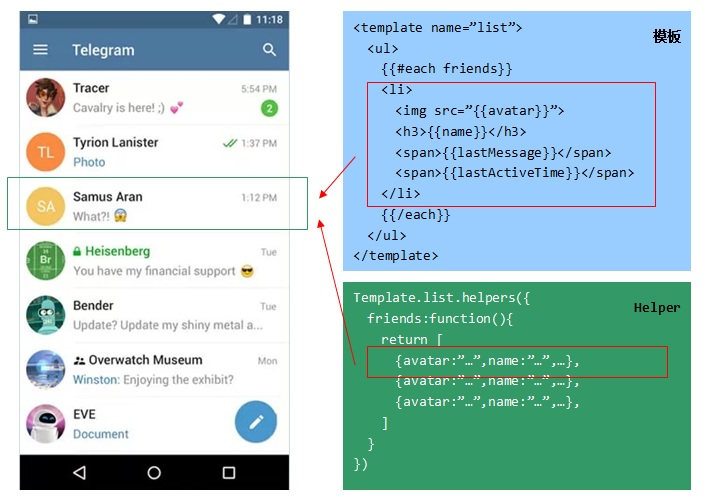

模板标签 *{{#each}}* 的参数用来声明数据集，在上图的示例中，使用了一个helper函数
用来解析参数 *friends* ，这是一个对象数组。Meteor将为数组中的每一个数据应用 *{{#each}}*
和 *{{/each}}* 所包含的模板块，并分别设置其 *数据上下文* 。


> 执行以下命令复位test应用、删除源文件：


`~/test$ meteor reset↵
~/test$ rm -rf \*↵`

执行以下命令拷贝tpl-each示例代码、运行并查看运行结果：

`~/test$ cp ~/demos/tpl-each/* .↵
~/test$ meteor↵`

理解并修改tpl-each示例代码，通过练习掌握模板标签{{#each}}的用法和用途。


## 4.9 动态调用模板
### 动态调用模板

可以使用一个特殊的标记符 *Template.dynamic* 来 *动态* 地调用子模板。下面
的示例使用Template.dynamic来调用hello模板，这等价于 *{{> hello}}* ：

```javascript
{{> Template.dynamic template="hello"}}
```

 **为template参数设置helper函数**

可以给 *template* 关键字参数传入一个helper函数，这样动态调用的感觉会更强烈了：

```javascript
<body>
  {{> Template.dynamic template=tpl}}
<body>
```

对应的helper函数将根据当前的状态返回模版名称：

```javascript
Template.body.helpers({
  tpl:function(){
    return Session.get("state");
  }
});
```

 **使用data参数设置数据上下文 **

可以在动态调用子模板时，使用 *data* 关键字参数传入一个对象作为子模板的数据上下文。
下面的示例为hello子模板设置一个数据上下文：

```javascript
{{> Template.dynamic template="hello" data={name:"j0hntHEripper"}}}
```

当然，你可以使用helper函数来作为data参数的值。


> 执行以下命令复位test应用、删除源文件：


`~/test$ meteor reset↵
~/test$ rm -rf \*↵`

执行以下命令拷贝tpl-dynamic示例代码、运行并查看运行结果：


`~/test$ cp ~/demos/tpl-dynamic/* .↵
~/test$ meteor↵`

理解并修改tpl-dynamic示例代码，通过练习掌握动态模板的用法和用途。


## 4.10 模板中的注释
### 模板中的注释

注释标签 *{{!}}* 用来在Spacebars模板中插入注释。在编译时Meteor将从生成的HTML代码中
清除这些注释。

 **单行注释**

使用 *{{!* 创建单行注释，并使用 *}}* 结束注释：

```javascript
<template name="demo">
  {{! Start of a section}}
  <div class="section">
    ...

</template>
```

 **多行注释**

使用 *{{!--* 创建多行注释，并使用 *--}}* 结束多行注释。在多行注释内可以使用 *{{* 和
 *}}* ：

```javascript
<template name="test">
  {{!-- This is a block comment.
  We can write {{foo}} and it doesn't matter.
  {{#with x}}This code is commented out.{{/with}}
  --}}
</template>
```

 **模板注释标签的位置限制**

需要注意的是，模板注释标签 *只能* 出现在模板定义块内部。因此，下面的使用是错误的：

```javascript
{{! 错误的注释标签位置}}
<template name="demo">...</template>
```


> 执行以下命令复位test应用、删除源文件：


`~/test$ meteor reset↵
~/test$ rm -rf \*↵`

执行以下命令拷贝tpl-comments示例代码、运行并查看运行结果：


`~/test$ cp ~/demos/tpl-comments/* .↵
~/test$ meteor↵`

理解并修改tpl-comments示例代码，通过练习掌握模板标签{{!}}的用法。


## 4.11 模板标签的位置限制
### 模板标签的位置限制

和通常基于HTML *字符串* 的模板系统不同，Spacebars能够 *理解* HTML语法
并且被设计为自动更新DOM。因此，并不能在模板中 *任意放置* 模板标签。
例如，你不能在本该出现 *HTML* 标签名的地方使用模板标签：

```javascript
<!--下面的用法是错误的-->
<template name="wrong">
  <{{tagname}}>...</{{tagname}}>
</template>
```

通常在模板中，模板标签有以下三种用法：

 **元素层级**

例如，一个合法的HTML标签可以出现的位置，就可以使用模板标签：

```javascript
<!--可以理解为模板标签出现在div标签的位置-->
<template name="normal">
  <!--div>...</div-->
  {{> tpl}}
</template>
```

 **属性层级 —— 作为HTML标签属性值**

模板标签可以作为HTML标签的 *属性值* 或属性值的一部分。例如：

```javascript
<template name="attrdemo">
  <div class="basicClass {{extClass}}">...
  <input type="checkbox" checked={{checked}}>
</template>
```

 **属性层级 —— 作为HTML标签属性集**

模板标签也可以作为HTML标签的 *属性集* 。例如：

```javascript
<div {{attrs}}>...
```

这要求标识符 *attrs* 对应的helper应当返回一个JSON对象，以便Spacebars将
键/值对映射为HTML标签的属性。例如，当helper函数返回： *{{class:'ezcls',id:'abc'}}* ，
那么上面的模板将展开为：

```javascript
<div class="ezcls" id="abc">...
```


> 执行以下命令复位test应用、删除源文件：


`~/test$ meteor reset↵
~/test$ rm -rf \*↵`

执行以下命令拷贝tpl-attrs示例代码、运行并查看运行结果：


`~/test$ cp ~/demos/tpl-attrs/* .↵
~/test$ meteor↵`

理解并修改tpl-attrs示例代码，通过练习掌握在模板中模板标签的合法作用点。


# 5 数据存储管理

## 5.1 数据集合 - Collection
### 数据集合 - Collection

在很多应用中，后端都需要使用一个数据库来持久化数据，比如MySQL、MongoDB等。
Meteor使用MongoDB实现数据的持久化，不过有趣的是，Meteor淡化了数据库系统的
存在，它将MongoDB深深的封装起来，仅仅暴露了一个API接口： *Mongo.Collection* 。

事实上，Meteor希望开发者 *忘记* 数据库的存在，它将数据持久化定义为一种 *服务* ，
开发者不需要关心数据表的维护，不需要管理数据库的启动、停止等，只需要 *使用*
就可以了：

```javascript
//创建
var msgs = new Mongo.Collection("messages");
//CRUD
msgs.insert(...);
msgs.update(...);
msgs.remove(...);
msgs.find(...);
```

有趣的是，Meteor在前端和后端定义了相同的 *Collection* 接口对象，这意味着你
仅仅使用一行代码就可以同时在前端和后端定义一对 *同名数据集* 。

 **同名的前端/后端数据集 —— 自动同步**

Meteor这么做是有意义的，默认情况下，在前端和后端的同名数据集 *自动* 保持 *同步* ！
在前端插入的数据，会通过Meteor的 *RPC* 机制插入到后端数据集，而后端数据的变化，
将通过 *pub/sub* 机制自动传播到前端：

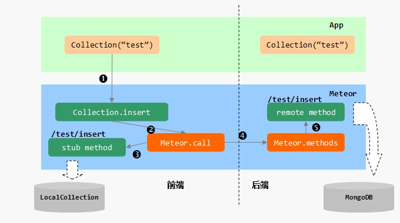

 **手动初始化pub/sub机制**

需要提醒的是，如果在应用配置中移除了对 *autopublish* 包的依赖，那么前端的CRUD操作
还会进入后端，但后端的变化不会将推送给前端。这时需要手工建立pub/sub机制：

```javascript
//前后端创建同名Collection对象
var msgs = new Mongo.Collection("messages");
if(Meteor.isServer){
  //后端发布
  Meteor.publish("ezpub",function(){
    return msgs.find();
  })
}
if(Meteor.isClient){
  //前端订阅
  Meteor.subscribe("ezpub");
}
```


## 5.2 插入文档 - Collection.insert
### 插入文档 - Collection.insert

使用集合对象的 *insert(doc,[callback])* 方法向集合中 *插入* 数据（JSON对象）。下面
的示例创建 *persons* 集合并插入一个新的文档：

```javascript
var demo = new Mongo.Collection("persons");
demo.insert({name:"Jason",age:28});
```

 **使用方法**

 *insert()* 方法的主要参数如下：


- doc - 用来指定作为数据的JSON对象
- callback - 用来指定一个回调函数 *function(error,result){...}* ，当插入完成时
callback参数指定的回调函数将被调用


在 *后端* 调用该方法时，如果不指定 *callback* 参数，将阻塞执行直至插入完成，或者在发生
错误时抛出异常； *前端* 不支持同步阻塞方式的执行，因此如果不设置 *callback* 参数，将
无法捕捉错误和执行结果。

不过，无论是否使用callback参数， *insert()* 方法都将返回新插入文档的 *id* 编号。

 **使用场景**

对于一对前后端的 *同名* 数据集，如果在前端执行的 *insert()* 会自动同步到后端（通过
RPC机制），而后端执行的 *insert()* 会自动同步到前端（通过pub/sub机制）。因此，如果
有多个前端连接到同一个后端，那么在其中任何一个前端执行的插入操作，将实时 *同步* 到
所有的前端和后端。

在下面的聊天室应用中，任何一个前端插入的消息，会实时出现在其他前端：


> 执行以下命令复位test应用、删除源文件：


`~/test$ meteor reset↵
~/test$ rm -rf \*↵`

执行以下命令拷贝col-insert示例代码、运行并查看运行结果：


`~/test$ cp ~/demos/col-insert/* .↵
~/test$ meteor↵`

理解并修改col-insert示例代码，通过练习掌握Collection对象的insert方法在
前端和后端的差异之处。


## 5.3 更新文档 - Collection.update
### 更新文档 - Collection.update

使用集合对象的 *update(selector,modifier,[options],[callback])* 方法更新
集合中 *指定* 的文档。

下面的示例更新persons集合中名为Json的第一个文档记录，设置其积分为100：

```javascript
var demp = new Mongo.Collection("persons");
demo.update({name:"Jason"},{$set:{score:100}})
```

 **使用方法**

 *update()* 方法的参数如下：


- selector - 文档选择符，可以是文档id或合法的MongoDB选择符
- modifier - 文档修改指令对象，update方法将根据这个指令修改匹配的数据
- options - 可选参数是一个JSON对象，影响update操作的行为
- callback - 指定回调函数 *function(error,nums){...}* ，在更新完成后被调用。


在 *后端* 调用该方法时，如果不指定 *callback* 参数，将阻塞执行直至更新完成，或者在发生
错误时抛出异常； *前端* 不支持同步阻塞方式的执行，因此如果不设置 *callback* 参数，将
无法捕捉错误和执行结果。

 **更新所有符合条件的文档**

默认情况下， *update()* 方法仅仅更新匹配选择条件的 *第一个* 文档，通过设置参数 *options*
对象的multi属性为true，可以使 *update()* 方法更新匹配选择条件的 *所有* 文档。
下面的示例可以更新persons集合中名为Json的 *所有* 文档记录，设置其积分为100：

```javascript
var demp = new Mongo.Collection("persons");
demo.update({name:"Jason"},{$set:{score:100},{multi:true}})
```

 **在没有匹配文档时执行插入操作**

默认情况下， *update()* 方法如果找不到匹配选择条件的文档，将不会执行任何修改操作。通过
设置参数 *options* 对象的upsert属性为true，可以使 *update()* 方法在无法找到匹配文档时，
执行插入操作。下面的示例将使用指定的文档更新contacts集合中名为Json的 *第一个* 文档记录，
如果找不到的话就插入指定的文档：

```javascript
var demo = new Mongo.Collection("contacts");
demo.update({name:"Jason"},{name:"Jason",tel:"114"},{upsert:true});
```

 **受信代码与非受信代码**

 *update()* 方法的行为取决于是在受信代码中被调用，还是在非受信代码中被调用。服务端
代码被认为是受信代码，而浏览器中运行的客户端代码被认为是非受信代码。

在受信代码中，可以设置 *options* 参数的 *multi* 属性来一次更新多个文档，然而在非受信
代码中，只可以是使用文档的 *_id* 作为选择符，一次更新一个文档，而且还必须通过应用层
设置的allow和deny规则检查。此外，非受信代码中调用的 *update()* 方法，也不能执行通过
设置 *options* 参数的 *upsert* 属性来执行无匹配时的插入操作 —— 除非在应用中添加了 *insecure* 包。


> 执行以下命令复位test应用、删除源文件：


`~/test$ meteor reset↵
~/test$ rm -rf \*↵`

执行以下方法拷贝col-update示例代码、运行并查看运行结果：


`~/test$ cp ~/demos/col-update/* .↵
~/test$ meteor↵`

理解并修改col-update示例代码，通过练习掌握Collection对象在前端和后端执行
的差异。


## 5.4 删除文档 - Collection.remove
### 删除文档 - Collection.remove

使用集合对象的 *remove(selector,[callback])* 方法删除指定的文档。下面的示例删除
persons集合中所有名为Jason的文档：

```javascript
var demo = new Mongo.Collection("persons");
demo.remove({name:"Jason"});
```

 **使用方法**

 *remove()* 方法的参数如下：


- selector - 文档选择符，可以是文档id或合法的MongoDB选择符
- callback - 指定回调函数 *function(error){...}* ，在更新完成后被调用


在 *后端* 调用该方法时，如果不指定 *callback* 参数，将阻塞执行直至删除完成，或者在发生
错误时抛出异常； *前端* 不支持同步阻塞方式的执行，因此如果不设置 *callback* 参数，将
无法捕捉错误和执行结果。

 **受信代码与非受信代码**

 *remove()* 方法的行为取决于是在受信代码中被调用，还是在非受信代码中被调用。服务端
代码被认为是受信代码，而浏览器中运行的客户端代码被认为是非受信代码。

在受信代码中，可以使用任意MongoDB的选择符实现一次删除多个文档，然而在非受信
代码中，只能使用文档的 *_id* 作为选择符，一次删除一个文档，而且还必须通过应用层
设置的allow和deny规则检查。


> 执行以下命令复位test应用、删除源文件：


`~/test$ meteor reset↵
~/test$ rm -rf \*↵`

执行以下命令拷贝col-remove示例代码、运行并查看运行结果：


`~/test$ cp ~/demos/col-remove/* .↵
~/test$ meteor↵`

理解并修改col-remove示例代码，通过练习掌握Collection对象的remove方法在前端
和后端的使用差异。


## 5.5 查找文档 - Collection.find
### 查找文档 - Collection.find

使用集合对象的 *find([selector],[options])* 方法查找集合中满足 *指定条件* 的文档。
下面的示例查找persons集合中 *所有* 名为Jason的文档：

```javascript
var demo = new Mongo.Collection("persons");
var cursor = demo.find({name:"Jason"});
```

 **使用方法**

 *find()* 方法的参数如下：


-  *selector*  - 指定文档选择符，当不指定该参数或传入空对象 *{}* 时，匹配所有文档
-  *options*  - 查找选项参数，是一个JSON对象，用来定制查找行为，比如排序、限制返回数量、选择字段等。


 *find()* 方法返回一个 *游标/Cursor* 对象，它仅仅 *登记* 了要进行的查询 *上下文* ，并不马上
 *物理地* 访问数据库以返回文档。

默认情况下，前端执行 *find()* 方法返回的 *Cursor* 对象是 *反应式* 对象，这意味着你可以
直接利用它来构造反应式UI。可以设置参数 *options* 的 *reactive* 属性为false，关闭
其 *反应式* 特性。

 **对查询结果进行排序**

默认情况下， *find()* 方法不对返回的结果文档进行排序，可以使用参数 *options* 的 *sort*
属性对结果文档进行排序。下面的示例查询persons集合中的所有文档，并对返回结果按age字段
升序排列：

```javascript
var demo = new Mongo.Collection("persons");
var cursor = demo.find({},{sort:{"age":1}});
```

升序对应数字1，降序对应数字-1

 **跳过指定数量的文档**

当实现一个数据集的分页操作时，通常需要跳过指定数量的文档。设置参数 *options* 的
 *skip* 属性，可以达到这个目的。下面的示例查询persons集合中年龄大于20岁的文档，并
跳过起始部分的100个文档返回剩余结果：

```javascript
var demo = new Mongo.Collection("persons");
var cursor = demo.find({age:{$gt:20}},{skip:100});
```

 **限定返回的文档数量**

当实现一个数据集的分页操作时，也需要限定一次调用返回的文档数量。设置参数 *options*
的 *limit* 属性，可以达到这个目的。下面的示例查询persons集合中年龄大于20岁的文档，
并设置最多返回10个文档：

```javascript
var demo = new Mongo.Collection("persons");
var cursor = demo.find({age:{$gt:20}},{limit:10});
```

 **设定返回文档的结构**

不是每次查询都需要返回文档的全部字段，可以使用参数 *options* 的 *fields* 参数选择
要在结果文档中包含的字段。下面的示例查询persons集合，仅返回每个文档的name和tel
字段：

```javascript
var demo = new Mongo.Collection("persons");
var cursor = demo.find({},{fields:{name:1,tel:1}});
```


> 执行以下命令复位test应用、删除源文件


`~/test$ meteor reset↵
~/test$ rm -rf \*↵`

执行以下命令拷贝col-find示例代码、运行并查看运行结果：


`~/test$ cp ~/demos/col-find/* .↵
~/test$ meteor↵`

理解并修改col-find示例代码，通过练习掌握Collection的find方法在前端
和后端的使用差异。


## 5.6 查询结果 - 游标/Cursor
### 查询结果 - 游标/Cursor

 *游标/Cursor* 对象代表了一个 *查询上下文* ，它只是记录了数据库地址、查询条件、
查询选项等选项，并没有物理地访问数据库。要真正地获取数据，需要使用游标对象
的方法：forEach()、map()或fetch()。

 **游标循环 - Cursor.forEach(callback,[thisArg])**

 *forEach()* 方法用来对游标匹配的文档集中的每一个文档执行
 *callback* 参数指定的 *处理函数* 。下面的示例在终端打印persons集合中所有名为
Jason的文档的电话字段：

```javascript
var demo = new Mongo.Collection("persons");
demo.find({name:"Jason"}).forEach(function(doc){
  console.log(doc.tel);
})
```

参数 *thisArg* 是可选的，用来设置在处理函数中的 *this* 对象。

 ** &equiv;游标映射 - Cursor.map(callback,[thisArg])**

 *map()* 方法将游标匹配的每一个文档对象，通过 *callback* 参数指定的
 *映射函数* 映射为一个新的值，并返回这些新值构成的数组。下面的示例提取
persons集合中所有名为Jason的文档的电话：

```javascript
var demo = new Mongo.Collection("persons");
var tels = demo.find({name:"Jason"}).map(function(doc){
  return doc.tel;
});
```

参数 *thisArg* 是可选的，用来设置在映射函数中的 *this* 对象。

 **游标提取 - Cursor.fetch()**

 *fetch()* 方法提取游标匹配的全部文档，返回这些文档组成的数组：

```javascript
var demo =new Mongo.Collection("persons");
var persons =demo.find().fetch();
```

 **游标计数 - Cursor.count()**

 *count()* 方法返回游标匹配的文档数量。


> 执行以下命令复位test应用、删除源文件：


`~/test$ meteor reset↵
~/test$ rm -rf \*↵`

执行以下命令拷贝col-cursor示例代码、运行并查看运行结果：


`~/test$ cp ~/demos/col-cursor/* .↵
~/test$ meteor↵`

理解并修改col-cursor示例代码，通过练习掌握游标对象的使用方法。

