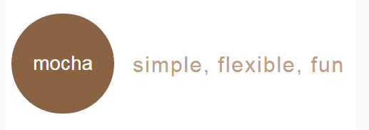

# 1  快速开始

## 1.1  什么是mocha？
### 介绍

mocha 是一个功能丰富的 *javascript测试框架* ，可以运行在nodejs和浏览器环境，使异步测试变得简单有趣。mocha  *串联运行测试* ，允许灵活和精确地报告结果，同时映射未捕获的异常用来纠正测试用例。

支持 *TDD/BDD*  的 开发方式，结合 should.js/expect/chai/better-assert  *断言库* ，能轻松构建各种风格的 *测试用例* 。

### 特点


-  **简单** 
-  **灵活** 
-  **有趣** 


### 安装

通过npm全局安装：
 *npm install -g mocha* 




## 1.2  第一个测试用例
### 第一个测试用例

我们首先来见识一下mocha最基本的测试用例是怎么的结构,如下。

 **测试用例** ：

```javascript
//模块依赖
var assert = require("assert");

//断言条件
describe('Array', function(){
  describe('#indexOf()', function(){
    it('当值不存在时应该返回 -1', function(){
      assert.equal(-1, [1,2,3].indexOf(5));
      assert.equal(-1, [1,2,3].indexOf(0));
    });
  });
});
```

 **示例解析** ：测试用例首先需要引用断言模块，如上文中 *var assert = require('assert');* ，代码  *assert.equal(-1, [1,2,3].indexOf(5));*  中使用的是assert.equal(actual, expected, [message]) 语法。作用等同于使用'=='进行相等判断。 *actual* 为实际值， *expected*  为期望值。 *message* 为返回的信息。

运行 Mocha： *$ mocha* 


> 这节课让我们熟悉一下学习环境中终端的使用方法，以及运行结果的查看。


- 点击<span style="margin:0px 5px;padding:5px;background:#333;color:white;border-radius:3px;">文件管理</span>按钮，鼠标点击project文件夹右键 *创建* 一个新的文件夹 *tests* （点击创建之后，弹出框中的类别选择 **目录** ）
- 然后点击新创建的tests文件夹右键，点击 **创建** 一个test.js文件，然后双击文件。
- 再把上述中的示例写入到我们新创建的test.js文件当中，然后点击> 保存文件。（不建议拷贝）
- 最后在右边linux环境中输入 *cd project/tests* 命令回车，再输入命令 * mocha * , 运行我们的示例。(mocha默认识别test.js文件)


</div>

> PS：为什么要使用assert模块我们将在下节中讲解，至于describe、it 函数我们将在 **第二章mocha接口的方法解析** 中详细讲解。


## 1.3  assert断言
### 断言

断言（assert）指的是对代码 *行为的预期* 。一个测试用例内部，包含 *一个或多个断言* （assert）。

断言会 *返回一个布尔值* ，表示代码行为是否符合预期。测试用例之中，只要有一个断言为false，这个测试用例就会失败，只有所有断言都为true，测试用例才会通过。

比如上节示例中的：

 *assert.equal(-1, [1,2,3].indexOf(5));* 

 *assert.equal(-1, [1,2,3].indexOf(0));* 

 *实际值（-1）* 和 *期望值（[1,2,3].indexOf(5)）* 是一样的，断言为true，所以这个测试用例成功了。

mocha 允许开发者使用 *任意的断言库* ，当这些断言库抛出了一个错误异常时，mocha将会捕获并进行相应处理。这意味着你可以利用如 * should.js断言库* 、 Node.js 常规的 assert 模块或其它类似的断言代码库。以下是众所周知的适用于Node.js或浏览器的断言库：


- should.js
- expect.js
- chai.js
- better-assert
- assert：nodejs原生模块，在前文示例中我们有应用到。


> PS:由于Mocha自身不带断言库，所以我们需要引入一个断言库。本课程中使用的是chai.js，为什么会选这个断言库呢？


## 1.4  chai.js断言库
### 断言库

Chai 是一个非常灵活的断言库，它可以让你使用如下三种主要断言方式的任何一种：

 **assert：** 

这是来自老派测试驱动开发的经典的assert方式。比如：

 *assert.equal(variable, "value");* 

 **expect：** 

这种链式的断言方式在行为驱动开发中最为常见。比如：

 *expect(variable).to.equal("value");* 

 **should：** 

这也是在测试驱动开发中比较常用的方式之一。举例：

 *variable.should.equal("value");* 

> PS:在本课程中我们将使用expect的断言方式。


## 1.5  expect 的语法
### expect 的语法

expect 库应用是 *非常广泛* 的，它拥有很好的链式结构和仿自然语言的方法。通常写同一个断言会有几个方法，比如expect(response).to.be(true) 和 expect(response).equal(true)。以下列举了 expect 常用的主要方法：


-  **ok**  ：检查是否为真
-  **true** ：检查对象是否为真
-  **to.be、to** ：作为连接两个方法的链式方法
-  **not** ：链接一个否定的断言，如 expect(false).not.to.be(true)
-  **a/an** ：检查类型（也适用于数组类型）
-  **include/contain** ：检查数组或字符串是否包含某个元素
-  **below/above** ：检查是否大于或者小于某个限定值


在课程开始讲解什么是mocha的时说：mocha支持 *TDD/BDD*  的 开发方式，结合  *should.js、expect、chai、better-assert*  断言库，能轻松构建各种风格的 *测试用例* 。这里面有两个知识点，一个是断言库，另一个是  *TDD/BDD*  。

断言库我们已经在前文中讲解了，那下一章我们就开始讲解 *TDD/BDD*  。

> PS: 更多的文档可以看 <a href="http://chaijs.com/api/bdd/">http://chaijs.com/api/bdd/</a>


# 2  mocha 接口

## 2.1  BDD 行为驱动开发
### BDD风格

mocha “接口” 系统允许开发者选择自身喜爱的特定领域语言风格, mocha 提供  *TDD* （测试驱动开发）、 *BDD*  (行为驱动开发) 和  *exports*  风格的接口。

BDD是 *“行为驱动的开发”* （Behavior-Driven Development）的简称，指的是写出优秀测试的最佳实践的总称。

BDD认为，不应该针对代码的实现细节写测试，而是要针对行为写测试。BDD测试的是 *行为* ，即软件应该怎样运行。

BDD接口提供以下方法：


-  **describe()** ：测试套件
-  **it()** ：测试用例
-  **before()** ：所有测试用例的统一前置动作
-  **after()** ：所有测试用例的统一后置动作
-  **beforeEach()** ：每个测试用例的前置动作
-  **afterEach()** ：每个测试用例的后置动作


BDD的特征就是使用 *describe()和it()*  这两个方法。我们将在下节中详细讲解

 *before()、after()、beforeEach()和afterEach() * 是为测试做辅助的作用域，它们合起来组成了hook的概念。hook 我们将拿出来在下一章中进行讲解。


## 2.2  方法解析
### descript()和it()

###  **descript() ** 

describe()方法接收两个参数：第一个参数是一个字符串，表示 *测试套件* 的名字或标题，表示将要测试什么。第二个参数是一个函数，用来实现这个 *测试套件* 。

 **上述中引出了一个概念： *测试套件* 。那什么是 *测试套件* 呢？** 

测试套件（test suite）指的是，一组针对软件规格的某个方面的 *测试用例* 。也可以看作，对软件的某个方面的描述（describe）。结构如下：

```javascript
describe("A suite", function() {
  // ...
});
```

###  **it()** 

要想理解it()，首先我们要知道什么是 ** *测试用例* ** ?
测试用例（test case）指的是，针对软件一个功能点的测试，是软件测试的最 *基本单位* 。一组相关的测试用例，构成一个测试套件。

测试用例由it函数构成，它与describe函数一样，接受两个参数：第一个参数是字符串，表示 *测试用例的标题* ；第二个参数是函数，用来实现这个 *测试用例* 。

###  **BDD风格用例** 

```javascript
var expect = require('chai').expect;

describe('Array', function(){
  before(function(){
    console.log('在测试之前运行');
  });

  describe('#indexOf()', function(){
    it('当值不存在时应该返回 -1', function(){
      expect([1,2,3].indexOf(4)).to.equal(-1);
    });
  });
});
```


> 

- 点击<span style="margin:0px 5px;padding:5px;background:#333;color:white;border-radius:3px;">文件管理</span>按钮，点击我们新创建的tests文件夹 **右键** ，再点击 **创建** 一个expect.js文件，然后双击文件。
- 再把上述中的示例写入到我们新创建的expect.js文件当中，然后点击> 保存文件。（不建议拷贝）
- 最后在右边linux环境中输入命令 * mocha expect.js * , 运行我们的示例。


</div>


## 2.3  TDD 测试驱动开发
### TDD风格

TDD（测试驱动开发）组织方式是使用 *测试集（suite）和测试（test）* 。

每个测试集都有 * setup 和 teardown 函数* 。这些方法会在测试集中的测试执行前执行，它们的作用是为了避免代码重复以及最大限度使得测试之间相互独立。

TDD接口：


-  **suite** ：类似BDD中 describe()
-  **test** ：类似BDD中 it()
-  **setup** ：类似BDD中 before()
-  **teardown** ：类似BDD中 after()
-  **suiteSetup** ：类似BDD中 beforeEach()
-  **suiteTeardown** ：类似BDD中 afterEach()


### 示例

```javascript
var assert = require("assert");

suite('Array', function(){
  setup(function(){
    console.log('测试执行前执行');
  });

  suite('#indexOf()', function(){
    test('当值不存在时应该返回 -1', function(){
      assert.equal(-1, [1,2,3].indexOf(4));
    });
  });
});
```

运行mocha：

 *mocha --ui tdd *.js*  (*表示的是文件名)

> PS：mocha 默认是使用 bdd 的接口，所以在这里我们告诉mocha我们用的是tdd.


> 

- 点击<span style="margin:0px 5px;padding:5px;background:#333;color:white;border-radius:3px;">文件管理</span>按钮，点击新创建的tests文件夹 **右键** ，再点击 **创建** 一个tdd.js文件，然后双击文件。
- 再把上述中的示例写入到我们新创建的tdd.js文件当中，然后点击> 保存文件。（不建议拷贝）
- 最后在右边linux环境中输入命令 * mocha --ui tdd tdd.js * , 运行我们的示例。


</div>


## 2.4  exports 风格
### exports

exports类似于nodejs里的 *模块语法* ,关键字 before, after, beforeEach, 和 afterEach 是特殊保留的，值为对象时是一个 *测试套件* ，为函数时则是一个 *测试用例* 。

 **示例如下：** 

```javascript
module.exports = {
  before: function(){
    // ...
  },

  'Array': {
     '#indexOf()': {
        '当值不存在时应该返回 -1': function(){
          expect([1,2,3].indexOf(4)).to.equal(-1);
        }
      }
  }
};
```

 **运行 mocha** 

 *mocha --ui exports *.js* 


## 2.5  总结
### 总结

我们在前文中讲到了  *mocha * 提供 TDD（测试驱动开发）、BDD (行为驱动开发) 和 exports 风格的接口。其实还有 QUnit 和 require 风格的接口。

但是比较常用就是  *BDD 和 TDD* ，mocha 默认的也是BDD，且 BDD 是 TDD 的一个专业版本，它指定了从业务需求的角度出发需要哪些单元测试。所以我们本课程中主要讲解的是 mocha BDD风格的接口。

下一章我们将讲解 BDD 中的  *hook*  。


# 3  hook 机制 和 测试技巧

## 3.1  hook 机制
### hook 机制

hook 就是在测试流程的不同时段触发，比如在整个测试流程之前，或在每个独立测试之前等。

hook也可以理解为是一些逻辑，通常表现为一个函数或者一些声明，当特定的事件触发时 hook 才执行。

提供方法有：before()、beforeEach() after() 和 afterEach()。

 **方法解析** ：


-  **before()** ：所有测试用例的统一前置动作
-  **after()** ：所有测试用例的统一后置动作
-  **beforeEach()** ：每个测试用例的前置动作
-  **afterEach()** ：每个测试用例的后置动作


用法：

```javascript
describe('hooks', function() {
  before(function() {
    //在执行本区块的所有测试之前执行
  });

  after(function() {
    //在执行本区块的所有测试之后执行
  });

  beforeEach(function() {
    //在执行本区块的每个测试之前都执行
  });

  afterEach(function() {
    //在执行本区块的每个测试之后都执行
  });

  //测试用例

});
```


## 3.2  描述 hook
### 描述 hook

所有的 * hook * 都可以加上描述，这样可以更好地定位到测试用例中的错误。如果 * hook * 函数指定了名称，会在没有描述时使用函数名，例如：

```javascript
beforeEach(function() {
  //beforeEach hook
});

beforeEach(function needFun() {
  //beforeEach: namedFun
});

beforeEach('some description', function() {
  //beforeEach:some description
});
```

 **补充** ：上述示例中 注释的内容就是对 hook 的描述。


## 3.3  测试占位
### 测试占位

测试用例占位只要添加一个没有回调的 it() 方法即可：

```javascript
var assert = require('assert');

describe('Array', function() {

  describe('#indexOf()', function() {
    //同步测试
    it('当值不存在时应该返回 -1', function() {
      assert.equal(-1, [1,2,3].indexOf(5));
      assert.equal(-1, [1,2,3].indexOf(0));
    });
  });

  describe('Array', function() {
    describe('#indexOf()', function() {
      //下面是一个挂起的测试
      it('当值不存在时应该返回 -1');
    });
  });
});
```


> 

- 在tests文件夹中创建一个pending.js文件
- 再把上述中的示例写入到我们新创建的pending.js文件当中，然后点击> 保存文件。（不建议拷贝）
- 最后在右边linux环境中输入命令 * mocha pending.js* , 运行我们的示例。（要进入到tests文件夹中在运行命令）


</div>


## 3.4  仅执行指定测试
### 仅执行指定测试

仅执行指定测试的特性可以让你通过添加 .only() 来指定唯一要执行的测试套件或测试用例：

```javascript
describe('Array', function(){
  describe.only('#indexOf()', function(){
    ...
  })
})
```

或一个指定的测试用例：

```javascript
describe('Array', function(){
  describe('#indexOf()', function(){
    it.only('当值不存在时应该返回 -1', function(){

    })

    it('当值不存在时应该返回 -1', function(){

    })
  })
})
```

> PS:注意只能出现一个 .only()


## 3.5  忽略指定测试
### 忽略指定测试

该特性和 .only() 非常相似，通过添加 .skip() 你可以告诉 Mocha 忽略的测试套件或者测试用例（可以有多个）。该操作使得这些操作处于挂起的状态，这比使用注释来的要好，因为你可能会忘记把注释给取消掉。

```javascript
describe('Array', function(){
  describe.skip('#indexOf()', function(){
    ...
  })
})
```

或一个指定的测试用例：

```javascript
describe('Array', function(){
  describe('#indexOf()', function(){
    it.skip('当值不存在时应该返回 -1', function(){

    })

    it('当值不存在时应该返回 -1', function(){

    })
  })
})
```


## 3.6  动态生成测试
### 动态生成测试

由于mocha 可以使用 function.prototype.call 和function 表达式 *定义测试套件和测试用例* ，所以可以动态生成测试用例。

```javascript
var assert = require('assert');

function add() {
  return Array.prototype.slice.call(arguments).reduce(function(prev, curr) {
    return prev + curr;
  }, 0);
}

describe('add()', function() {
  var tests = [
    {args: [1, 2],       expected: 3},
    {args: [1, 2, 3],    expected: 6},
    {args: [1, 2, 3, 4], expected: 10}
  ];

  tests.forEach(function(test) {
    it('correctly adds ' + test.args.length + ' args', function() {
      var res = add.apply(null, test.args);
      assert.equal(res, test.expected);
    });
  });
});
```


> 

- 在tests文件夹中创建一个dynamically.js文件
- 再把上述中的示例写入到我们新创建的dynamically.js文件当中，然后点击> 保存文件。（不建议拷贝）
- 最后在右边linux环境中输入命令 * mocha dynamically.js* , 运行我们的示例。（要进入到tests文件夹中在运行命令）


</div>


# 4 为项目开发一个BDD测试

## 4.1 辅助模块
### 辅助模块

我们进行单元测试，一般都需要组合几个工具来来使用的。下面我们开始介绍：

###  **chai断言库** 

chai 断言库支持BDD 的 expect/should 语法风格 和TDD的 assert 语法风格。（在第一章的中有讲到）

###  **superagent** 

在用Node做Web开发的时候，模拟HTTP请求时必不可少的。这也就引出了superagent这个模块，它是一个模拟http请求的库。它作用是简化发起请求的库。

项目的package.json 代码如下：

```javascript
{
  "name": "mocha-test",
  "version": "0.0.1",
  "private": true,
  "scripts": {
    "start": "node app.js",
    "test": "mocha test"
  },
  "devDependencies": {
    "superagent": "1.4.0",
    "chai": "3.4.0"
  }
}
```


## 4.2 项目描述
### 项目描述

在右边环境中初始化了一个project的文件夹。里面我们安装了chai断言库和superagent模块。现在我们在project文件夹中完成一个小小的nodejs项目。

首先我们创建一个app.js文件。内容如下：

```javascript
var http = require('http'),
    PORT = 3000;

function onRequest(request, response) {
    console.log("Request received.");
    response.writeHead(200, {"Content-Type": "text/plain"});
    response.write("Hello World");
    response.end();
}

var server = http.createServer(onRequest);
server.listen(PORT);
```

描述：为了让项目尽可能的简单，我们没有用到任何的框架。只是创建了一个http服务器监听了80端口。


> 

- 在project文件夹中创建一个app.js文件
- 再把上述中的内容写入到app.js文件中，然后点击> 保存文件。一定要保存！一定要保存！一定要保存！重要的事说要三遍（不建议拷贝）


</div>


## 4.3 项目重构
### 项目重构

我们的app.js需要最外部暴露两个方法。所以要对我们右边的项目进行修改。

需要修改的代码：

```javascript
var server = http.createServer(onRequest);
server.listen(PORT);
```

 **重构为** ：

```javascript
var server = http.createServer(onRequest);
var boot = function () {
    server.listen(PORT, function () {
        console.info('Express server listening on port ' + PORT);
    });
};
var shutdown = function () {
    server.close();
};
if (require.main === module) {
    boot();
} else {
    console.info('Running app as a module');
    exports.boot = boot;
    exports.shutdown = shutdown;
}
```

重构描述：现在我们把启动服务和关闭服务分别进行了封装并且对外进行了暴露。


> 按照上述中的描述改写 app.js 中的代码。
</div>


## 4.4 测试用例
### 测试用例

现在，我们创建一个名字为 tests 的测试文件夹，并创建一个index.js的文件。测试用例前需要启动服务器，结束后关闭服务。这个时候就用到了前面暴露的 * boot() 和 shutdown() * 方法。

示例如下：

```javascript
var boot = require('../app').boot,
    shutdown = require('../app').shutdown,
    request = require('superagent'),
    expect = require('chai').expect;

describe('server', function () {
    before(function () {
        boot();
    });
    describe('index', function () {
        it('should respond to GET', function (done) {
            request
                .get('http://localhost:3000')
                .end(function (err, res) {
                    expect(res.status).to.equal(200);
                    done();
                });
        });
    });
    after(function () {
        shutdown();
    });
});
```

运行命令： *mocha tests* 


> 

- 在tests文件夹中创建一个index.js文件
- 再把上述中的内容写入到index.js文件中，然后点击> 保存文件。一定要保存！一定要保存！一定要保存！重要的事说要三遍（不建议拷贝）
- 最后在linux环境中输入命令： **mocha tests** 。


