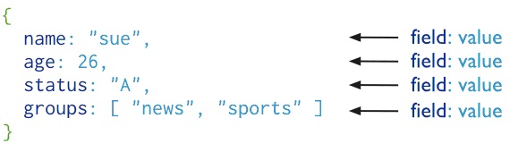
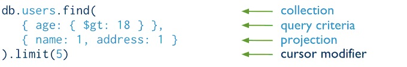
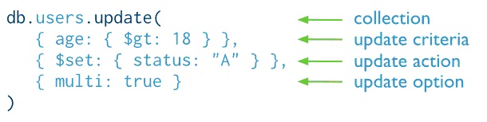
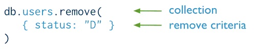
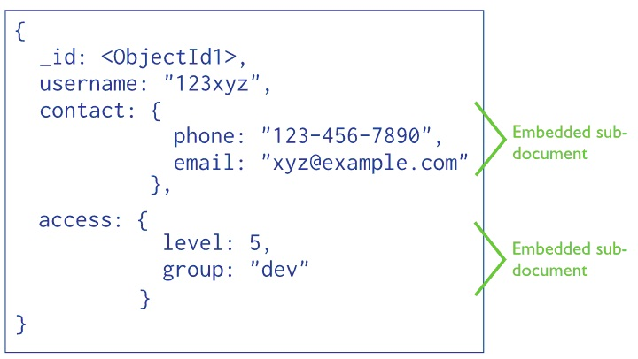

# MongoDB 教程
<!-- TOC  -->

- [MongoDB 教程](#mongodb-教程)
- [1 MongoDB 的简单介绍](#1-mongodb-的简单介绍)
    - [1.1 什么是MongoDB？](#11-什么是mongodb)
    - [1.2 MongoDB 数据之Document和BSON](#12-mongodb-数据之document和bson)
- [2 MongoDB 文档的增删改查](#2-mongodb-文档的增删改查)
    - [2.1 MongoDB 插入文档](#21-mongodb-插入文档)
    - [2.2 MongoDB 批量插入文档](#22-mongodb-批量插入文档)
    - [2.3 MongoDB 查询与投影](#23-mongodb-查询与投影)
    - [2.4 MongoDB 的find()方法](#24-mongodb-的find方法)
    - [2.5 MongoDB 修改文档 - update命令](#25-mongodb-修改文档---update命令)
    - [2.6 MongoDB 修改文档 -  save命令](#26-mongodb-修改文档----save命令)
    - [2.7 MongoDB 删除文档 - remove命令](#27-mongodb-删除文档---remove命令)
- [3 MongoDB 单字段查询](#3-mongodb-单字段查询)
    - [3.1 MongoDB 相等条件](#31-mongodb-相等条件)
    - [3.2 MongoDB 比较条件](#32-mongodb-比较条件)
    - [3.3 MongoDB 数组条件](#33-mongodb-数组条件)
    - [3.4 MongoDB 子文档字段条件](#34-mongodb-子文档字段条件)
- [4 MongoDB 复合查询](#4-mongodb-复合查询)
    - [4.1 MongoDB AND 复合查询](#41-mongodb-and-复合查询)
    - [4.2 MongoDB OR 复合查询](#42-mongodb-or-复合查询)
- [5 MongoDB 游标与结果集](#5-mongodb-游标与结果集)
    - [5.1 MongoDB cursor 游标](#51-mongodb-cursor-游标)
    - [5.2 MongoDB 文档数量 - 结果集](#52-mongodb-文档数量---结果集)
    - [5.3 MongoDB 字段条件 - 结果集](#53-mongodb-字段条件---结果集)

<!-- /TOC  -->

# 1 MongoDB 的简单介绍

## 1.1 什么是MongoDB？
### 简介

MongoDB是一个基于分布式文件存储的数据库，由C++语言编写，旨在为WEB应用提供可扩展的高性能数据存储解决方案。

MongoDB是一个高性能，开源，无模式的文档型数据库，官方给自己的定义是Key-value存储(高性能和高扩展)和传统RDBMS(丰富的查询和功能)之间的一座桥梁。

## 1.2 MongoDB 数据之Document和BSON
### Document和BSON

MongoDB中保存的数据格式为BSON，如：。



MongoDB中数据的基本单元称为文档(Document)，它是MongoDB的核心概念，由多个键极其关联的值有序的放置在一起组成，数据库中它对应于关系型数据库的行。

数据在MongoDB中以BSON（Binary-JSON）文档的格式存储在磁盘上。

BSON（Binary Serialized Document Format）是一种类json的一种二进制形式的存储格式，简称Binary JSON，BSON和JSON一样，支持内嵌的文档对象和数组对象，但是BSON有JSON没有的一些数据类型，如Date和BinData类型。

BSON的优点是灵活性高，但它的缺点是空间利用率不是很理想，BSON有三个特点：轻量性、可遍历性、高效性。

# 2 MongoDB 文档的增删改查

## 2.1 MongoDB 插入文档
### 插入文档

在数据库中，数据插入是最基本的操作，在MongoDB使用db.collection.insert(document)语句来插入文档，如下图：


document是文档数据，collection是存放文档数据的集合。

例如：所有用户的信息存放在users集合中，每个用户的信息为一个user文档，插入数据:

```bash
db.users.insert(user);
```

如果collection存在，document会添加到collection目录下，
如果collection不存在，数据库会先创建collection，然后再保存document。

> 练习一下：把自己的姓名(name)和年龄(age)保存到person集合中！

如果想要查看已插入的person文档，可以使用：db.person.find()查看当前库中person集合里的数据。

如果想要查看当前数据库中的集合列表，可以使用：show collections。

> `db.person.insert({name:'阿牛', age:28});`

## 2.2 MongoDB 批量插入文档
### 批量插入文档

insert语句不但可以插入单个文档，还可以一次性插入多个文档。

插入多个文档时，insert命令的参数为一个数组，数组元素为BSON格式的文档。

多个文档可以放在一个数组内，一次插入多条数据，例如：

```db.users.insert([{name:"tommy"},{name:"xiaoming"}])```

文档批量插入非常方便，但是使用批量插入时也有一些问题需要注意，因为BSON格式的限制，一次插入的数据量不能超过16M，在一个insert命令中插入多条数据时，MongoDB不保证完全成功或完全失败。

> 使用insert命令将以下数据一次性插入person集合中。
<table border="1" width="350px;">
<thead>
<tr><td>name</td><td>age</td><td>status</td></tr>
</thead>
<tbody>
<tr><td>Mary</td><td>21</td><td>A</td></tr>
<tr><td>Lucy</td><td>89</td><td>A</td></tr>
<tr><td>Jacky</td><td>30</td><td>A</td></tr>
</tbody>
</table>

 ```
db.person.insert([
 {name:"Mary",  age:21, status:"A"},
 {name:"Lucy",  age:89, status:"A"},
 {name:"Jacky", age:30, status:"A"}
]);
```

## 2.3 MongoDB 查询与投影
### 查询文档

在MongoDB中，查询指向特定的文档集合，查询设定条件，指明MongoDB需要返回的文档；查询也可以包含一个投影，指定返回的字段。

如下图，在查询过程指定了一个查询条件和一个排序修饰。


在关系型数据库中，投影指的是对列的筛选，类似的，在MongoDB中，投影指的是对出现在结果集中的对象属性的筛选。

## 2.4 MongoDB 的find()方法
### 文档查询 - find方法

MongoDB中查询检索数据时使用find命令，使用方法如下：

- 语法：

```bash
db.collection.find(criteria,projection);
```

- 参数：

criteria – 查询条件，文档类型，可选。

```bash
projection– 返回的字段，文档类型，可选,若需返回所有字段，则忽略此参数。
```

find命令两个可选参数，criteria为查询条件，projection为返回的字段，如果不传入条件数据库会返回该集合的所有文档。

如下图简单示例：



> 请检索出person集合中所有的数据？

> `db.person.find();`

## 2.5 MongoDB 修改文档 - update命令
### update命令

update命令可以更新指定文档的特定字段值，也可以替换整个文档，如果更新操作会增加文档大小，MongoDB将重新分配空间并重新定位。

- 语法：
```sh
db.collection.update(query,update,{upsert:boolean,multi:boolean});
```

- 参数：

query：查询条件，文档，和find中的查询条件写法一致。

```bash
update：修改内容，文档。

upsert(可选)：如果值为true，那么当集合中没有匹配文档时，创建文档。默认false。

multi(可选)：如果值为true，那么将更新全部符合条件的文档，否则仅更新一个文档，默认false。
```

如下示例：将users集合中所有符合条件"age>18"文档的status字段更新为"A"。



> 试一试：请将person集合中所有年龄小于30岁的数据，更新其状态为'X'(提示:小于的操作符是$lt)。

`db.person.update({age:{$lt:30}},{$set:{"status":"X"}},{multi:true});`

## 2.6 MongoDB 修改文档 -  save命令
### save命令

save命令可以更新或插入一个新文档，与update命令不同的是，save只能对一个文档进行操作。

- 语法：

`db.collection.save();`

- 参数：

document：新的文档；

> 考考你：请使用save命令将文档{name:"Tony",age:12,gender:"man"}保存到person集合中。

> `db.person.save({name:"Tony",age:12,gender:"man"});`

## 2.7 MongoDB 删除文档 - remove命令
### remove命令

需要删除文档时使用remove命令，删除文档可以清理掉不需要的数据，释放存储空间，提升检索效率，但是错误的删除会是一场灾难，因此在执行数据删除操作时需要非常的谨慎！

- 语法：

```bash
db.collection.remove(
    query,
    justOne
 )
```

- 参数：

query：BSON类型，删除文档的条件。

```bash
justOne：布尔类型，true：只删除一个文档，false：默认值，删除所有符合条件的文档。
```

下面是一个是将users集合中所有status="D"的文档删除操作，对比一下MongoDB和传统SQL数据库删除的操作，看看有哪些不同之处。

与传统SQL比较 - 删除文档

- MongoDB



- 传统SQL


# 3 MongoDB 单字段查询

## 3.1 MongoDB 相等条件
### 相等条件

相等条件是最简单常用的的查询操作，查询条件是{ field:value }格式的BSON对象。

- 语法：

```bash
{ field: value }
```

- 示例：查询"inventory集合中所有type字段为snacks的文档";

```bash
db.inventory.find({ type: "snacks" })
```

> 试一试：请在终端中输入命令，查找person集合中所有状态（status）为"X"的数据。

> `db.person.find({status:"X"});`

## 3.2 MongoDB 比较条件
### 比较条件

比较条件也是最基本的查询条件之一，通过运算符的比较运算来筛选或排除文档，从而获取到我们想要的文档数据。

- 语法：

```bash
{ field: { op: value }}
```

- 示例：查询"inventory集合中包含quantity字段并且值大于1000的文档"。

```bash
db.inventory.find({ quantity: { $gt: 1000}});
```

相信你已经发现了示例中的$gt是我们之前没有遇见过的字段。

没错！如你所想，$gt就是比较运算符的一种，代表"大于"，下面我们一起来介绍MongoDB中常见的一些运算符：大于($gt)、大于等于($gte)、小于($lt)、小于等于($lte)、不等于($ne)、包含于($in)、不包含于($nin)。

通过MongoDB中提供的丰富运算符，可以帮助你精确的来检索数据，比如数值型的字段可以使用$gt、$gte、$lt、$ne等运算符来比较，数组条件的可以使用$in、$nin来实现。

> 试一试：从person集合中找出所有年龄（age）大于40岁的记录？

> `db.person.find({age:{$gt:40}});`

## 3.3 MongoDB 数组条件
### 数组条件

当字段包含数组，可以进行数组完全匹配或匹配特定的值。

单个元素匹配只需要传入元素的值即可，完全匹配需要传入一个数组，特定元素匹配需要"字段.索引"形式传入参数。

数组完全匹配：

`db.inventory.find( { tags: [ 'fruit', 'food', 'citrus' ] } );`

单个元素匹配：

`db.inventory.find( { tags: 'fruit' } );`

特定元素匹配:

`db.inventory.find( { 'tags.0' : 'fruit' } );`

## 3.4 MongoDB 子文档字段条件
### 子文档条件

查询数据时，我们可能会遇到包含嵌入的子文档数据，如：



如果文档中包含嵌入的子文档，可以使用".key"的方式访问子文档节点，例如：

`db.mycol.find({"access.level":5});`

# 4 MongoDB 复合查询

## 4.1 MongoDB AND 复合查询
### 复合查询 - AND

当查询条件为多个字段时，需要使用多字段复合条件查询，下面我们来学习一下，如何实现多字段复合查询。

在查询条件中指定多个字段条件，检索出所有满足条件的文档数据。

示例：查询inventory集合中type字段为food并且价格低于95的所有文档。

`db.inventory.find({$and:[{type: "food"},{ price: { $lt: 95 }}]});`

> 练习：请查询person集合中年龄(age)大于30岁，并且名字(name)为"Lucy"的数据。

> `db.person.find({$and:[{age:{$gt:30}},{name:"Lucy"}]});`

## 4.2 MongoDB OR 复合查询
### 复合查询 - OR

当有多个查询条件但只需满足其中一个条件就可时，我们就可以使用$or运算符。

$or条件为一个数组类型的值，每个数组元素为一个BSON对象。

示例：inventory集合中检索数量（qty）大于100或者（$or）价格（price）小于9.95的所有数据。

```bash
db.inventory.find( {
                     $or: [
                            { qty: { $gt: 100 } },
                            { price: { $lt: 9.95 } }
                           ]
                    } );
```

<div class='cw-test'>
练习：在person集合中查一下，状态(status)为"A"或年龄(age)为30的数据。

> `db.person.find({$or:[{status:"A"},{age:30}]});`

# 5 MongoDB 游标与结果集

## 5.1 MongoDB cursor 游标
### cursor游标

- 什么是游标(cursor)？

find命令并不直接返回结果，而是返回一个结果集的迭代器，即游标。

- 想要获取数据，我们可以使用next方法来遍历游标，如下：

```bash
var myCursor = db.inventory.find( { type: "food" } );
var myDocument = myCursor.hasNext() ? myCursor.next() : null;

if (myDocument) {
    var myItem = myDocument.item;
    print(tojson(myItem));
}
```

- 使用forEach方法也能实现游标的遍历，如下：

```bash
var myCursor =  db.inventory.find( { type: "food" } );
myCursor.forEach(printjson);
```

## 5.2 MongoDB 文档数量 - 结果集
### 限制条件 - 结果集

很多时候查询返回的结果集并不完全是你想要的，或许你只需要它们中间的一部分，这个时候我们可以通过条件来限制结果集返回的内容。

limit方法：设定返回结果集中的最大文档数量。

- 语法：

`db.collection.find().limit(Num)`

- 参数：

Num:Number类型，大于0。

- 示例：

db.testData.find().limit(3)，返回如下结果：

```bash
{ "_id" : ObjectId("51a7dc7b2cacf40b79990be6"), "x" : 1 }

    { "_id" : ObjectId("51a7dc7b2cacf40b79990be7"), "x" : 2 }

    { "_id" : ObjectId("51a7dc7b2cacf40b79990be8"), "x" : 3 }
```

<div class='cw-test'>
练习一下，查找person集合中的前3个文档。

> `db.person.find().limit(3);`

## 5.3 MongoDB 字段条件 - 结果集
### 限制条件 - 结果集

有的时候只需要返回结果集中的部分字段，这个时候我们可以通过传入字段条件的方式来实现。

- 语法：

`db.collection.find( 查询条件,字体条件 )`

- 参数：

字段条件：JSON对象，格式=>{字段：值},值等于1时表示需要返回,0时表示不需要返回。

- 示例：返回person的"status"和"age"字段。

`db.person.find({}, {status:1,age:1})`

你知道怎么列出person集合中名字(name)吗，试一下？

> `db.person.find({},{name:1});`
