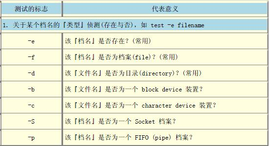
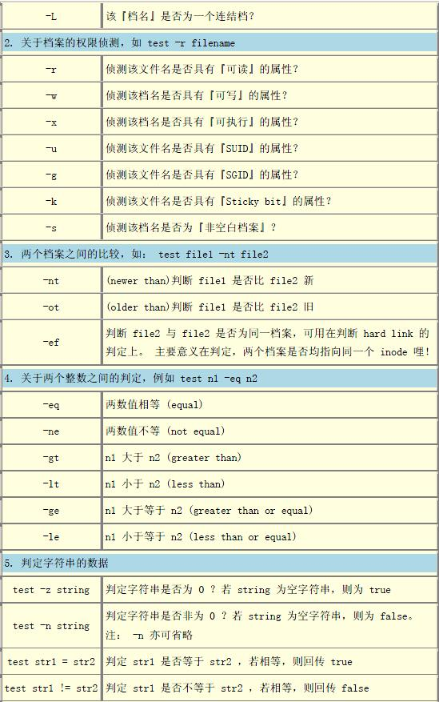
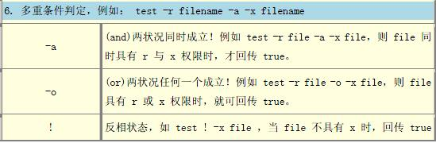

# Linux Shell教程 1

<!-- TOC  -->

- [Linux Shell教程 1](#linux-shell教程-1)
- [1  shell入门](#1--shell入门)
    - [1.1  本课程学习说明](#11--本课程学习说明)
    - [1.2  本课程主要内容](#12--本课程主要内容)
    - [1.3  shell简介](#13--shell简介)
    - [1.4  什么时候使用shell](#14--什么时候使用shell)
    - [1.5  第一个shell脚本](#15--第一个shell脚本)
- [2  Shell变量](#2--shell变量)
    - [2.1  定义变量](#21--定义变量)
    - [2.2  使用变量](#22--使用变量)
    - [2.3  重新定义变量](#23--重新定义变量)
    - [2.4  只读变量](#24--只读变量)
    - [2.5  删除变量](#25--删除变量)
    - [2.6  变量类型](#26--变量类型)
    - [2.7  特殊变量](#27--特殊变量)
- [3 数据类型及表达式](#3-数据类型及表达式)
    - [3.1  字符串](#31--字符串)
    - [3.2  转义字符](#32--转义字符)
    - [3.3  表达式变量替换](#33--表达式变量替换)
    - [3.4  表达式命令替换](#34--表达式命令替换)
    - [3.5  数组的定义](#35--数组的定义)
    - [3.6  数组的读写](#36--数组的读写)
- [4 shell运算符](#4-shell运算符)
    - [4.1  shell运算符介绍](#41--shell运算符介绍)
    - [4.2  算数运算符](#42--算数运算符)
    - [4.3  关系运算符](#43--关系运算符)
    - [4.4  布尔运算符](#44--布尔运算符)
    - [4.5  字符串运算符](#45--字符串运算符)
    - [4.6  文件测试运算符](#46--文件测试运算符)
- [5 条件判断语句](#5-条件判断语句)
    - [5.1  命令执行的判断依据： ; , &amp;&amp;, ||](#51--命令执行的判断依据---ampamp-)
    - [5.2  善用test判断式](#52--善用test判断式)
    - [5.3  if else语句（一）](#53--if-else语句一)
    - [5.4  if else语句（二）](#54--if-else语句二)
    - [5.5  if else语句（三）](#55--if-else语句三)
    - [5.6  if else语句与test结合使用](#56--if-else语句与test结合使用)
    - [5.7  case语句](#57--case语句)
- [6  循环语句](#6--循环语句)
    - [6.1  for循环](#61--for循环)
    - [6.2  while循环](#62--while循环)
    - [6.3  until循环](#63--until循环)
    - [6.4  用break跳出循环](#64--用break跳出循环)
    - [6.5  用continue继续循环](#65--用continue继续循环)
- [7  函数](#7--函数)
    - [7.1  定义及使用函数](#71--定义及使用函数)
    - [7.2  函数返回值](#72--函数返回值)
    - [7.3  函数参数](#73--函数参数)
    - [7.4  函数嵌套](#74--函数嵌套)

<!-- /TOC  -->

# 1  shell入门

## 1.1  本课程学习说明
### 本课程学习说明

本课程主要介绍 ***shell环境的使用*** 以及 ***shell script脚本编程*** 等内容。

Shell本身是一个用C语言编写的程序，它是用户使用Unix/Linux的桥梁，用户的大部分工作都是通过shell完成的。对于用户来说，shell是最重要的实用程序， *深入了解和熟练掌握shell的特性极其使用方法，是用好Unix/Linux系统的关键* 。

学习本课程 ***需要读者对Unix/Linux系统有基本的了解及使用*** ，具体包括：

- 理解Linux系统中文件、文件夹、权限等概念，熟悉一些基本命令如ls、echo等得使用等。
- 熟练掌握vi/vim编辑器的使用，这是shell编程最常使用的编辑器。
- 最好熟悉其它某一门编程语言的语法，如C/C++/Java等，这将有助于理解shell script语法。

如果读者不具备这样的先决条件，建议读者先自学一下Linux系统的基础知识和vim使用，再来学习本课程。但也可以边自学这些知识边学习本课程。

## 1.2  本课程主要内容
### 本课程主要内容

本课程的主要内容为以下几部分：

-  **shell预备知识** ，包括shell介绍，shell script脚本基本语法等；
-  **shell变量、数据类型、表达式、运算符等基础知识** ；
-  **shell script脚本语法详细介绍** ；
-  **shell操作环境** ；
-  **shell管道及重定向** ；
-  **正则表达法与grep、sed、awk工具** 。

由于内容较多，故将教程分成两部分：

- 以上1 2 3条为教程第一部分，为 ***基础篇*** 。
- 其余为第二部分，为 ***进阶篇*** 。

啰嗦了很多，我们赶紧进入正题吧，现在开始学习shell的开心历程吧！！！

## 1.3  shell简介
### shell简介

Shell本身是一个用C语言编写的程序，它是用户使用Unix/Linux的桥梁，用户的大部分工作都是通过Shell完成的。 *Shell既是一种命令语言，又是一种程序设计语言。* 作为命令语言，它交互式地解释和执行用户输入的命令；作为程序设计语言，它定义了各种变量和参数，并提供了许多在高级语言中才具有的控制结构，包括循环和分支。

它虽然不是Unix/Linux系统内核的一部分，但它调用了系统核心的大部分功能来执行程序、建立文件并以并行的方式协调各个程序的运行。因此，对于用户来说，shell是最重要的实用程序，深入了解和熟练掌握shell的特性极其使用方法，是用好Unix/Linux系统的关键。

可以说， **shell使用的熟练程度反映了用户对Unix/Linux使用的熟练程度** 。

 **Shell有两种执行命令的方式** ：

-  ***交互式*** （Interactive）：解释执行用户的命令，用户输入一条命令，Shell就解释执行一条。
-  ***批处理*** （Batch）：用户事先写一个Shell脚本(Script)，其中有很多条命令，让Shell一次把这些命令执行完，而不必一条一条地敲命令。

Shell脚本和编程语言很相似，也有变量和流程控制语句，但Shell脚本是解释执行的，不需要编译，Shell程序从脚本中一行一行读取并执行这些命令，相当于一个用户把脚本中的命令一行一行敲到Shell提示符下执行。

Unix/Linux上常见的Shell脚本解释器有 **bash、sh、csh、ksh等** ，习惯上把它们称作一种Shell。我们常说有多少种Shell，其实说的是 **Shell脚本解释器** 。由于bash是最常见的脚本解释器，如无特殊说明， ***本课程中使用的shell默认都是bash shell*** 。

 **注意** ： *bash是linux标准的默认shell，bash完全兼容sh* ，也就是说，用sh写的脚本可以不加修改的在bash中执行。

## 1.4  什么时候使用shell
### 什么时候使用shell

因为Shell似乎是各UNIX系统之间通用的功能，并且经过了POSIX的标准化。因此，Shell脚本只要“用心写”一次，即可应用到很多系统上。因此，之所以要使用Shell脚本是基于：

-  ***简单性*** ：Shell是一个高级语言；通过它，你可以简洁地表达复杂的操作。
-  ***可移植性*** ：使用POSIX所定义的功能，可以做到脚本无须修改就可在不同的系统上执行。
-  ***开发容易*** ：可以在短时间内完成一个功能强大又实用的脚本。

但是，考虑到Shell脚本的命令限制和效率问题，下列情况 ***一般不使用Shell*** ：

- 资源密集型的任务，尤其在需要考虑效率时（比如，排序，hash等等）。
- 需要处理大任务的数学操作，尤其是浮点运算，精确运算，或者复杂的算术运算（这种情况一般使用C++或FORTRAN 来处理）。
- 有跨平台（操作系统）移植需求（一般使用C 或Java）。
- 复杂的应用，在必须使用结构化编程的时候（需要变量的类型检查，函数原型，等等）。
- 对于影响系统全局性的关键任务应用。
- 对于安全有很高要求的任务，比如你需要一个健壮的系统来防止入侵、破解、恶意破坏等等。
- 项目由连串的依赖的各个部分组成。
- 需要大规模的文件操作。 需要多维数组的支持。
- 需要数据结构的支持，比如链表或数等数据结构。
- 需要产生或操作图形化界面 GUI。
- 需要直接操作系统硬件。
- 需要 I/O 或socket 接口。
- 需要使用库或者遗留下来的老代码的接口。
- 私人的、闭源的应用（shell 脚本把代码就放在文本文件中，全世界都能看到）。

如果你的应用符合上边的任意一条，那么就考虑一下 *更强大的语言吧——或许是Perl、Tcl、Python、Ruby——或者是更高层次的编译语言比如C/C++，或者是Java* 。即使如此，你会发现，使用shell来原型开发你的应用，在开发步骤中也是非常有用的。

## 1.5  第一个shell脚本
### 第一个shell脚本

打开文本编辑器vim，新建一个文件test，扩展名为sh（sh代表shell），全名是 test.sh 。扩展名并不影响脚本执行，见名知意就好，如果你用 php 写shell 脚本，扩展名就用 php 好了。

输入一些代码：

```bash
#!/bin/sh
#echo "123456"
echo "Hello World !"
```

第一行“#!” 是一个约定的标记，它告诉系统这个脚本需要什么 *解释器* 来执行，即使用哪一种Shell。通常 */bin/sh* 是指向 */bin/bash* 的。

但后面的字符  *# 表示注释* ，#后面的内容将被忽略。

echo命令用于向窗口输出文本。

 ***运行Shell脚本有两种方法。***

####  ***作为可执行程序***

将上面的代码保存为test.sh，并 cd 到相应目录：

```bash
$ chmod +x ./test.sh  #使脚本具有执行权限
$ ./test.sh  #执行脚本
Hello World !
```

 *注意，一定要写成./test.sh，而不是test.sh。* 运行其它二进制的程序也一样，直接写test.sh，linux系统会去PATH里寻找有没有叫test.sh的，而只有/bin, /sbin, /usr/bin，/usr/sbin等在PATH里，你的当前目录通常不在PATH里，所以写成test.sh是会找不到命令的，要用./test.sh告诉系统说，就在当前目录找。

通过这种方式运行bash脚本，第一行一定要写对，好让系统查找到正确的解释器。

####  ***作为解释器参数***

这种运行方式是，直接运行解释器，其参数就是shell脚本的文件名，如：

```bash
$ /bin/sh test.sh
$ /bin/php test.php
```

这种方式运行的脚本，不需要在第一行指定解释器信息，写了也没用。

再看一个例子。下面的脚本使用  *read*  命令从 stdin 获取输入并赋值给 PERSON 变量，最后在 stdout 上输出：

```bash
#!/bin/bash
# Author : mozhiyan
# Copyright (c) http://see.xidian.edu.cn/cpp/linux/
# Script follows here:
echo "What is your name?"
read PERSON
echo "Hello, $PERSON"
```

运行脚本：

```bash
$ chmod +x ./test.sh
$ ./test.sh
What is your name?
mozhiyan
Hello, mozhiyan
```

> 编写并运行脚本，实现本小节中第二个例子：用read命令读取名字，并在屏幕中输出欢迎信息。

# 2  Shell变量

## 2.1  定义变量
### 定义变量

Shell支持自定义变量。

定义变量时，变量名不加美元符号（$），如：

```bash
variableName="value"
```

 ***注意，变量名和等号之间不能有空格，这可能和你熟悉的所有编程语言都不一样。*** 同时，变量名的命名须遵循如下规则：

- 首个字符必须为字母（a-z，A-Z）。
- 中间不能有空格，可以使用下划线（_）。
- 不能使用标点符号。
- 不能使用bash里的关键字（可用help命令查看保留关键字）。

变量定义举例：

```bash
$ myUrl="http://see.xidian.edu.cn/cpp/linux/"
$ myNum=100
```

## 2.2  使用变量
### 使用变量

使用一个定义过的变量，只要在变量名前面加美元符号（$）即可，如：

```bash
$ your_name="mozhiyan"
$ echo $your_name
mozhiyan
$ echo ${your_name}
mozhiyan
```

变量名外面的花括号是可选的，加不加都行，加花括号是为了帮助解释器识别变量的边界，比如下面这种情况：

```bash
$ for skill in Ada Coffe Action Java \
do \
    echo "I am good at ${skill}Script" \
done
```

如果不给skill变量加花括号，写成 *echo "I am good at $skillScript"* ，解释器就会把 *$skillScript* 当成一个变量（其值为空），代码执行结果就不是我们期望的样子了。

 ***注：推荐给所有变量加上花括号，这是个好的编程习惯。***

> 定义名字变量name并赋值成一个人名，然后使用echo输出该变量的名字。

## 2.3  重新定义变量
### 重新定义变量

已定义的变量，可以被重新定义，如：

```bash
$ myID="Im a bird"
$ echo ${myID}
$ myID="Im a monkey"
$ echo ${myID}
```

这样写是合法的，但注意，第二次赋值的时候不能写  *$myID="Im a monkey"* ，使用变量的时候才加美元符（$）。

> 对变量myID赋值并打印内容后，重新对变量赋值并打印其内容。

## 2.4  只读变量
### 只读变量

使用 readonly 命令可以将变量定义为只读变量，只读变量的值不能被改变。

下面的例子尝试更改只读变量，结果报错：

```bash
#!/bin/bash
myUrl="http://see.xidian.edu.cn/cpp/shell/"
readonly myUrl
myUrl="http://see.xidian.edu.cn/cpp/danpianji/"
```

运行脚本，结果如下：

```bash
./test.sh: line 7: myUrl: readonly variable
```

> 对myUrl变量赋值后将其设置为只读，然后尝试更改变量内容，查看运行结果。

## 2.5  删除变量
### 删除变量

使用 unset 命令可以删除变量。语法：

```bash
$ unset variable_name
```

变量被删除后不能再次使用；unset 命令不能删除只读变量。

举个例子：

```bash
#!/bin/sh
myUrl="http://see.xidian.edu.cn/cpp/u/xitong/"
unset myUrl
echo $myUrl
```

上面的脚本没有任何输出。

> 将myUrl赋值后，unset该变量，然后对该变量重新赋值，echo该变量查看运行结果。

## 2.6  变量类型
### 变量类型

运行shell时，会同时存在三种变量：

**1) 局部变量**

局部变量在脚本或命令中定义，仅在当前shell实例中有效，其他shell启动的程序不能访问局部变量。

 ***2) 环境变量***

所有的程序，包括shell启动的程序，都能访问环境变量，有些程序需要环境变量来保证其正常运行。必要的时候shell脚本也可以定义环境变量。

 ***3) shell变量***

shell变量是由shell程序设置的特殊变量。shell变量中有一部分是环境变量，有一部分是局部变量，这些变量保证了shell的正常运行

## 2.7  特殊变量
### 特殊变量

前面已经讲到，变量名只能包含数字、字母和下划线，因为某些包含其他字符的变量有特殊含义，这样的变量被称为特殊变量。

#### 特殊变量列表

<table border="1">
<tr>
<th>变量</th>
<th>含义</th>
</tr>
<tr>
<td> $0 </td>
<td> 当前脚本的文件名 </td>
</tr>
<tr>
<td> $n </td>
<td> 传递给脚本或函数的参数。n是一个数字，表示第几个参数。例如，第一个参数是$1，第二个参数是$2。</td>
</tr>
<tr>
<td> $# </td>
<td> 传递给脚本或函数的参数个数。 </td>
</tr>
<tr>
<td> $@ </td>
<td> 传递给脚本或函数的所有参数。</td>
</tr>
<tr>
<td> $* </td>
<td> 传递给脚本或函数的所有参数。被双引号("")包含时，与$@稍有不同。</td>
</tr>
<tr>
<td> $? </td>
<td> 上个命令的退出状态，或函数的返回值。 </td>
</tr>
<tr>
<td> $$ </td>
<td> 当前Shell进程ID。对于 Shell 脚本，就是这些脚本所在的进程ID。 </td>
</tr>
</table>

##### 下面是部分特殊变量的使用范例：

```bash
#!/bin/bash
echo "File Name: $0"
echo "First Parameter : $1"
echo "First Parameter : $2"
echo "Quoted Values: $@"
echo "Quoted Values: $*"
echo "Total Number of Parameters : $#"
```

运行结果：

```bash
$./test.sh Zara Ali
File Name : ./test.sh
First Parameter : Zara
Second Parameter : Ali
Quoted Values: Zara Ali
Quoted Values: Zara Ali
Total Number of Parameters : 2
```

> 将上述范例shell脚本内容在右侧shell环境中输入并执行脚本，查看运行结果是否与范例一致。

# 3 数据类型及表达式

## 3.1  字符串
### 字符串

字符串是shell编程中 *最常用最有用的数据类型* （除了数字和字符串，也没啥其它类型好用了），字符串可以用单引号，也可以用双引号，也可以不用引号。单双引号的区别跟PHP类似。

####  *单引号*

```bash
str='this is a string'
```

单引号字符串的限制：

- 单引号里的任何字符都会原样输出，单引号字符串中的变量是无效的；
- 单引号字串中不能出现单引号（对单引号使用转义符后也不行）。

####  *双引号*

```bash
your_name='qinjx'
str="Hello, I know your are \"$your_name\"! \n"
```

双引号的优点：

- 双引号里可以有变量
- 双引号里可以出现转义字符

####  *拼接字符串*

```bash
your_name="qinjx"
greeting="hello, "$your_name" !"
greeting_1="hello, ${your_name} !"
echo $greeting $greeting_1
```

####  *获取字符串长度*

```bash
string="abcd"
echo ${#string} #输出 4
```

####  *提取子字符串*

```bash
string="alibaba is a great company"
echo ${string:1:4} #输出liba
```

####  *查找子字符串*

```bash
string="alibaba is a great company"
echo `expr index "$string" is`
```

> 将上述4个范例（拼接字符串、获取字符串长度、提取子字符串、查找子字符串）中的至少3个在右侧shell环境中运行并查看结果。

## 3.2  转义字符
### 转义字符

如果表达式中包含特殊字符，Shell 将会进行替换。例如，在双引号中使用变量就是一种替换，转义字符也是一种替换。

举个例子：

```bash
#!/bin/bash
a=10
echo -e "Value of a is $a \n"
```

运行结果：

```bash
Value of a is 10
```

这里 -e 表示对转义字符进行替换。如果不使用 -e 选项，将会原样输出：

```bash
Value of a is 10\n
```

 ***下表的转义字符都可以用在 echo 中*** ：


可以使用 echo 命令的  *-E 选项禁止转义* ，默认也是不转义的；使用  *-n 选项可以禁止插入换行符* 。

> 不带换行的输出字符串"Value of a is $a"（定义a=100），注意与范例不同，需要读者思考如何修改脚本。

## 3.3  表达式变量替换
### 表达式变量替换

变量替换可以根据变量的状态（是否为空、是否定义等）来改变它的值

 ***可以使用的变量替换形式*** ：


请看下面的例子：

```bash
#!/bin/bash

echo ${var:-"Variable is not set"}
echo "1 - Value of var is ${var}"

echo ${var:="Variable is not set"}
echo "2 - Value of var is ${var}"

unset var
echo ${var:+"This is default value"}
echo "3 - Value of var is $var"

var="Prefix"
echo ${var:+"This is default value"}
echo "4 - Value of var is $var"

echo ${var:?"Print this message"}
echo "5 - Value of var is ${var}"
```

运行结果：

```bash
Variable is not set
1 - Value of var is
Variable is not set
2 - Value of var is Variable is not set

3 - Value of var is
This is default value
4 - Value of var is Prefix
Prefix
5 - Value of var is Prefix
```

> 不带换行的输出字符串"Value of a is $a"（定义a=100），注意与范例不同，需要读者思考如何修改脚本。

## 3.4  表达式命令替换
### 表达式命令替换

命令替换是指Shell可以先执行命令，将输出结果暂时保存，在适当的地方输出。

命令替换的语法：

```bash
$(command)
```

或者

```bash
`command`
```

注意是反引号，不是单引号，这个键位于 Esc 键下方。

 ***推荐用$(command)的方式*** ，因为反引号在某些情况下会有问题。

下面的例子中，将命令执行结果保存在变量中：

```bash
#!/bin/bash
DATE=$(date)
echo "Date is $DATE"
USERS=$(who | wc -l)
echo "Logged in user are $USERS"
```

运行结果：

```bash
Date is Thu Jul  2 03:59:57 MST 2015
Logged in user are 1
```

> 在右侧shell环境中编写并执行范例代码，尝试使用两种命令替换方式，查看运行结果是否有区别。

## 3.5  数组的定义
### 数组的定义

Shell在编程方面比Windows批处理强大很多，无论是在循环、运算。

 ***bash支持一维数组*** （不支持多维数组），并且没有限定数组的大小。类似与C语言，数组元素的下标由0开始编号。获取数组中的元素要利用下标，下标可以是整数或算术表达式，其值应大于或等于0。

在Shell中，用括号来表示数组，数组元素用“空格”符号分割开。定义数组的一般形式为：

```bash
array_name=(value1 ... valuen)
```

例如：

```bash
array_name=(value0 value1 value2 value3)
```

或者

```bash
array_name=(
value0
value1
value2
value3
)
```

还可以单独定义数组的各个分量：

```bash
array_name[0]=value0
array_name[1]=value1
array_name[2]=value2
```

可以不使用连续的下标，而且下标的范围没有限制。

## 3.6  数组的读写
### 数组的读写

读取数组元素值的一般格式是：

```bash
${array_name[index]}
```

例如：

```bash
valuen=${array_name[2]}
```

举个例子：

```bash
#!/bin/bash
NAME[0]="Zara"
NAME[1]="Qadir"
NAME[2]="Mahnaz"
NAME[3]="Ayan"
NAME[4]="Daisy"
echo "First Index: ${NAME[0]}"
echo "Second Index: ${NAME[1]}"
```

运行脚本，输出：

```bash
$./test.sh
First Index: Zara
Second Index: Qadir
```

使用@ 或 * 可以获取数组中的所有元素，例如：

```bash
${array_name[*]}
${array_name[@]}
```

> 定义一个包含5个数字的数组（元素为1 2 3 4 5），输出其第3个和第5个元素。然后修改第4个元素为10，输出整个数组。

# 4 shell运算符

## 4.1  shell运算符介绍
### shell运算符介绍

Bash 支持很多运算符，包括 *算数运算符* 、 *关系运算符* 、 *布尔运算符* 、 *字符串运算符* 和 *文件测试运算符* 。

原生bash ***不支持简单的数学运算，但是可以通过其他命令来实现*** ，例如 awk 和 expr，expr 最常用。

expr 是一款表达式计算工具，使用它能完成表达式的求值操作。

例如，两个数相加：

```bash
#!/bin/bash
val=`expr 2 + 2`
echo "Total value : $val"
```

运行脚本输出：

```bash
Total value : 4
```

 ***两点注意*** ：

- 表达式和运算符之间要有 *空格* ，例如  *2+2*  是不对的，必须写成  *2 + 2* ，这与我们熟悉的大多数编程语言不一样。
- 完整的表达式要被  *``*  包含，注意这个字符不是常用的单引号，在  *Esc*  键下边。

> 变量a=125，b=111，计算表达式 a - b 的值。

## 4.2  算数运算符
### 算数运算符

来看一个使用算术运算符的例子：

```bash
#!/bin/sh
a=10
b=20
val=`expr $a + $b`
echo "a + b : $val"
val=`expr $a - $b`
echo "a - b : $val"
val=`expr $a \* $b`
echo "a * b : $val"
val=`expr $b / $a`
echo "b / a : $val"
val=`expr $b % $a`
echo "b % a : $val"
if [ $a == $b ]
then
   echo "a is equal to b"
fi
if [ $a != $b ]
then
   echo "a is not equal to b"
fi
```

运行结果：

```bash
a + b : 30
a - b : -10
a * b : 200
b / a : 2
b % a : 0
a is not equal to b
```

 ***注意*** ：

- 乘号前边必须加反斜杠()才能实现乘法运算；
-  *if...then...fi*  是条件语句，后续将会讲解。
- 条件表达式要放在方括号之间，并且要有空格，例如  *[$a==$b]*  是错误的，必须写成  *[ $a == $b ]* 。

 ***附：算术运算符列表***


> 变量a=125，b=111，分别计算表达式 a + b、a - b、a * b、b / a、b % a 的值。

## 4.3  关系运算符
### 关系运算符

关系运算符只支持数字，不支持字符串，除非字符串的值是数字。

来看一个关系运算符的例子：

```bash
#!/bin/sh
a=10
b=20
if [ $a -eq $b ]
then
   echo "$a -eq $b : a is equal to b"
else
   echo "$a -eq $b: a is not equal to b"
fi
if [ $a -ne $b ]
then
   echo "$a -ne $b: a is not equal to b"
else
   echo "$a -ne $b : a is equal to b"
fi
if [ $a -gt $b ]
then
   echo "$a -gt $b: a is greater than b"
else
   echo "$a -gt $b: a is not greater than b"
fi
if [ $a -lt $b ]
then
   echo "$a -lt $b: a is less than b"
else
   echo "$a -lt $b: a is not less than b"
fi
if [ $a -ge $b ]
then
   echo "$a -ge $b: a is greater or  equal to b"
else
   echo "$a -ge $b: a is not greater or equal to b"
fi
if [ $a -le $b ]
then
   echo "$a -le $b: a is less or  equal to b"
else
   echo "$a -le $b: a is not less or equal to b"
fi
```

运行结果：

```bash
10 -eq 20: a is not equal to b
10 -ne 20: a is not equal to b
10 -gt 20: a is not greater than b
10 -lt 20: a is less than b
10 -ge 20: a is not greater or equal to b
10 -le 20: a is less or  equal to b
```

 ***附：关系运算符列表***


> 变量a=125，b=111，分别计算表达式 a -eq b、a -ne b、a -gt b、a -lt b、a -ge b、a -le b 的值。

## 4.4  布尔运算符
### 布尔运算符

来看一个布尔运算符的例子：

```bash
#!/bin/sh
a=10
b=20
if [ $a != $b ]
then
   echo "$a != $b : a is not equal to b"
else
   echo "$a != $b: a is equal to b"
fi
if [ $a -lt 100 -a $b -gt 15 ]
then
   echo "$a -lt 100 -a $b -gt 15 : returns true"
else
   echo "$a -lt 100 -a $b -gt 15 : returns false"
fi
if [ $a -lt 100 -o $b -gt 100 ]
then
   echo "$a -lt 100 -o $b -gt 100 : returns true"
else
   echo "$a -lt 100 -o $b -gt 100 : returns false"
fi
if [ $a -lt 5 -o $b -gt 100 ]
then
   echo "$a -lt 100 -o $b -gt 100 : returns true"
else
   echo "$a -lt 100 -o $b -gt 100 : returns false"
fi
```

运行结果：

```bash
10 != 20 : a is not equal to b
10 -lt 100 -a 20 -gt 15 : returns true
10 -lt 100 -o 20 -gt 100 : returns true
10 -lt 5 -o 20 -gt 100 : returns false
```

 ***附：布尔运算符列表***


> 修改范例脚本中的变量为a=125，b=111，编写并运行范例脚本。

## 4.5  字符串运算符
### 字符串运算符

来看一个例子：

```bash
#!/bin/sh
a="abc"
b="efg"
if [ $a = $b ]
then
   echo "$a = $b : a is equal to b"
else
   echo "$a = $b: a is not equal to b"
fi
if [ $a != $b ]
then
   echo "$a != $b : a is not equal to b"
else
   echo "$a != $b: a is equal to b"
fi
if [ -z $a ]
then
   echo "-z $a : string length is zero"
else
   echo "-z $a : string length is not zero"
fi
if [ -n $a ]
then
   echo "-n $a : string length is not zero"
else
   echo "-n $a : string length is zero"
fi
if [ $a ]
then
   echo "$a : string is not empty"
else
   echo "$a : string is empty"
fi
```

运行结果：

```bash
abc = efg: a is not equal to b
abc != efg : a is not equal to b
-z abc : string length is not zero
-n abc : string length is not zero
abc : string is not empty
```

 ***附：字符串运算符列表***


> 修改范例脚本中的变量为a="abc"，b="abcd"，编写并运行范例脚本。

## 4.6  文件测试运算符
### 文件测试运算符

文件测试运算符用于检测 Unix 文件的各种属性。

例如，变量 file 表示文件 *“/var/www/tutorialspoint/unix/test.sh”* ，它的大小为100字节，具有 rwx 权限。下面的代码，将检测该文件的各种属性：

```bash
#!/bin/sh
file="/var/www/tutorialspoint/unix/test.sh"
if [ -r $file ]
then
   echo "File has read access"
else
   echo "File does not have read access"
fi
if [ -w $file ]
then
   echo "File has write permission"
else
   echo "File does not have write permission"
fi
if [ -x $file ]
then
   echo "File has execute permission"
else
   echo "File does not have execute permission"
fi
if [ -f $file ]
then
   echo "File is an ordinary file"
else
   echo "This is sepcial file"
fi
if [ -d $file ]
then
   echo "File is a directory"
else
   echo "This is not a directory"
fi
if [ -s $file ]
then
   echo "File size is zero"
else
   echo "File size is not zero"
fi
if [ -e $file ]
then
   echo "File exists"
else
   echo "File does not exist"
fi
```

运行结果：

```bash
File has read access
File has write permission
File has execute permission
File is an ordinary file
This is not a directory
File size is zero
File exists
```

 ***附：文件测试运算符列表***


> 编写并运行范例脚本。

# 5 条件判断语句

## 5.1  命令执行的判断依据： ; , &amp;&amp;, ||
### 命令执行的判断依据： ; , &amp;&amp;, ||

####  *1、无条件继续执行：分号;*

在某些时候，我们希望一次执行多个命令，也就是说， *执行完一条命令后，无条件的执行下一条命令* 。我们可以在指令与指令中间利用分号 (;) 来隔开，这样一来，分号前的指令执行完后， 就会立刻接着执行后面的指令了。

例如关机时，希望我可以先执行两次 sync ，然后才 shutdown 计算机，那么可以这样做：

```bash
$ sync; sync; shutdown -h now
```

####  *2、正确则继续执行：&amp;&amp;*

有时候我们希望上一条命令执行正确才执行下一条命令。我们可以在指令与指令中间利用&amp;&amp;来隔开。

举例来说：我想要在某个目录底下建立一个档案，也就是说，如果该目录存在的话， 那我才建立这个档案，如果不存在，那就算了。我们可以这样实现：

```bash
$ ls /tmp &amp;&amp; touch /tmp/testingagin
```

####  *3、错误则继续执行：||*

有时候我们希望上一条命令执行错误才执行下一条命令。我们可以在指令与指令中间利用 || 来隔开。

举例来说：如果我想要当某个档案不存在时，就去建立那个档案， 否则就略过。我们可以这样实现：

```bash
$ ls /tmp/testingagin || touch /tmp/testingagin
```

> 编写并运行范例脚本。

## 5.2  善用test判断式
### 善用test判断式

在前面的内容中，我们提到过 $? 这个变量所代表的意义， 此外，也透过 &amp;&amp; 及 || 来作为前一个指令是否能够成功进行的一个参考。

那么，如果我想要知道 /test 这个目录是否存在时，难道一定要使用 ls 来执行， 然后再以 $? 来判断执行成果吗？当然不是！我们可以用  *test*  这个指令来侦测呢！

当我要 *检测系统上面某些档案或者是相关的属性* 时，利用 test 这个指令来工作， 真是好用得不得了，举例来说，我要检查 /test是否存在时，使用：

```bash
$ test -e /test
```

 *执行结果并不会显示任何讯息，但最后我们可以透过 $? 或 &amp;&amp; 及 || 来展现整个结果* 。 例如我们在将上面的例子改写成这样：

```bash
$ test -e /test &amp;&amp; echo "exist" || echo "Not exist"
```

最终的结果可以告知我们是 exist 还是 Not exist。

现在我们知道 -e 是测试一个东西在不在， 如果还想要测试一下其它内容，还有哪些标志可以来判断的呢？如下表所示：







> 编写shell脚本，实现这样的功能：检查当前目录是否存在名叫test的文件，如果有则输出exist，没有则创建test文件。

## 5.3  if else语句（一）
### if else语句（一）

if 语句通过关系运算符判断表达式的真假来决定执行哪个分支。Shell 有三种 if ... else 语句：

-  *if ... fi 语句* ；
-  *if ... else ... fi 语句* ；
-  *if ... elif ... else ... fi 语句* 。

####  ***第一种: if ... fi 语句***

if ... else 语句的语法：

```bash
if [ expression ]
then
   Statement(s) to be executed if expression is true
fi
```

如果 expression 返回 true，then 后边的语句将会被执行；如果返回 false，不会执行任何语句。

最后必须以 fi 来结尾闭合 if，fi 就是 if 倒过来拼写，后面也会遇见。

 *注意：expression 和方括号([ ])之间必须有空格，否则会有语法错误。*

####  ***范例1***

```bash
#!/bin/bash
a=10
b=10
if [ $a == $b ]
then
   echo "a is equal to b"
fi
```

运行结果：

```bash
a is equal to b
```

另外，if ... else 语句也可以写成一行， *以命令的方式来运行* ，像这样：

```bash
if test $[2*3] -eq $[1+5]; then echo 'The two numbers are equal!'; fi;
```

> 编写并运行范例脚本。

## 5.4  if else语句（二）
### if else语句（二）

####  ***第二种: if ... else ... fi 语句***

if ... else ... fi 语句的语法：

```bash
if [ expression ]
then
   Statement(s) to be executed if expression is true
else
   Statement(s) to be executed if expression is not true
fi
```

如果 expression 返回 true，那么 then 后边的语句将会被执行；否则，执行 else 后边的语句。

####  ***范例1***

```bash
#!/bin/bash
a=10
b=20
if [ $a == $b ]
then
   echo "a is equal to b"
else
   echo "a is not equal to b"
fi
```

执行结果：

```bash
a is not equal to b
```

> 编写并运行范例脚本。

## 5.5  if else语句（三）
### if else语句（三）

####  ***第三种: if ... elif ... fi 语句***

if ... elif ... fi 语句可以对多个条件进行判断，语法为：

```bash
if [ expression 1 ]
then
   Statement(s) to be executed if expression 1 is true
elif [ expression 2 ]
then
   Statement(s) to be executed if expression 2 is true
elif [ expression 3 ]
then
   Statement(s) to be executed if expression 3 is true
else
   Statement(s) to be executed if no expression is true
fi
```

哪一个 expression 的值为 true，就执行哪个 expression 后面的语句；如果都为 false，那么不执行任何语句。

####  ***范例1***

```bash
#!/bin/bash
a=10
b=20
if [ $a == $b ]
then
   echo "a is equal to b"
elif [ $a -gt $b ]
then
   echo "a is greater than b"
elif [ $a -lt $b ]
then
   echo "a is less than b"
else
   echo "None of the condition met"
fi
```

运行结果：

```bash
a is less than b
```

> 编写并运行范例脚本。

## 5.6  if else语句与test结合使用
### if else语句与test结合使用

if ... else 语句也经常与 test 命令结合使用。

####  ***范例1***

```bash
#!/bin/bash
num1=$[2*3]
num2=$[1+5]
if test $[num1] -eq $[num2]
then
    echo 'The two numbers are equal!'
else
    echo 'The two numbers are not equal!'
fi
```

输出：

```bash
The two numbers are equal!
```

 *注：test 命令用于检查某个条件是否成立，与方括号([ ])类似。*

> 编写并运行范例脚本。

## 5.7  case语句
### case语句

case ... esac 与其他语言中的 switch ... case 语句类似，是一种 *多分支选择结构* 。

 *case 语句匹配一个值或一个模式* ，如果匹配成功，执行相匹配的命令。case语句格式如下：

```bash
case 值 in
模式1)
    command1
    ;;
模式2）
    command2
    ;;
*)
    command3
    ;;
esac
```

case语句取值后面必须为关键字  *in* ，每一模式必须以右括号结束。取值可以为变量或常数。匹配发现取值符合某一模式后，其间所有命令开始执行直至  *;;* 。 *;;*  与其他语言中的 break 类似，意思是跳到整个 case 语句的最后。

 *取值将检测匹配的每一个模式* 。一旦模式匹配，则执行完匹配模式相应命令后不再继续其他模式。如果无一匹配模式，使用星号 * 捕获该值，再执行后面的命令。

####  ***范例1***

下面的脚本提示输入1到4，与每一种模式进行匹配。

```bash
#!/bin/bash
echo 'Input a number between 1 to 4'
echo -n 'Your number is:'
read aNum
case $aNum in
    1)  echo 'You select 1'
    ;;
    2)  echo 'You select 2'
    ;;
    3)  echo 'You select 3'
    ;;
    4)  echo 'You select 4'
    ;;
    *)  echo 'You do not select a number between 1 to 4'
    ;;
esac
```

输入不同的内容，会有不同的结果，例如：

```bash
$ Input a number between 1 to 4
Your number is:3
You select 3
$ Input a number between 1 to 4
Your number is:5
You do not select a number between 1 to 4
```

> 用case语句实现一个计算器，功能是：用户输入运算数和+-*/四则运算符，输出计算结果。

# 6  循环语句

## 6.1  for循环
### for循环

与其他编程语言类似，Shell支持for循环。

for循环一般格式为：

```bash
for 变量 in 列表
do
    command1
    command2
    ...
    commandN
done
```

 *列表是一组值（数字、字符串等）组成的序列，每个值通过空格分隔* 。每循环一次，就将列表中的下一个值赋给变量。

 *in 列表是可选的* ，如果不用它，for 循环使用命令行的位置参数。

####  ***范例1***

顺序输出当前列表中的数字：

```bash
#!/bin/bash
for loop in 1 2 3 4 5
do
    echo "The value is: $loop"
done
```

运行结果：

```bash
The value is: 1
The value is: 2
The value is: 3
The value is: 4
The value is: 5
```

####  ***范例2***

顺序输出字符串中的字符：

```bash
#!/bin/bash
for str in This is a string
do
    echo $str
done
```

运行结果：

```bash
This
is
a
string
```

> 编写shell脚本，倒序输出10-1。

## 6.2  while循环
### while循环

 *while循环用于不断执行一系列命令，也用于从输入文件中读取数据；命令通常为测试条件。* 其格式为：

```bash
while command
do
   Statement(s) to be executed if command is true
done
```

命令执行完毕，控制返回循环顶部，从头开始直至测试条件为假。

####  ***范例1***

以下是一个基本的while循环，测试条件是：如果COUNTER小于5，那么返回 true。COUNTER从0开始，每次循环处理时，COUNTER加1。运行上述脚本，返回数字1到5，然后终止。

```bash
#!/bin/bash
COUNTER=0
while [ $COUNTER -lt 5 ]
do
    COUNTER=`expr $COUNTER + 1`
    echo $COUNTER
done
```

运行脚本，输出：

```bash
1
2
3
4
5
```

####  ***范例2***

 *while循环可用于读取键盘信息* 。下面的例子中，输入信息被设置为变量FILM，按<Ctrl-D>结束循环。

```bash
#!/bin/bash
echo 'type <CTRL-D> to terminate'
echo -n 'enter your most liked film: '
while read FILM
do
    echo "Yeah! great film the $FILM"
done
```

运行脚本，输出类似下面：

```bash
type <CTRL-D> to terminate
enter your most liked film: Sound of Music
Yeah! great film the Sound of Music
```

> 编写并运行两个范例脚本。

## 6.3  until循环
### until循环

until循环执行一系列命令直至条件为true时停止。until循环与while循环在处理方式上刚好相反。一般while循环优于until循环，但在某些时候，也只是极少数情况下，until循环更加有用。

until循环格式为：

```bash
until command
do
   Statement(s) to be executed until command is true
done
```

command一般为条件表达式，如果返回值为false，则继续执行循环体内的语句，否则跳出循环。

####  ***范例1***

使用 until 命令输出 0 ~ 4 的数字：

```bash
#!/bin/bash
a=0
until [ ! $a -lt 5 ]
do
   echo $a
   a=`expr $a + 1`
done
```

运行结果：

```bash
0
1
2
3
4
```

> 用 until 编写shell脚本，实现功能：倒序输出10-1。

## 6.4  用break跳出循环
### 用break跳出循环

在循环过程中， *有时候需要在未达到循环结束条件时强制跳出循环* ，像大多数编程语言一样，Shell也使用break来跳出循环。

break命令允许跳出所有循环（终止执行后面的所有循环）。

####  ***范例1***

下面的例子中， *脚本进入死循环直至用户输入数字大于5* 。要跳出这个循环，返回到shell提示符下，就要使用break命令。

```bash
#!/bin/bash
while :
do
    echo -n "Input a number between 1 to 5: "
    read aNum
    case $aNum in
        1|2|3|4|5) echo "Your number is $aNum!"
        ;;
        *) echo "You do not select a number between 1 to 5, game is over!"
            break
        ;;
    esac
done
```

在嵌套循环中，break 命令后面还可以跟一个整数，表示跳出第几层循环。

####  ***范例2***

下面是一个嵌套循环的例子，如果 var1 等于 2，并且 var2 等于 0，就跳出循环：

```bash
#!/bin/bash
for var1 in 1 2 3
do
   for var2 in 0 5
   do
      if [ $var1 -eq 2 -a $var2 -eq 0 ]
      then
         break 2
      else
         echo "$var1 $var2"
      fi
   done
done
```

如上， *break 2 * 表示直接跳出外层循环。运行结果：

```bash
1 0
1 5
```

> 编写并运行两个范例脚本。

## 6.5  用continue继续循环
### 用continue继续循环

continue命令与break命令类似，只有一点差别，它不会跳出所有循环，仅仅跳出当前循环。

####  ***范例1***

对break的例子进行修改：

```bash
#!/bin/bash
while :
do
    echo -n "Input a number between 1 to 5: "
    read aNum
    case $aNum in
        1|2|3|4|5) echo "Your number is $aNum!"
        ;;
        *) echo "You do not select a number between 1 to 5!"
            continue
            echo "Game is over!"
        ;;
    esac
done
```

运行代码发现，当输入大于5的数字时，该例中的循环不会结束，语句 * echo "Game is over!" * 永远不会被执行。

同样， *continue 后面也可以跟一个数字，表示跳出第几层循环* 。

> 编写并运行两个范例脚本。

# 7  函数

## 7.1  定义及使用函数
### 定义及使用函数

函数可以让我们将一个复杂功能划分成若干模块，让程序结构更加清晰，代码重复利用率更高。像其他编程语言一样，Shell 也支持函数。Shell 函数必须先定义后使用。

Shell 函数的定义格式如下：

```bash
function_name () {
    list of commands
    [ return value ]
}
```

如果你愿意，也可以在函数名前加上关键字 function：

```bash
function function_name () {
    list of commands
    [ return value ]
}
```

####  ***范例1***

下面是一个函数使用的简单例子：

```bash
#!/bin/bash
# Define your function here
Hello () {
   echo "Url is http://www.hubwiz.com"
}
# Invoke your function
Hello
```

运行结果：

```bash
$./test.sh
Url is http://www.hubwiz.com
```

调用函数只需要给出函数名，不需要加括号。

> 使用函数编写shell脚本，实现功能：计算两个数a与b的和。

## 7.2  函数返回值
### 函数返回值

 *函数返回值，可以显式增加return语句；如果不加，会将最后一条命令运行结果作为返回值。*

函数返回值在调用该函数后通过  *$?*  来获得。

####  ***范例1***

来看一个带有return语句的函数：

```bash
#!/bin/bash
funWithReturn(){
    echo "The function is to get the sum of two numbers..."
    echo -n "Input first number: "
    read aNum
    echo -n "Input another number: "
    read anotherNum
    echo "The two numbers are $aNum and $anotherNum !"
    return $(($aNum+$anotherNum))
}
funWithReturn
# Capture value returnd by last command
ret=$?
echo "The sum of two numbers is $ret !"
```

运行结果：

```bash
The function is to get the sum of two numbers...
Input first number: 25
Input another number: 50
The two numbers are 25 and 50 !
The sum of two numbers is 75 !
```

 ***Shell 函数返回值只能是整数*** ，一般用来表示函数执行成功与否，0表示成功，其他值表示失败。如果 return 其他数据，比如一个字符串，往往会得到错误提示： *“numeric argument required”* 。

注：如果 *一定要让函数返回字符串* ，那么可以 *先定义一个变量，用来接收函数的计算结果* ，脚本在需要的时候访问这个变量来获得函数返回值。

> 1、编写并运行范例脚本。

2、编写shell脚本，定义一个函数计算a+b，主程序中输出函数的返回值。

## 7.3  函数参数
### 函数参数

在Shell中，调用函数时可以向其传递参数。在函数体内部，通过 * $n * 的形式来获取参数的值，例如， *$1* 表示第一个参数， *$2* 表示第二个参数...

####  ***范例1***

带参数的函数范例：

```bash
#!/bin/bash
funWithParam(){
    echo "The value of the first parameter is $1 !"
    echo "The value of the second parameter is $2 !"
    echo "The value of the tenth parameter is $10 !"
    echo "The value of the tenth parameter is ${10} !"
    echo "The value of the eleventh parameter is ${11} !"
    echo "The amount of the parameters is $# !"  # 参数个数
    echo "The string of the parameters is $* !"  # 传递给函数的所有参数
}
funWithParam 1 2 3 4 5 6 7 8 9 34 73
```

运行脚本：

```bash
The value of the first parameter is 1 !
The value of the second parameter is 2 !
The value of the tenth parameter is 10 !
The value of the tenth parameter is 34 !
The value of the eleventh parameter is 73 !
The amount of the parameters is 12 !
The string of the parameters is 1 2 3 4 5 6 7 8 9 34 73 !
```

 ***注意，$10 不能获取第十个参数，获取第十个参数需要${10}。当n>=10时，需要使用${n}来获取参数。***

关于特殊变量的介绍请参见 *变量--特殊变量* 一节。

> 主程序输入a和b，使用函数参数的方式传给函数，函数计算a+b并输出结果。

## 7.4  函数嵌套
### 函数嵌套

同其他语言一样，shell函数也支持嵌套使用。

####  ***范例1***

下面来看一个函数嵌套的例子：

```bash
#!/bin/bash
# Calling one function from another
number_one () {
   echo "Url_1 is http://www.baidu.com/cpp/shell/"
   number_two
}
number_two () {
   echo "Url_2 is http://www.baidu.com/cpp/u/xitong/"
}
number_one
```

运行结果：

```bash
Url_1 is http://www.baidu.com/cpp/shell/
Url_2 is http://www.baidu.com/cpp/u/xitong/
```

> 编写并运行范例脚本。
