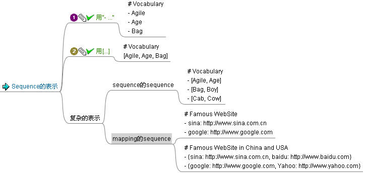

# YAML

<!-- TOC -->

- [YAML](#yaml)
- [1 简介和格式](#1-简介和格式)
    - [1.1 简介](#11-简介)
    - [1.2 多行缩进](#12-多行缩进)
    - [1.3 单行缩写](#13-单行缩写)
    - [1.4 适用场景](#14-适用场景)
- [2 语言比较](#2-语言比较)
    - [2.1 JSON](#21-json)
    - [2.2 XML和SDL](#22-xml和sdl)
    - [2.3 缩排划界](#23-缩排划界)
    - [2.4 非阶层式的资料模型](#24-非阶层式的资料模型)
    - [2.5 实际的考量](#25-实际的考量)
    - [2.6 安全性](#26-安全性)
- [3 语法](#3-语法)
    - [3.1 YAML语法](#31-yaml语法)
    - [3.2 YAML语法示例](#32-yaml语法示例)
    - [3.3 xml和yaml](#33-xml和yaml)
    - [3.4 注释与文档](#34-注释与文档)
    - [3.5 数据结构](#35-数据结构)
- [4 函式库](#4-函式库)
    - [4.1 移植性](#41-移植性)
    - [4.2 常见错误与使用细节](#42-常见错误与使用细节)
    - [4.3 实例](#43-实例)

<!-- /TOC -->

# 1 简介和格式

## 1.1 简介
### 简介

 *YAML* 是“*另一种标记语言*”的外语缩写；它是一种直观的能够被电脑识别的数据序列化格式，是一个可读性高并且容易被人类阅读，容易和脚本语言交互，用来表达资料序列的编程语言。

它是类似于标准通用标记语言的子集 *XML* 的数据描述语言，语法比 *XML* 简单很多。

#### 诞生

 *YAML* 参考了其他多种语言，包括： *XML* 、 *C语言* 、 *Python* 、 *Perl* 以及电子邮件格式 *RFC2822* 。
 *Clark Evans* 在2001年5月在首次发表了这种语言，另外 *Ingy döt Net* 与 *Oren Ben-Kiki* 也是这语言的共同设计者。

#### 命名

 *YAML* 是" *YAML Ain't a Markup Language* "（ *YAML* 不是一种置标语言）的递归缩写。
在开发的这种语言时， *YAML*  的意思其实是：" *Yet Another Markup Language* "（仍是一种置标语言），

#### 功能


-  *YAML* 的语法和其他高阶语言类似，并且可以简单表达清单、散列表，标量等资料形态。
- 它使用空白符号缩排和大量依赖外观的特色，特别适合用来表达或编辑数据结构、各种设定档、倾印除错内容、文件大纲（例如：许多电子邮件标题格式和YAML非常接近）。
- 尽管它比较适合用来表达阶层式（ *hierarchical model* ）的数据结构，不过也有精致的语法可以表示关联性（ *relational model* ）的资料。
- 由于YAML使用空白字符和分行来分隔资料，使的他特别适合用 *grep* 、 *Python* 、 *Perl* 、 *Ruby* 操作。
- 其让人最容易上手的特色是巧妙避开各种封闭符号，如： *引号* 、 *各种括号* 等，这些符号在嵌套结构中会变得复杂而难以辨认。


## 1.2 多行缩进
### 多行缩进

数据结构可以用类似大纲的缩排方式呈现，结构通过缩进来表示，连续的项目通过减号“ *-* ”来表示，map结构里面的 *key/value* 对用冒号“ *:* ”来分隔。样例如下：

```yaml
house:
  family:
    name: Doe
    parents:
      - John
      - Jane
    children:
      - Paul
      - Mark
      - Simone
  address:
    number: 34
    street: Main Street
    city: Nowheretown
    zipcode: 12345
```

注意：


- 字串不一定要用双引号标识；
- 在缩排中空白字符的数目并不是非常重要，只要相同阶层的元素左侧对齐就可以了（**不能使用 TAB** 字符）；
- 允许在文件中加入选择性的空行，以增加可读性；
- 在一个档案中，可同时包含多个文件，并用“ *——* ”分隔；
- 选择性的符号“ *...* ”可以用来表示档案结尾（在利用串流的通讯中，这非常有用，可以在不关闭串流的情况下，发送结束讯号）。


## 1.3 单行缩写
### 单行缩写

 *YAML* 也有用来描述好几行相同结构的数据的缩写语法，数组用' *[]* '包括起来，hash用' *{}* '来包括。

因此，上面的这个YAML能够缩写成这样:

```yaml
house:
  family: { name: Doe, parents: [John, Jane], children: [Paul, Mark, Simone] }
  address: { number: 34, street: Main Street, city: Nowheretown, zipcode: 12345 }
```


## 1.4 适用场景
### 适用场景

#### 脚本语言

由于实现简单，解析成本很低， *YAML* 特别适合在脚本语言中使用。列一下现有的语言实现： *Ruby* ， *Java* ， *Perl* ， *Python* ， *PHP* ， *OCaml* ， *JavaScript* ，除了 *Java* ，其他都是脚本语言。

#### 序列化

 *YAML* 比较适合做序列化。因为它是 *宿主语言* 数据类型直转的。

#### 配置文件

 *YAML* 做配置文件也不错。写 *YAML* 要比写 *XML* 快得多(无需关注标签或引号)，并且比 *ini* 文档功能更强。
比如 *Ruby on Rails* 的配置就选用的 *YAML* 。对 *ROR* 而言，这很自然，也很省事.
由于兼容性问题，不同语言间的数据流转建议不要用 *YAML* .

#### 附加YAML库到浏览器

```yaml
<script src="/scripts/js-yaml.min.js"></script>
<script type="text/javascript">
var doc = jsyaml.load('greeting: hello\nname: world');
</script>
```


# 2 语言比较

## 2.1 JSON
### JSON

虽然 *YAML* 是参考 *JSON* ， *XML* 和 *SDL* 等语言，不过跟这些语言比起来， *YAML* 仍有自己的特色。

#### JSON

　　 *JSON* 的语法是 *YAML1.2* 版的子集，同时非常接近 *YAML1.0与1.1* 版的子集，因此大部分的 *JSON* 文件都可以被 *YAML* 的剖析器剖析。这是因为 *JSON* 的语法结构和 *YAML* 的内置格式相同。虽然大范围的分层也可以使用类似 *JSON* 的内置格式，不过这并YAML标准并不建议这样使用，除非这样编写能让文件可读性增加。

 *YAML* 的许多扩展在 *JSON* 是找不到的，如：进阶资料形态、关系锚点、字串不需要双引号、映射资料形态会储存键值的顺序。


## 2.2 XML和SDL
### XML和SDL

XML和SDL标签概念，在YAML中是找不到的。对于数据结构序列（尽管这是有争议的），标签属性的特色就是可以将资料及复杂资料附加资讯分离，并将各种原生数据结构（如：杂凑表、阵列）用同一种语言表示。

 *YAML* 则以资料的可扩展性作为替代。（包括为了模拟物件的类别型态）在YAML本身的规范中，并没有类似XML的语言定义文件纲要（ *language-defined document schema descriptors* ）──例如验证自己本身的结构是否正确的文件。不过，YAML纲要描述语言（ *YAML schema descriptor language* ）是存在的。另外还有YAXML──用XML描述YAML的结构──可以让 *XML Schema* 与 *XSLT* 转换程式应用在 *YAML* 之上。况且，在一般使用的情况下， *YAML* 丰富的定义型态之语法已经提供了足够的方式来辨认YAML文件是否正确。


## 2.3 缩排划界
### 缩排划界

由于YAML的运作主要依赖大纲式的缩排来决定结构，这有效解决了界定符冲突（Delimiter collision）的问题。YAML的资料形态不依赖引号之特点，使的YAML文件可以利用区块，轻易的插入各种其他类型文件，如： *XML* 、 *SDL* 、 *JSON* ，甚至插入另一篇 *YAML* 。

```yaml
# example

# Collection Types ##########

# http://yaml.org/type/map.html --#

map:
  # Unordered set of key: value pairs.
  Block style: !!map
    Clark : Evans
    Ingy  : döt Net
    Oren  : Ben-Kiki
  Flow style: !!map { Clark: Evans, Ingy: döt Net, Oren: Ben-Kiki }

# http://yaml.org/type/omap.html -#

omap:
  # Explicitly typed ordered map (dictionary).
  Bestiary: !!omap
    - aardvark: African pig-like ant eater. Ugly.
    - anteater: South-American ant eater. Two species.
    - anaconda: South-American constrictor snake. Scaly.
    # Etc.
  # Flow style
  Numbers: !!omap [ one: 1, two: 2, three : 3 ]
```

相反的，要将YAML置入XML或SDL中时，需要将所有空白字符和位势符号（ *potential sigils* ，如： *<* , *>* 和 *&amp;* ）转换成实体语法；要将YAML置入 *JSON* 中，需要用引号框住，并转换内部的所有引号。


## 2.4 非阶层式的资料模型
### 非阶层式的资料模型

跟 *SDL* 、 *JSON* 等，每个子结点只能有单一一个父节点的阶层式模型不同，YAML提供了一个简单的关系体制，可以从树状结构的其他地方，重复相同的资料，而不必显示那些冗余的结构。

这点和 *XML* 中的 *IDRef* 类似，YAML剖析器在将YAML转换成物件时，会自动将那些参考资料的结构展开，所以程式在使用时并不会查觉到哪些资料是解码自这种结构。XML则不会将这种结构展开。这种表示法可以增加程式的可读性，并且，在那种“大部分参数维持和上次相同，只有少数改变”的设定档及通讯协定中，可以减少数据输入错误。一个例子是：“送货地点”和“购买地点”在发票的纪录中几乎都是相同的资料。


## 2.5 实际的考量
### 实际的考量

YAML是“行导向的”，因此，就算想由现有程序的混乱输出，转换成YAML格式，并保留大部分的原始文件之外观，也非常简单。因为他不需要平衡封闭的标签、括号及引号，可以从很简单的利用程式，从报表产生YAML。同样，空格分隔可让使用行导向的命令如： *grep* 、 *Awk* 、 *perl* 、 *ruby* ，和 *Python* ，来应急性的过滤YAML文件时更加方便。

特别是与标记语言不同的，连续的YAML区块导向往往是格式良好的YAML文件本身。这使得很容易撰写那种“在开始提取的具体记录之前，不需要‘读取全部文件内容’”的解析器（通常需要平衡起始和关闭标签、寻找引号和跳脱字符）。当处理一个单一静态的，整个存在内存中的数据结构将很大，或为提取一个项目来重建的整个结构，代价相当昂贵的记录档，这种特性是相当方便的。

值得讨论的是，尽管它的缩排方式似乎复杂化了深度很大的巢状层次，YAML将缩排视为一个单一的空白，这可能会取得比其他标记语言更好的压缩比。此外，极深的缩排可以完全避免的是：


- 使用“内置格式”（即简称类 *JSON* 格式）而无缩排；
- 使用关联锚点展开阶层以形成一个摊平的格式，使得YAML解析器能透明地重组成完整的数据结构。


## 2.6 安全性
### 安全性

YAML是纯粹用来表达资料的语言，所以内部不会存代码注入的可执行命令。这代表剖析器会相当（至少）安全的解析文件，而不用担心潜在与执行命令相关的安全漏洞。举例来说，JSON是JavaScript的子集，使用JavaScript本身的剖析器是相当诱人的，不过也造成许多代码注入的漏洞。虽然在所有资料序列语言中，安全解析本质上是可能的，但可执行性却正是这样一个恶名昭彰的缺陷；而YAML缺乏相关的命令语言，可能相对安全。

#### 资料处理和呈现

XML和YAML规范提供非常不同的逻辑模型来进行资料结点的展现、处理及储存。


# 3 语法

## 3.1 YAML语法
### YAML语法


- YAML使用可打印的Unicode字符，可使用 *UTF-8* 或 *UTF-16*
- 使用 **空白字符** （不能使用> Tab）分层，同层元素左侧对齐
- 单行注解由井字号（>  # ）开始，可以出现在行中任何位置
- 每个清单成员以单行表示，并用短杠+空白（> -  ）起始
- 每个杂凑表的成员用冒号+空白（> :  ）分开键和值
- 杂凑表的键值可以用问号 (> ?)起始，表示多个词汇组成的键值
- 字串一般不使用引号，但必要的时候可以用引号框住
- 使用双引号表示字串时，可用倒斜线（> \）进行特殊字符转义
- 区块的字串用缩排和修饰词（非必要）来和其他资料分隔，有新行保留（使用符号> |）或新行折叠（使用符号> >）两种方式
- 在单一档案中，可用连续三个连字号（> ）区分多个档案
- 可选择性的连续三个点号（> ...）用来表示档案结尾(在流式传输时非常有用，不需要关闭流即可知道到达结尾处)
- 重复的内容可使从参考标记星号 (> *)复制到锚点标记（> &amp;）
- 指定格式可以使用两个惊叹号 ( !! )，后面接上名称


## 3.2 YAML语法示例
### YAML语法示例

```yaml
receipt:     Oz-Ware Purchase Invoice
date:        2015-12-15
customer:
    given:   Dorothy
    family:  Gale
items:
    - part_no:   A4786
      descrip:   Water Bucket (Filled)
      price:     1.47
      quantity:  4
    - part_no:   E1628
      descrip:   High Heeled "Ruby" Slippers
      price:     100.27
      quantity:  1
bill-to:  &amp;id001
    street: |
            123 Tornado Alley
            Suite 16
    city:   East Westville
    state:  KS
ship-to:  *id001
specialDelivery:  >
    Follow the Yellow Brick
    Road to the Emerald City.
    Pay no attention to the
    man behind the curtain.
...
```

这个文件的的顶层由七个键值组成：其中一个键值" *items* "，是个两个元素构成的清单，清单中的两个元素同时也是包含了四个键值的杂凑表。
文件中重复的部分处理方式：使用锚点（ *&amp;* ）和参考（ *** ）标签将" *bill-to* "杂凑表的内容复制到" *ship-to* "杂凑表。也可以在文件中加入选择性的空行，以增加可读性。


## 3.3 xml和yaml
### xml和yaml语法格式

对比一下下面的xml和yaml的代码块：

#### xml代码块:

```yaml
<site>
    <name>hubwiz</name>
    <url>www.hubwiz.com</url>
</site>
```

#### YAML代码块

```yaml
# example

site:
    name: hubwiz
    url : www.hubwiz.com
```

或：

```yaml
# example

site: {name: hubwiz, url: www.hubwiz.com}
```

 *YAML* 利用缩进或者是 *explicit indicatior* （如上面的 *{}* ）来表示属性的嵌套，更为直观和 *simple* 。


## 3.4 注释与文档
### 注释与文档

注释：是 *#* 号， 完整是： *# Comment Example*


举个例子：

```yaml
# Comment Example
# Profile Of Mary
Mary:
    - name: Mary
    - age  : 19   # age property
```

#### 文档

既然YAML定义是data serialization，暂时把一个doucment视为一个object序列化后得到的yaml配置信息

```yaml
# documents example

Mary:
    - name: Mary
    - age  : 19   # age property
```

文档之间用**作为间隔。


## 3.5 数据结构
### 数据结构

YAML的设计者认为在配置文件中所要表达的数据内容有三种类型：标量(Scalar，如字符串和整数等)、序列（Sequence，如数组）和Mapping（类似hash的key/value pair）。

sequence型主要是用来表示数组类型的数据。下图描述了YAML中Sequence型数据的表示法：



mapping数据类型主要用来表示key: value对类型的数据。YAML描述方式见下图：


# 4 函式库

## 4.1 移植性
### 移植性

简单的YAML档案（例如：简单的键值对）不需要完整的YAML剖析器，便可以被RegEx解析。许多常用的编程语言──纯用某个语言，让函式库具有可携性──都有的YAML的产生器和剖析器。当效能比较重要时，也有许多和C语言绑定的函式库可使用。

#### JavaScript

原生的JavaScript即可产生YAML，但不能剖析。

 **YAML JavaScript**


## 4.2 常见错误与使用细节
### 常见错误与使用细节


- 编辑器


建议使用能将跳格字符自动转换成空白字符的编辑器，并且使用定宽度的字型。

编辑器要能正确的处理UTF-8和UTF16编码（或是使用纯ASCII编码──它同时是UTF-8的子集）。


- 字串


 *YAML* 的字串不需使用引号，这可以增加可读性，并避免巢状的跳脱字符。然而，这有时也会导致错误，例如，字串本身是一个暧昧的字眼（像数字或布林值）；或在短句中意外的出现YAML的结构符号（常见的例子是由惊叹号起始的句子，或是包含冒号-空白的句子："!Caca de vaca!"、"Caution: lions ahead"）。这在发布YAML档案时并不造成困扰，但在制作小型指令码和人工编辑档案时，这问题还蛮常出现的。比较好的方法是善用区块符号（" *|* " or " *>* "）而不要使用单行字串，来避免这种暧昧的表达示。


## 4.3 实例
### 实例

我们用YAML来描述一本书《单元测试知道-javascript版》

```yaml
# 《单元测试之道-javascript版》描述
  # begin of document
书名  : '单元测试之道-javascript版'
出版社: '汇智网出版社'
原作者: ['match', 'cigarette']
译者  :
    - 老王
     - 小小
前二章节  :
    - 第一章: 序言
    - 第二章: 你的首个单元测试计划

#end of document
```

注意： *YAML* 推荐使用 *空格* 作为缩进，避免了在不同编辑器中对 *tab* 的表示形式不同而可能产生误解。


