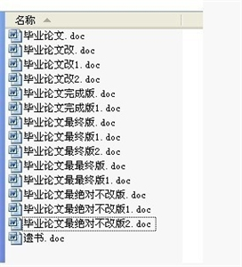
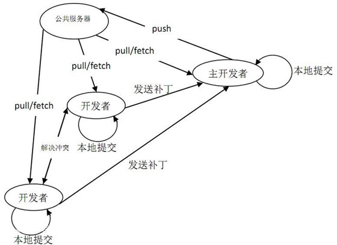
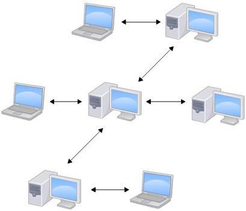
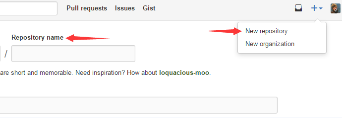
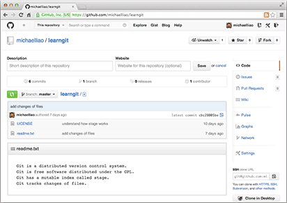
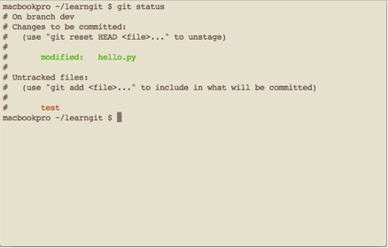

<!-- TOC  -->

- [1 Git简介](#1-git简介)
    - [1.1 Git的诞生](#11-git的诞生)
    - [1.2 Git介绍](#12-git介绍)
    - [1.3 Git特点](#13-git特点)
    - [1.4 集中式](#14-集中式)
    - [1.5 分布式](#15-分布式)
    - [1.6 Git安装](#16-git安装)
- [2 创建版本库](#2-创建版本库)
    - [2.1 什么是版本库？](#21-什么是版本库)
    - [2.2 添加文件](#22-添加文件)
    - [2.3 提交文件](#23-提交文件)
    - [2.4 小结](#24-小结)
- [3 操作Git](#3-操作git)
    - [3.1 status命令与diff命令](#31-status命令与diff命令)
    - [3.2 版本回退 git reset](#32-版本回退-git-reset)
    - [3.3 重新恢复到新版本](#33-重新恢复到新版本)
    - [3.4 git reflog命令查看自己都干了些啥](#34-git-reflog命令查看自己都干了些啥)
    - [3.5 工作区 workArea](#35-工作区-workarea)
    - [3.6 暂存区 stage](#36-暂存区-stage)
    - [3.7 暂存区实践](#37-暂存区实践)
    - [3.8 管理修改 git add](#38-管理修改-git-add)
    - [3.9 撤销修改 git checkout](#39-撤销修改-git-checkout)
    - [3.10 删除文件 git rm](#310-删除文件-git-rm)
- [4 远程仓库](#4-远程仓库)
    - [4.1 远程仓库简介](#41-远程仓库简介)
    - [4.2 GitHub创建新仓库](#42-github创建新仓库)
    - [4.3 本地库推送到远程库 git push](#43-本地库推送到远程库-git-push)
    - [4.4 SSH警告](#44-ssh警告)
    - [4.5 从远程库克隆 git clone](#45-从远程库克隆-git-clone)
- [5 分支管理 master](#5-分支管理-master)
    - [5.1 分支管理图文详解一 master](#51-分支管理图文详解一-master)
    - [5.2 分支管理图文详解二](#52-分支管理图文详解二)
    - [5.3 创建分支 branch](#53-创建分支-branch)
    - [5.4 合并分支 merge](#54-合并分支-merge)
    - [5.5 删除分支 git branch -d](#55-删除分支-git-branch--d)
    - [5.6 产生冲突](#56-产生冲突)
    - [5.7 解决冲突](#57-解决冲突)
    - [5.8 Bug分支](#58-bug分支)
    - [5.9 Feature分支](#59-feature分支)
    - [5.10 推送分支](#510-推送分支)
    - [5.11 多人协作 git push](#511-多人协作-git-push)
- [6 标签管理](#6-标签管理)
    - [6.1 标签的简介](#61-标签的简介)
    - [6.2 创建标签 git tag](#62-创建标签-git-tag)
    - [6.3 操作标签  git tag -d](#63-操作标签--git-tag--d)
    - [6.4 GitHub的使用](#64-github的使用)
- [7 自定义Git](#7-自定义git)
    - [7.1 自定义Git介绍 git config](#71-自定义git介绍-git-config)
    - [7.2 忽略特殊文件.gitignore](#72-忽略特殊文件gitignore)
    - [7.3 配置别名 alias.](#73-配置别名-alias)
    - [7.4 配置文件 cat .git/config](#74-配置文件-cat-gitconfig)
    - [7.5 搭建Git服务器](#75-搭建git服务器)
    - [7.6 管理公钥和权限 authorized_keys/Gitolite](#76-管理公钥和权限-authorized_keysgitolite)

<!-- /TOC  -->

# 1 Git简介

## 1.1 Git的诞生
### Git的简史

　　同生活中的许多伟大事物一样，*Git* 诞生于一个极富纷争大举创新的年代。

　　*Linux* 内核开源项目有着为数众广的参与者。 绝大多数的 *Linux* 内核维护工作都花在了提交补丁和保存归档的繁琐事务上（1991－2002年间）。 到 2002 年，整个项目组开始启用一个专有的分布式版本控制系统 *BitKeeper* 来管理和维护代码。

　　到了 2005 年，开发 *BitKeeper* 的商业公司同 *Linux* 内核开源社区的合作关系结束，他们收回了 *Linux* 内核社区免费使用 *BitKeeper* 的权力。 这就迫使 *Linux* 开源社区（特别是 *Linux* 的缔造者 *Linux Torvalds*）基于使用 *BitKcheper* 时的经验教训，开发出自己的版本系统。 他们对新的系统制订了若干目标：

- 速度
- 简单的设计
- 对非线性开发模式的强力支持（允许成千上万个并行开发的分支）
- 完全分布式

　　有能力高效管理类似 *Linux* 内核一样的超大规模项目（速度和数据量）

　　自诞生于 2005 年以来，*Git* 日臻成熟完善，在高度易用的同时，仍然保留着初期设定的目标。 它的速度飞快，极其适合管理大项目，有着令人难以置信的非线性分支管理系统。

　　**Git**迅速成为最流行的分布式版本控制系统，尤其是2008年，*GitHub*网站上线了，它为开源项目免费提供Git存储，无数开源项目开始迁移至GitHub，包括jQuery，PHP，Ruby等等。

## 1.2 Git介绍
### Git是什么？

　　**Git**是一款免费、开源的分布式版本控制系统，用于敏捷高效地处理任何或小或大的项目。

　　**Git**是一个开源的分布式版本控制系统，用以有效、高速的处理从很小到非常大的项目版本管理。**Git** 是 *Linus Torvalds* 为了帮助管理 *Linux* 内核开发而开发的一个开放源码的版本控制软件。

　　最原始的版本控制是纯手工的版本控制：修改文件，保存文件副本。有时候偷懒省事，保存副本时命名比较随意，时间长了就不知道哪个是新的，哪个是老的了，即使知道新旧，可能也不知道每个版本是什么内容，相对上一版作了什么修改了，当几个版本过去后，很可能就是下面的样子了：



## 1.3 Git特点
### Git特点

　　分布式相比于集中式的最大区别在于开发者可以提交到本地，每个开发者通过克隆（*git clone*），在本地机器上拷贝一个完整的*Git*仓库。

- **直接记录快照，而非差异比较** ： *Git* 更像是把变化的文件作快照后，记录在一个微型的文件系统中。
- **近乎所有操作都是本地执行** ：在 *Git* 中的绝大多数操作都只需要访问本地文件和资源，不用连网。
- **时刻保持数据完整性** ：在保存到 *Git* 之前，所有数据都要进行内容的校验和（*checksum*）计算，并将此结果作为数据的唯一标识和索引。
- **多数操作仅添加数据** ：常用的 *Git* 操作大多仅仅是把数据添加到数据库。

开发流程示意图：



## 1.4 集中式
### 集中版本控制

　　CVS及SVN都是集中式的版本控制系统，而*Git*是分布式版本控制系统。

　　集中式版本控制系统，版本库是集中存放在*中央服务器*的，一起工作的人需要用自己的电脑从服务器上同步更新或上传自己的修改。


　　但是，所有的版本数据都存在服务器上，用户的本地设备就只有自己以前所同步的版本，如果不连网的话，用户就看不到历史版本，也无法切换版本验证问题，或在不同分支工作。。

　　而且，所有数据都保存在单一的服务器上，有很大的风险这个服务器会损坏，这样就会丢失所有的数据，当然可以定期备份。

## 1.5 分布式
### 分布式版本控制

　　那分布式版本控制系统与集中式版本控制系统有何不同呢？

  　分布式版本控制系统根本没有*“中央服务器”*，每个人的电脑上都是一个完整的版本库，不需要联网就可以工作。既然每个人电脑上都有一个完整的版本库，那多个人如何协作呢？比方说你和同事在各自电脑修改相同文件，这时，你们俩之间只需把各自的修改推送给对方，就可以互相看到对方的修改了。

　　分布式版本控制系统的安全性要高很多，因为每个人电脑里都有完整的版本库。大家之间可以相互复制。

　　分布式版本控制系统通常也有一台充当*“中央服务器”*的电脑，但这个服务器的作用仅仅是用来方便“交换”大家的修改，没有它大家也一样干活，只是交换修改不方便而已。



## 1.6 Git安装
### 安装Git

　　最早*Git*是在*Linux*上开发的，很长一段时间内，Git也只能在Linux和Unix系统上跑。不过，慢慢地有人把它移植到了Windows上。现在，Git可以在Linux、Unix、Mac和Windows这几大平台上正常运行了。

　　在Linux上安装Git

　　首先，你可以试着输入*git*，看看系统有没有安装*Git*：

```bash
$ git
```

　　像上面的命令，有很多*Linux*会友好地告诉你*Git*没有安装，还会告诉你如何安装*Git*。

　　如果你碰巧用*Debian*或*Ubuntu Linux*，通过一条*sudo apt-get install git*就可以直接完成*Git*的安装，非常简单。如果想查看是否安装成功，通过*git --version*。

　　如果是其他Linux版本，可以直接通过源码安装。先从Git官网下载源码，然后解压，依次输入：*./config*，*make*，*sudo make install*这几个命令安装就好了。

安装完成后，还需要最后一步设置，在命令行输入：

```bash
$ git config --global user.name "Your Name"
$ git config --global user.email "email@example.com"
```

因为*Git*是分布式版本控制系统，所以每个机器都必须自报家门：你的名字和Email地址。

注意*git config*命令的*--global*参数，用了这个参数，表示你这台机器上所有的Git仓库都会使用这个配置，当然也可以对某个仓库指定不同的用户名和Email地址。在此课程中，我们配置的环境中*Git*已安装好，我们课程提供也是在*Linux*系统中命令进行操作。

# 2 创建版本库

## 2.1 什么是版本库？
### 什么是版本库？

　　版本库又名仓库，英文名*repository*，你可以简单理解成一个目录，这个目录里面的所有文件都可以被*Git*管理起来，每个文件的修改、删除，*Git*都能跟踪，以便任何时刻都可以追踪历史，或者在将来某个时刻可以“还原”。

　　所以，创建一个版本库非常简单，首先，选择一个合适的地方，创建一个空目录：

```bash
$ mkdir learngit
$ cd learngit
$ pwd
/home/hubwiz/learngit
```

　　*pwd*命令用于显示当前目录。在环境中这个仓库位于*/home/hubwiz/learngit*。

　　通过*git init*命令把这个目录变成Git可以管理的仓库：

```bash
$ git init
Initialized empty Git repository in /home/hubwiz/learngit/.git/
```

　　瞬间*Git*就把仓库建好了，而且告诉你是一个空的仓库（empty Git repository），细心的读者可以发现当前目录下多了一个.git的目录，这个目录是Git来跟踪管理版本库的，没事千万不要手动修改这个目录里面的文件，不然改乱了，就把Git仓库给破坏了。

　　如果你没有看到*.git*目录，那是因为这个目录默认是隐藏的，用*ls -ah*命令就可以看见。

## 2.2 添加文件
### 添加文件

　　我们了解下版本控制系统，其实只能跟踪文本文件的改动，比如*TXT文件*，*网页*，所有的*程序代码*等等，*Git*也不例外。版本控制系统可以告诉你每次的改动，比如在第5行加了一个单词*“Linux”*，在第8行删了一个单词*“Windows”*。而图片、视频这些二进制文件，虽然也能由版本控制系统理，但没法跟踪文件的变化，只能把二进制文件每次改动串起来，也就是只知道图片从100KB改成了120KB，但到底改了啥，版本控制系统不知道，也没法知道。

为了简明起见，我们创建一个*readme.txt*作为练习：

```bash
echo "Git is a version control system." > readme.txt
// 输入这句话保存到创建的readme.txt文件中
echo " Git is free software." >> readme.txt
// 输入此内容追加到readme.txt中
```

一定要放到*learngit*目录下（子目录也行），因为这是一个*Git*仓库，放到其他地方Git再厉害也找不到这个文件。

用命令*git add*告诉Git，把文件添加到仓库：

```bash
$ git add readme.txt
```

*git add* 实际上是个脚本命令，没有任何显示，说明添加成功。

## 2.3 提交文件
### 提交文件

用命令*git commit*告诉*Git*，把文件提交到仓库：

```bash
$ git commit -m "wrote a readme file"
[master (root-commit) cb926e7] wrote a readme file
1 file changed, 2 insertions(+)
create mode 100644 readme.txt
```

　　简单解释一下*git commit*命令，*-m*后面输入的是本次提交的说明，可以输入任意内容，当然最好是有意义的，这样你就能从历史记录里方便地找到改动记录。

　　*git commit*命令执行成功后会告诉你，1个文件被改动（我们新添加的*readme.txt*文件），插入了两行内容（*readme.txt*有两行内容）。

　　为什么*Git*添加文件需要*add*，*commit*一共两步呢？因为*commit*可以一次提交很多文件，所以你可以多次*add*不同的文件，比如：

```bash
$ git add file1.txt
$ git add file2.txt file3.txt
$ git commit -m "add 3 files."
```

## 2.4 小结
### 小结

此节知识点我们所学习的内容：

初始化一个**Git**仓库，使用*git init*命令。

添加文件到**Git**仓库，分两步：

- 第一步，使用命令*git add <file>*，注意，可反复多次使用，添加多个文件；
- 第二步，使用命令*git commit*，完成。

# 3 操作Git

## 3.1 status命令与diff命令
### status命令与diff命令

　　前面我们已经成功地添加并提交了一个*readme.txt*文件，修改*readme.txt*如下：

```bash
echo "Git is a distributed version control system. " > readme.txt
echo "Git is free software." >> readme.txt
```

　　运行*git status*命令看看结果：

```bash
$ git status
...
no changes added to commit (use "git add" and/or "git commit -a")
```

　　*git status*命令可以让我们时刻掌握仓库当前的状态，上面显示，*readme.txt*被修改过了，但还没有准备提交的修改。

　　*git diff*这个命令看看：

```bash
$ git diff readme.txt
...
-Git is version control system.
+Git is a distributed version control system.
Git is free software
```

　　*git diff*顾名思义就是查看*difference*，显示的格式正是*Unix*通用的*diff*格式，可以从上面的命令输出看到，我们在第一行添加了一个*“distributed”*单词。

　　*readme.txt*作了什么修改后，再把它提交到仓库，提交修改和提交新文件是一样的两步，*git add*和*git commit*：

```bash
$ git add readme.txt
$ git commit -m "add distributed"
```

注意

- 要随时掌握工作区的状态，使用*git status*命令。
- 如果*git status*告诉你有文件被修改过，用*git diff*可以查看修改内容。

## 3.2 版本回退 git reset
### 版本回退

　　现在，再练习一次，修改readme.txt文件如下：

```bash
echo "Git is a distributed version control system." > readme.txt
echo "Git is free software distributed under the GPL." >> readme.txt
```

　　我们再次提交一次readme.txt

```bash
$ git add readme.txt
$ git commit -m "append GPL"
```

　　我们现在已经提交多次文件，想看看有那些？版本控制系统肯定有某个命令可以告诉我们历史记录，在Git中，我们用*git log*命令查看：

```bash
$ git log
commit 3628164fb26d48395383f8f31179f24e0882e1e0
Date:   Tue Aug 25 15:11:49 2015 +0000
append GPL
commit ea34578d5496d7dd233c827ed32a8cd576c5ee85
Date:   Tue Aug 25 14:53:12 2015 +0000
add distributed
commit cb926e7ea50ad11b8f9e909c05226233bf755030
Date:   Mon Aug 24 17:51:55 2015 +0000
wrote a readme file
```

　　*git log*命令显示从最近到最远的提交日志，我们可以看到3次提交，最近的一次是*append GPL*，上一次是*add distributed*，最早的一次是*wrote a readme file*。commit 36281****2e1e0是*commit id*（*版本号*）。如果嫌输出信息太多，可以使用*$ git log --pretty=oneline*，此时你看到的一大串类似3628164...882e1e0的是commit id（版本号）。

　　每提交一个新版本，实际上Git就会把它们自动串成一条时间线。现在准备把*readme.txt*回退到上一个版本，也就是*“add distributed”*的那个版本，怎么做呢？

　　首先，*Git*必须知道当前版本是哪个版本，在Git中，用*HEAD*表示当前版本，也就是最新的提交3628164...882e1e0（注意我的提交ID和你的肯定不一样），上一个版本就是*HEAD^*，上上一个版本就是*HEAD^^*，当然往上100个版本写100个*^*比较容易数不过来，所以写成*HEAD~100*。

　　现在，我们要把当前版本“append GPL”回退到上一个版本“add distributed”，就可以使用*git reset*命令：

```bash
$ git reset --hard HEAD^
HEAD is now at ea34578 add distributed
```

## 3.3 重新恢复到新版本
### 重新恢复到新版本

　　接着上节版本回退，还可以继续回退到上一个版本*wrote a readme file*，不过我们现在看看版本库的状态*git log*：

```bash
$ git log
```

　　最新的那个版本*append GPL*已经看不到了！好比你从21世纪坐时光穿梭机来到了19世纪，想再回去已经回不去了，肿么办？

　　只要右侧环境还在，就可以找到那个*append GPL*的*commit id*是*3628164...*，于是就可以指定回到未来的某个版本：

```bash
$ git reset --hard 3628164
HEAD is now at 3628164 append GPL
```

　　版本号没必要写全，前几位就可以了，Git会自动去找。当然也不能只写前一两位，因为Git可能会找到多个版本号，就无法确定是哪一个了。

　　可以查看readme.txt的内容*$ cat readme.txt*.

　　Git的版本回退速度非常快，因为Git在内部有个指向当前版本的*HEAD*指针，当你回退版本的时候，Git仅仅是把HEAD从指向*append GPL*：


　　改为指向*add distributed*：


## 3.4 git reflog命令查看自己都干了些啥
### git reflog命令

　　现在，你回退到了某个版本，当想恢复到新版本怎么办？找不到新版本的commit id怎么办？

　　在**Git**中可以放心下。当你用*$ git reset --hard HEAD^*回退到*add distributed*版本时，再想恢复到*append GPL*，就必须找到*append GPL*的*commit id*。**Git**提供了一个命令*git reflog*用来记录你的每一次命令：

```bash
$ git reflog
ea34578 HEAD@{0}: reset: moving to HEAD^
3628164 HEAD@{1}: commit: append GPL
ea34578 HEAD@{2}: commit: add distributed
cb926e7 HEAD@{3}: commit (initial): wrote a readme file
```

　　这样可以看到，第二行显示*append GPL*的commit id是3628164，这样我们就可以重新找到了。

　　注意，我们从这两节中可以了解到：

- *HEAD*指向的版本就是当前版本，因此，*Git*允许我们在版本的历史之间穿梭，使用命令_git reset --hard commit*id*。
- 穿梭前，用*git log*可以查看提交历史，以便确定要回退到哪个版本。
- 要重返未来，用*git reflog*查看命令历史，以便确定要回到未来的哪个版本。

## 3.5 工作区 workArea
### 基本概念

**工作区**：就是你在电脑里能看到的目录,*learngit*文件夹就是一个工作区，比如我们环境中当前的目录。


## 3.6 暂存区 stage
### 基本概念

**版本库**:工作区有一个隐藏目录.git 这个不算工作区，而是Git的版本库。

**暂存区**：英文叫*stage*,或*index*。一般存放在*git* 目录下的index文件(*.git/index*)中，所以我们把暂存区时也叫作索引(index).

Git的版本库里存了很多东西，其中最重要的就是称为*stage*（或者叫*index*）的暂存区，还有Git为我们自动创建的第一个分支*master*，以及指向*master*的一个指针叫*HEAD*。


我们把文件往Git版本库里添加的时候，是分两步执行的：

- 第一步是用*git add*把文件添加进去，实际上就是把文件修改添加到暂存区；
- 第二步是用*git commit*提交更改，实际上就是把暂存区的所有内容提交到当前分支。

因为我们创建Git版本库时，Git自动为我们创建了唯一一个*master*分支，所以现在*git commit*就是往*master*分支上提交更改。

你可以简单理解为，需要提交的文件修改通通放到*暂存区*，然后一次性提交暂存区的所有修改。

## 3.7 暂存区实践
### 实践理解暂存区

现在我们对*readme.txt*做个修改，比如追加一行内容：

```bash
echo "Git has a mutable index called stage." >> readme.txt
```

然后，在工作区新增一个LICENSE文本文件

```bash
echo "LICENSE is a new file." > LICENSE
```

用*git status*查看一下状态，*Git*显示结果，*readme.txt*被修改了，而*LICENSE*还从来没有被添加过，所以它的状态是*Untracked*。

现在，使用两次命令*git add*，把*readme.txt*和*LICENSE*都添加后，用*git status*再查看一下，通过图可以理解为


所以，*git add*命令实际上就是把要提交的所有修改放到暂存区（*Stage*），然后，执行*git commit*就可以一次性把暂存区的所有修改提交到分支。

```bash
$ git commit -m "understand how stage works"
```

一旦提交后，如果你又没有对工作区做任何修改，用*git status*查看下，没有任何内容，现在版本库变成了这样，暂存区就没有任何内容了：


## 3.8 管理修改 git add
### 管理修改

　　Git与其他版本控制系统相比，*Git*跟踪并管理的是修改，而非文件。

　　为什么说*Git*管理的是修改，而不是文件。接下来做测试，我们对*readme.txt*修改，追加一行内容：

```bash
echo "Git tracks changes." >> readme.txt
```

　　然后通过*git add*添加

```bash
$ git add readme.txt
$ git status
```

　　接下来，我们再次修改readme.txt内容，把最后一行内容修改为：

```bash
Git tracks changes of files.
```

　　*git commit*提交

```bash
$ git commit -m "git tracks changes"
[master d4f25b6] git tracks changes
1 file changed, 1 insertion(+)
```

　　通过*git status*查看每次操作的状态，可以看出第二次修改 -> *git commit*，没有被提交。

　　Git管理的是修改，当你用*git add*命令后，在工作区的第一次修改被放入暂存区，准备提交，但是，在工作区的第二次修改并没有放入暂存区，所以，*git commit*只负责把暂存区的修改提交了，也就是第一次的修改被提交了，第二次的修改不会被提交。

Git是如何跟踪修改的，每次修改，如果不*add*到暂存区，那就不会加入到*commit*中。

## 3.9 撤销修改 git checkout
### 撤销修改

如果你在readme.txt中加入了一行文件，又感觉不好，你可以删除新加的，恢复到原来的。

Git会告诉你，*git checkout -- file*可以丢弃工作区的修改：

```bash
$ git checkout -- readme.txt
```

命令*git checkout -- readme.txt*意思就是，把*readme.txt*文件在工作区的修改全部撤销，这里有两种情况：

- 一种是readme.txt自修改后还没有被放到暂存区，现在，撤销修改就回到和版本库一模一样的状态；
- 一种是readme.txt已经添加到暂存区后，又作了修改，现在，撤销修改就回到添加到暂存区后的状态。

总之，就是让这个文件回到最近一次*git commit*或*git add*时的状态。

现在，看看readme.txt的文件内容：

```bash
$ cat readme.txt
Git is a distributed version control system.
Git is free software distributed under the GPL.
Git has a mutable index called stage.
Git tracks changes of files.
```

现在来看几种情况，如何撤销修改

1：当你改乱了工作区某个文件的内容，想直接丢弃工作区的修改时，用命令*git checkout -- file*。

2：当你不但改乱了工作区某个文件的内容，还添加到了暂存区时，想丢弃修改，分两步：

- 第一步用命令*git reset HEAD file*，就回到了1；
- 第二步按1操作。

3：已经提交了不合适的修改到版本库时，想要撤销本次提交，参考版本回退一节，不过前提是没有推送到远程库。

## 3.10 删除文件 git rm
### 删除文件

在**Git**中，删除也是一个修改操作，先添加一个新文件test.txt到Git并且提交：

```bash
$ git add test.txt
$ git commit -m "add test.txt"
[master 94cdc44] add test.txt
1 file changed, 1 insertion(+)
create mode 100644 test.txt
```

一般情况下，你通常直接在文件管理器中把没用的文件删了，或者用*rm*命令删了：

```bash
$ rm test.txt
```

这个时候，Git知道你删除了文件，因此，工作区和版本库就不一致了，*git status*命令会立刻告诉你哪些文件被删除了：

```bash
$ git status
...
no changes added to commit (use "git add" and/or "git commit -a")
```

现在你有两个选择，一是确实要从版本库中删除该文件，那就用命令*git rm*删掉，并且*git commit*：

```bash
$ git rm test.txt
rm 'test.txt'
$ git commit -m "remove test.txt"
```

现在，文件就从版本库中被删除了。

另一种情况是删错了，因为版本库里还有呢，所以可以很轻松地把误删的文件恢复到最新版本：

```bash
$ git checkout -- test.txt
```

*git checkout*其实是用版本库里的版本替换工作区的版本，无论工作区是修改还是删除，都可以“一键还原”。

　　命令*git rm*用于删除一个文件。如果一个文件已经被提交到版本库，那么你永远不用担心误删，但是要小心，你只能恢复文件到最新版本，你会丢失最近一次提交后你修改的内容。

# 4 远程仓库

## 4.1 远程仓库简介
### 远程仓库简介

　　到目前为止，我们已经掌握了如何在*Git*仓库里对一个文件进行时光穿梭，你再也不用担心文件备份或者丢失的问题了。

　　开始介绍*Git*的远程仓库功能。我们现在借用*GitHub*神奇的网站，这个网站就是提供Git仓库托管服务的，所以只要注册一个GitHub账号，就可以免费获得Git远程仓库。

　　由于你的本地*Git*仓库和*GitHub*仓库之间的传输是通过*SSH*加密的，所以，需要一点设置：

　　第1步：创建SSH Key。在当前目录下，看看有没有.ssh目录，如果有，再看看这个目录下有没有id_rsa和id_rsa.pub这两个文件，如果已经有了，可直接跳到下一步。如果没有，打开Shell（Windows下打开Git Bash），创建SSH Key：

```bash
$ ssh-keygen -t rsa -C "youremail@example.com"
```

　　你需要把邮件地址换成你自己的邮件地址，然后*一路回车*，使用默认值即可，可以在用户主目录里找到*.ssh*目录，里面有_id*rsa*和_id*rsa.pub*两个文件，这两个就是*SSH Key*的秘钥对，_id*rsa*是私钥，不能泄露出去，_id*rsa.pub*是公钥，可以放心地告诉任何人。

　　第2步：登陆*GitHub*，打开*“Account settings”*，*“SSH Keys”*页面：

　　然后，点*“Add SSH Key”*，填上任意*Title*，在*Key*文本框里粘贴_id*rsa.pub*文件的内容：


## 4.2 GitHub创建新仓库
### GitHub创建新仓库

　　**GitHub**创建一个*Git*仓库,并且本地仓库与此仓库进行远程同步，此仓库既可以作为备份，又可以让其他人通过该仓库来协作。

　　首先，登陆GitHub，然后，在右上角找到*“Create a new repo”*按钮，创建一个新的仓库：



　　在*Repository name*填入learngit，其他保持默认设置，点击*“Create repository”*按钮，就成功地创建了一个新的Git仓库。

　　目前，在GitHub上的这个learngit仓库还是空的，GitHub告诉我们，可以从这个仓库克隆出新的仓库，也可以把一个已有的本地仓库与之关联，然后，把本地仓库的内容推送到GitHub仓库。

　　现在，我们根据GitHub的提示，在本地的learngit仓库下运行命令：

```bash
$ git remote add origin git@github.com:onlyone/learngit.git
```

　　请千万注意，把上面的onlyone替换成你*自己的GitHub账户名*，否则，你在本地关联的就是我的远程库，关联没有问题，但是你以后推送是推不上去的，因为你的SSH Key公钥不在我的账户列表中。

　　添加后，远程库的名字就是origin，这是Git默认的叫法，也可以改成别的，但是origin这个名字一看就知道是远程库。

　　注意：要关联一个远程库，使用命令*git remote add origin git@server-name:path/repo-name.git*。

## 4.3 本地库推送到远程库 git push
### 本地库内容推送到远程库

　　本地库的所有内容推送到远程库上：

```bash
$ git push -u origin master
```

　　把本地库的内容推送到远程，用*git push*命令，实际上是把当前分支*master*推送到远程。

　　由于远程库是空的，我们第一次推送*master*分支时，加上了-u参数，Git不但会把本地的*master*分支内容推送的远程新的*master*分支，还会把本地的*master*分支和远程的*master*分支关联起来，在以后的推送或者拉取时就可以简化命令。

　　推送成功，github内容与当前目录中readme.txt一致：



　　从现在起，只要本地作了提交，就可以通过命令：

```bash
$ git push origin master
```

　　把本地master分支的最新修改推送至GitHub，现在，你就拥有了真正的分布式版本库！

　　注意：要关联一个远程库，使用命令*git remote add origin git@server-name:path/repo-name.git*；关联后，使用命令*git push -u origin master*第一次推送master分支的所有内容；此后，每次本地提交后，只要有必要，就可以使用命令*git push origin master*推送最新修改；

## 4.4 SSH警告
### SSH警告

　　当你第一次使用Git的*clone*或者*push*命令连接GitHub时，会得到一个警告：

```bash
The authenticity of host 'github.com (xx.xx.xx.xx)' can't be established.
RSA key fingerprint is xx.xx.xx.xx.xx.
Are you sure you want to continue connecting (yes/no)?
```

　　这是因为*Git*使用*SSH*连接，而SSH连接在第一次验证GitHub服务器的Key时，需要你确认GitHub的Key的指纹信息是否真的来自GitHub的服务器，输入*yes*回车即可。

　　Git会输出一个警告，告诉你已经把GitHub的Key添加到本机的一个信任列表里了：

```bash
Warning: Permanently added 'github.com' (RSA) to the list of known hosts.
```

　　这个警告只会出现一次，后面的操作就不会有任何警告了。

　　如果你实在担心有人冒充GitHub服务器，输入yes前可以对照GitHub的RSA Key的指纹信息是否与SSH连接给出的一致。

## 4.5 从远程库克隆 git clone
### 从远程库克隆

　　从远程库克隆,就需要我们先创建远程库，在github创建一个新的*gitskills*仓库，我们勾选*Initialize this repository with a README*，这样GitHub会自动为我们创建一个*README.md*文件。创建完毕后，可以看到*README.md*文件：

　　现在，远程库已经准备好了，下一步是用命令*git clone*克隆一个本地库：

```bash
$ git clone git@github.com:michaelliao/gitskills.git

$ cd gitskills
$ ls
README.md
```

　　注意把Git库的地址换成你自己的，然后进入*gitskills*目录看看，已经有README.md文件了。

　　你也许还注意到，GitHub给出的地址不止一个，还可以用*github.com/onlyone/gitskills.git*这样的地址。实际上，Git支持多种协议，默认的git://使用ssh，但也可以使用https等其他协议。

　　注意：要克隆一个仓库，首先必须知道仓库的地址，然后使用*git clone*命令克隆。

　　*Git*支持多种协议，包括*https*，但通过*ssh*支持的原生*git*协议速度最快。

# 5 分支管理 master

## 5.1 分支管理图文详解一 master
### 分支管理图文详解

　　在版本回退里，你已经知道，每次提交，*Git*都把它们串成一条时间线，这条时间线就是一个分支。截止到目前，只有一条时间线，在Git里，这个分支叫主分支，即*master*分支。*HEAD*严格来说不是指向提交，而是指向*master*，*master*才是指向提交的，所以，*HEAD*指向的就是当前分支。

　　一开始的时候，*master*分支是一条线，Git用*master*指向最新的提交，再用*HEAD*指向*master*，就能确定当前分支，以及当前分支的提交点：


　　每次提交，*master*分支都会向前移动一步，这样，随着你不断提交，*master*分支的线也越来越长，当我们创建新的分支，例如*dev*时，Git新建了一个指针叫*dev*，指向*master*相同的提交，再把*HEAD*指向*dev*，就表示当前分支在*dev*上：


　　你看，Git创建一个分支很快，因为除了增加一个*dev*指针，改改*HEAD*的指向，工作区的文件都没有任何变化！

## 5.2 分支管理图文详解二
### 分支管理图文详解二

　　接着分支管理图文详解一，现在对工作区的修改和提交就是针对*dev*分支了，比如新提交一次后，*dev*指针往前移动一步，而*master*指针不变：


　　假如我们在*dev*上的工作完成了，就可以把*dev*合并到*master*上。Git怎么合并呢？最简单的方法，就是直接把*master*指向*dev*的当前提交，就完成了合并：


　　所以Git合并分支也很快！就改改指针，工作区内容也不变！

　　合并完分支后，甚至可以删除*dev*分支。删除*dev*分支就是把*dev*指针给删掉，删掉后，我们就剩下了一条*master*分支：


## 5.3 创建分支 branch
### 创建分支

首先，我们创建dev分支，然后切换到dev分支：

```bash
$ git checkout -b dev
Switched to a new branch 'dev'
```

*git checkout*命令加上*-b*参数表示创建并切换，相当于以下两条命令：

```bash
$ git branch dev
$ git checkout dev
Switched to branch 'dev'
```

然后，用*git branch*命令查看当前分支：

```bash
$ git branch
* dev
master
```

*git branch*命令会列出所有分支，当前分支前面会标一个***号。

然后，我们就可以在*dev*分支上正常提交，比如对*readme.txt*做个修改，加上一行：

```bash
Creating a new branch is quick.
```

然后提交：

```bash
$ git add readme.txt
$ git commit -m "branch test"
[dev fec145a] branch test
1 file changed, 1 insertion(+)
```

现在，*dev*分支的工作完成，我们就可以切换回*master*分支：

```bash
$ git checkout master
Switched to branch 'master'
```

切换回*master*分支后，再查看一个*readme.txt*文件，刚才添加的内容不见了！因为那个提交是在*dev*分支上，而*master*分支此刻的提交点并没有变：


## 5.4 合并分支 merge
### 合并分支

　　我们把前面*dev*分支的工作成果合并到*master*分支上：

```bash
$ git merge dev
Updating d17efd8..fec145a
Fast-forward
readme.txt |    1 +
1 file changed, 1 insertion(+)
```

　　*git merge*命令用于合并指定分支到当前分支。合并后，再查看readme.txt的内容，就可以看到，和*dev*分支的最新提交是完全一样的。

　　注意到上面的*Fast-forward*信息，Git告诉我们，这次合并是“快进模式”，也就是直接把master指向dev的当前提交，所以合并速度非常快。

　　当然，也不是每次合并都能*Fast-forward*，我们后面会将其他方式的合并。

## 5.5 删除分支 git branch -d
### 删除分支

合并完成后，就可以放心地删除*dev*分支了：

```bash
$ git branch -d dev
Deleted branch dev (was 5659891).
```

删除后，查看*branch*，就只剩下master分支了：

```bash
$ git branch
* master
```

因为创建、合并和删除分支非常快，所以Git鼓励你使用分支完成某个任务，合并后再删掉分支，这和直接在master分支上工作效果是一样的，但过程更安全。

前面所讲知识：汇总下这些使用命令：

查看分支：*git branch*

创建分支：*git branch <name>*

切换分支：*git checkout <name>*

创建+切换分支：*git checkout -b <name>*

合并某分支到当前分支：*git merge <name>*

删除分支：*git branch -d <name>*

## 5.6 产生冲突
### 产生冲突

当我们进行合并分支往往会产生冲突。

在准备新的*feature1*分支，继续我们的新分支开发

```bash
$ git checkout -b feature1
```

修改readme.txt最后一行，改为*Creating a new branch is quick AND simple.*

在*feature1*分支上提交

```bash
$ git add readme.txt
$ git commit -m "AND simple"
```

切换到master分支

```bash
$ git checkout master
Switched to branch 'master'
Your branch is ahead of 'origin/master' by 1 commit.
```

Git还会自动提示我们当前*master*分支比远程的*master*分支要超前1个提交。

在master分支上把readme.txt文件的最后一行改为*Creating a new branch is quick &amp; simple.*提交：

```bash
$ git add readme.txt
$ git commit -m "&amp; simple"
```

## 5.7 解决冲突
### 解决冲突

在上节中*master*分支和*feature1*分支各自都分别有新的提交，变成了这样：


这种情况下，Git无法执行“快速合并”，只能试图把各自的修改合并起来，但这种合并就可能会有冲突，执行*git merge feature1*,在看readme.txt：

```bash
<<<<<<< HEAD
Creating a new branch is quick &amp; simple.
=======
Creating a new branch is quick AND simple.
>>>>>>> feature1
```

我们把冲突的内容修改为*Creating a new branch is quick and simple.*，提交：

```bash
$ git add readme.txt
$ git commit -m "conflict fixed"
```

现在，master分支和feature1分支变成了下图所示：


用带参数的git log也可以看到分支的合并情况：

```bash
$ git log --graph --pretty=oneline --abbrev-commit
```

最后，删除feature1分支：

```bash
$ git branch -d feature1
Deleted branch feature1.
```

冲突解决，最后，删除feature1分支* git branch -d feature1*。当Git无法自动合并分支时，就必须首先解决冲突。解决冲突后，再提交，合并完成。

用*git log --graph*命令可以看到分支合并图。

## 5.8 Bug分支
### Bug分支

　　如果你有一个bug任务，你想创建一个分支*issue-101*来修复它，但是你当前正在*dev*上进行的工作还没有完成而不能提交，bug需要现在修复，所以现在你需要暂停dev上工作，Git提供了一个*stash*功能，可以把当前工作现场“储藏”起来，等以后恢复现场后继续工作：*$ git stash*。

　　假定需要在master分支上修复，就从master创建临时分支：

```bash
$ git checkout master
Switched to branch 'master'
$ git checkout -b issue-101
Switched to a new branch 'issue-101'
```

　　现在修复bug，需要把“Git is free software ...”改为“Git is a free software ...”，然后提交：

```bash
$ git add readme.txt
$ git commit -m "fix bug 101"
```

　　修复完成后，切换到*master*分支，并完成合并，最后删除*issue-101*分支：

```bash
$ git checkout master
...
$ git merge --no-ff -m "merged bug fix 101" issue-101
...
$ git branch -d issue-101
Deleted branch issue-101 (...).
```

　　Git把stash内容存在某个地方了，但是需要恢复一下，有两个办法：

- 一是用*git stash apply*恢复，但是恢复后，*stash*内容并不删除，你需要用*git stash drop*来删除；
- 另一种方式是用*git stash pop*，恢复的同时把*stash*内容也删了：

## 5.9 Feature分支
### Feature分支

　　在软件开发中，总会添加一个新功能时，你肯定不希望因为一些实验性质的代码，把主分支搞乱了，所以每添加一个新功能，最好新建一个*feature*分支，在上面开发，完成后，合并，最后，删除该*feature*分支。

　　现在新功能开发代号为*Vulcan*:

```bash
$ git checkout -b feature-vulcan
Switched to a new branch 'feature-vulcan'
```

　　开发完毕，添加并提交：

```bash
$ git add vulcan.py
$ git commit -m "add feature vulcan"
```

切回dev，准备合并：

```bash
$ git checkout dev
```

　　一切顺利的话，*feature*分支和*bug*分支是类似的，合并，然后删除。

　　由于种种原因，此功能又不需要了，现在这个分支需要就地销毁：

```bash
$ git branch -d feature-vulcan
error: The branch 'feature-vulcan' is not fully merged.
If you are sure you want to delete it, run 'git branch -D feature-vulcan'.
```

　　销毁失败。Git友情提醒，*feature-vulcan*分支还没有被合并，如果删除，将丢失掉修改，如果要强行删除，需要使用命令*git branch -D feature-vulcan*。

　　现在我们强行删除：

```bash
$ git branch -D feature-vulcan
Deleted branch feature-vulcan (was 756d4af).
```

　　注意：开发一个新feature，最好新建一个分支；如果要丢弃一个没有被合并过的分支，可以通过*git branch -D <name>*强行删除。

## 5.10 推送分支
### 推送分支

　　当你从远程仓库克隆时，实际上Git自动把本地的*master*分支和远程的*master*分支对应起来了，并且远程仓库的默认名称是*origin*。

　　要查看远程库的信息，用*git remote*

```bash
$ git remote
origin
```

　　或者，用git remote -v显示更详细的信息：

```bash
$ git remote -v
```

##### 推送分支

　　推送分支，就是把该分支上的所有本地提交推送到远程库。推送时，要指定本地分支，这样，Git就会把该分支推送到远程库对应的远程分支上：

```bash
 git push origin master
```

　　如果要推送其他分支，比如dev，就改成

```bash
git push origin dev
```

- *master*分支是主分支，因此要时刻与远程同步；
- *dev*分支是开发分支，团队所有成员都需要在上面工作，所以也需要与远程同步；
- *bug*分支只用于在本地修复bug，就没必要推到远程了，除非老板要看看你每周到底修复了几个bug；
- *feature*分支是否推到远程，取决于你是否和你的小伙伴合作在上面开发。

## 5.11 多人协作 git push
### 多人协作

　　多人协作时，大家都会往*master*和*dev*分支上推送各自的修改。当你的同事也克隆一份此项目从远程库，默认情况下，只能看到本地的*master*分支。现在，你的同事要在*dev*分支上开发，就必须创建远程*origin*的*dev*分支到本地，于是他用这个命令创建本地*dev*分支：

```bash
$ git checkout -b dev origin/dev
```

　　现在，他就可以在*dev*上继续修改，然后，时不时地把*dev*分支*push*到远程，并且已经向*origin/dev*分支推送了他的提交，这时你也对同样的文件作了修改，并试图推送，推送失败，因为你的同事的最新提交和你试图推送的提交有冲突，解决办法也很简单，Git已经提示我们，先用*git pull*把最新的提交从*origin/dev*抓下来，然后，在本地合并，解决冲突，再推送，*git pull*也失败了，原因是没有指定本地*dev*分支与远程*origin/dev*分支的链接，根据提示，设置*dev*和*origin/dev*的链接。

　　这回*git pull*成功，但是是合并有冲突，需要手动解决，解决的方法和分支管理中的解决冲突完全一样。解决后，提交，再*push*：

```bash
$ git commit -m "merge &amp; fix hello.py"
[dev adca45d] merge &amp; fix hello.py
$ git push origin dev
```

　　因此，多人协作的工作模式通常是这样：

- 首先，可以试图用*git push origin branch-name*推送自己的修改；
- 如果推送失败，则因为远程分支比你的本地更新，需要先用*git pull*试图合并；
- 如果合并有冲突，则解决冲突，并在本地提交；
- 没有冲突或者解决掉冲突后，再用*git push origin branch-name*推送就能成功！

　　如果git pull提示*“no tracking information”*，则说明本地分支和远程分支的链接关系没有创建，用命令*git branch --set-upstream branch-name origin/branch-name*。

# 6 标签管理

## 6.1 标签的简介
### 标签的简介

　　本节主要记录的Git标签的作用、标签的多种创建方式，以及标签的删除，与推送，和使用GitHub的Fork参与别人的项目。

##### 标签的作用

　　发布版本时，通常先在版本库中打一个标签，这样，就唯一确定了打标签时刻的版本。无论什么时候，取某个标签的版本，就是把那个打标签的时刻的历史版本取出来。所以，标签也是版本库的一个快照。*Git*的标签虽然是版本库的快照，但其实它就是指向某个*commit*的指针（跟分支很像，但是分支可以移动，标签不能移动），所以，创建和删除标签都是瞬间完成的。

## 6.2 创建标签 git tag
### 创建标签

　　在Git中打标签非常简单，首先，切换到需要打标签的分支上：

```bash
$ git branch
* dev
master
$ git checkout master
Switched to branch 'master'
```

　　然后，敲命令*git tag <name>*就可以打一个新标签：

```bash
$ git tag v1.0
```

　　默认标签是打在最新提交的commit上的。还可以对历史提交打上标签，只要找到历史提交的commit id，然后打上就可以了，例如要对*add merge*这次提交打标签，它对应的*commit id*是*6224937*，输入命令：

```bash
$ git tag v0.9 6224937
```

　　还可以创建带有说明的标签，用-a指定标签名，-m指定说明文字：

```bash
$ git tag -a v0.1 -m "version 0.1 released" 3628164
```

　　用命令git show <tagname>可以看到说明文字：

```bash
$ git show v0.1
tag v0.1
Tagger: hubwiz <hubwiz@163.com>
Date:   Mon Aug 26 07:28:11 2015 +0800
version 0.1 released
```

　　签名采用PGP签名，因此，必须首先安装gpg（GnuPG），如果没有找到gpg，或者没有gpg密钥对，就会报错：

```bash
gpg: signing failed: secret key not available
error: gpg failed to sign the data
error: unable to sign the tag
```

　　如果报错，请参考GnuPG帮助文档配置Key。

　　此节可以学习到：

- 命令*git tag <name>*用于新建一个标签，默认为*HEAD*，也可以指定一个*commit id*；
- *git tag -a <tagname> -m "blablabla..."*可以指定标签信息；
- *git tag -s <tagname> -m "blablabla..."*可以用PGP签名标签；
- 命令*git tag*可以查看所有标签。

## 6.3 操作标签  git tag -d
### 操作标签

如果标签打错了，也可以删除：

```bash
$ git tag -d v0.1
Deleted tag 'v0.1' (was e078af9)
```

因为创建的标签都只存储在本地，不会自动推送到远程。所以，打错的标签可以在本地安全删除。

如果要推送某个标签到远程，使用命令*it push origin <tagname>*:

```bash
$ git push origin v1.0
Total 0 (delta 0), reused 0 (delta 0)
To git@github.com:michaelliao/learngit.git
* [new tag]         v1.0 -> v1.0
```

或者，一次性推送全部尚未推送到远程的本地标签：

```bash
$ git push origin --tags
Counting objects: 1, done.
Writing objects: 100% (1/1), 554 bytes, done.
Total 1 (delta 0), reused 0 (delta 0)
To git@github.com:michaelliao/learngit.git
* [new tag]         v0.2 -> v0.2
* [new tag]         v0.9 -> v0.9
```

如果标签已经推送到远程，要删除远程标签就麻烦一点，先从本地删除：

```bash
$ git tag -d v0.9
Deleted tag 'v0.9' (was 6224937)
```

然后，从远程删除。删除命令也是push，但是格式如下：

```bash
$ git push origin :refs/tags/v0.9
To git@github.com:michaelliao/learngit.git
- [deleted]         v0.9
```

要看看是否真的从远程库删除了标签，可以登陆GitHub查看。

本节知识点主要学习点：

- *git push origin <tagname>*可以推送一个本地标签；
- *git push origin --tags*可以推送全部未推送过的本地标签；
- *git tag -d <tagname>*可以删除一个本地标签；
- *git push origin :refs/tags/<tagname>*可以删除一个远程标签。

## 6.4 GitHub的使用
### GitHub的使用

　　**GitHub**不仅是免费的远程仓库，个人的开源项目，可以放到*GitHub*上，而且GitHub还是一个开源协作社区，通过GitHub，既可以让别人参与你的开源项目，也可以参与别人的开源项目。

　　在GitHub上，利用*Git*极其强大的克隆和分支功能，人们可以自由参与各种开源项目。比如人气极高的*bootstrap*项目，这是一个非常强大的CSS框架，在它的项目主页，点*“Fork”*就在自己的账号下克隆了一个bootstrap仓库，然后，从自己的账号下*clone*。一定要从自己的账号下*clone*仓库，这样你才能推送修改。如果从bootstrap的作者的仓库地址*git@github.com:twbs/bootstrap.git*克隆，因为没有权限，你将不能推送修改。

　　**Bootstrap**的官方仓库*twbs/bootstrap*、你在GitHub上克隆的仓库*my/bootstrap*，以及你自己克隆到本地电脑的仓库，他们的关系就像下图显示的那样：


如果你希望bootstrap的官方库能接受你的修改，你就可以在GitHub上发起一个*pull request*。

本节主要内容：

- 在GitHub上，可以任意*Fork*开源仓库；
- 自己拥有*Fork*后的仓库的读写权限；
- 可以推送*pull request*给官方仓库来贡献代码。

# 7 自定义Git

## 7.1 自定义Git介绍 git config
### 自定义Git介绍

在*安装Git*一节中，我们已经配置了*user.name*和*user.email*，实际上，Git还有很多可配置项。

比如，让Git显示颜色，会让命令输出看起来更醒目：

```bash
$ git config --global color.ui true
```

这样，Git会适当地显示不同的颜色，比如git status命令：



文件名就会标上颜色。

## 7.2 忽略特殊文件.gitignore
### 忽略特殊文件

　　有些时候我们需要把一些文件例如：保存了数据库密码的配置文件放在Git目录下，但又不提交，那么需要我们在Git工作区的根目录下创建一个特殊的*.gitignore*文件，然后把要忽略的文件名填进去，Git就会自动忽略这些文件。

　　不需要从头写*.gitignore*文件，GitHub已经为我们准备了各种配置文件，只需要组合一下就可以使用了。所有配置文件可以直接在线浏览：<a href="https://github.com/github/gitignore">https://github.com/github/gitignore</a>

忽略文件的原则是：

- 忽略操作系统自动生成的文件，比如缩略图等；
- 忽略编译生成的中间文件、可执行文件等，也就是如果一个文件是通过另一个文件自动生成的，那自动生成的文件就没必要放进版本库，比如Java编译产生的.class文件；
- 忽略你自己的带有敏感信息的配置文件，比如存放口令的配置文件。

## 7.3 配置别名 alias.
### 配置别名

配置别名其实就是把命令重新设置简单些，方便输入，例如：如果输入*git st*就表示*git status*。

```bash
$ git config --global alias.st status
```

现在都用*co*表示*checkout*，*ci*表示*commit*，*br*表示*branch*：

```bash
$ git config --global alias.co checkout
$ git config --global alias.ci commit
$ git config --global alias.br branch
```

*--global*参数是全局参数，也就是这些命令在这台电脑的所有Git仓库下都有用。

## 7.4 配置文件 cat .git/config
### 配置文件

配置Git的时候，加上*--global*是针对当前用户起作用的，如果不加，那只针对当前的仓库起作用。

配置文件放哪了？每个仓库的Git配置文件都放在*.git/config*文件中：

```bash
$ cat .git/config
[core]
repositoryformatversion = 0
filemode = true
bare = false
logallrefupdates = true
ignorecase = true
precomposeunicode = true
[remote "origin"]
url = git@github.com:michaelliao/learngit.git
fetch = +refs/heads/*:refs/remotes/origin/*
[branch "master"]
remote = origin
merge = refs/heads/master
[alias]
last = log -1
```

别名就在*[alias]*后面，要删除别名，直接把对应的行删掉即可。

而当前用户的Git配置文件放在用户主目录下的一个隐藏文件*.gitconfig*中：

```bash
$ cat .gitconfig
[alias]
co = checkout
ci = commit
br = branch
st = status
[user]
name = Your Name
email = your@email.com
```

配置别名也可以直接修改这个文件，如果改错了，可以删掉文件重新通过命令配置。

## 7.5 搭建Git服务器
### 搭建Git服务器

搭建Git服务器需要准备一台运行*Linux*的机器，强烈推荐用*Ubuntu*或*Debian*，这样，通过几条简单的*apt*命令就可以完成安装。

假设你已经有*sudo*权限的用户账号，下面，正式开始安装。

**第一步**，安装git：

```bash
$ sudo apt-get install git
```

**第二步**，创建一个git用户，用来运行git服务：

```bash
$ sudo adduser git
```

**第三步**，创建证书登录：

收集所有需要登录的用户的公钥，就是他们自己的_id*rsa.pub*文件，把所有公钥导入到_/home/git/.ssh/authorized*keys*文件里，一行一个。

**第四步**，初始化Git仓库：

先选定一个目录作为Git仓库，假定是/srv/sample.git，在/srv目录下输入命令：

```bash
$ sudo git init --bare sample.git
```

　　Git就会创建一个裸仓库，裸仓库没有工作区，因为服务器上的Git仓库纯粹是为了共享，所以不让用户直接登录到服务器上去改工作区，并且服务器上的Git仓库通常都以*.git*结尾。然后，把*owner*改为*git*：

```bash
$ sudo chown -R git:git sample.git
```

**第五步**，禁用shell登录：

出于安全考虑，第二步创建的git用户不允许登录shell，这可以通过编辑/etc/passwd文件完成。找到类似下面的一行：

```bash
git:x:1001:1001:,,,:/home/git:/bin/bash
```

改为：

```bash
git:x:1001:1001:,,,:/home/git:/usr/bin/git-shell
```

这样，git用户可以正常通过ssh使用git，但无法登录shell，因为我们为git用户指定的git-shell每次一登录就自动退出。

**第六步**，克隆远程仓库：

现在，可以通过git clone命令克隆远程仓库了，在各自的电脑上运行：

```bash
$ git clone git@server:/srv/sample.git
Cloning into 'sample'...
warning: You appear to have cloned an empty repository.
```

## 7.6 管理公钥和权限 authorized_keys/Gitolite
### 管理公钥和管理权限

##### 管理公钥

　　如果团队很小，把每个人的公钥收集起来放到服务器的_/home/git/.ssh/authorized*keys*文件里就是可行的。如果团队有几百号人，就没法这么玩了，这时，可以用<a target="_blank" href="https://github.com/res0nat0r/gitosis">Gitosis</a>来管理公钥。

##### 管理权限

　　有很多不但视源代码如生命，而且视员工为窃贼的公司，会在版本控制系统里设置一套完善的权限控制，每个人是否有读写权限会精确到每个分支甚至每个目录下。因为Git是为Linux源代码托管而开发的，所以Git也继承了开源社区的精神，不支持权限控制。不过，因为Git支持钩子（hook），所以，可以在服务器端编写一系列脚本来控制提交等操作，达到权限控制的目的。<a target="_blank" href="https://github.com/sitaramc/gitolite">Gitolite</a>就是这个工具。

这里我们也不介绍Gitolite了，不要把有限的生命浪费到权限斗争中。

主要两点：

- 要方便管理公钥，用*Gitosis*；
- 要像SVN那样变态地控制权限，用*Gitolite*。
