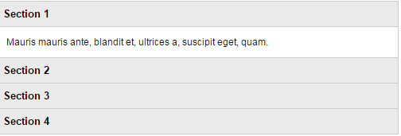

# jQuery

<!-- TOC -->

- [jQuery](#jquery)
- [1 什么是jQuery](#1-什么是jquery)
    - [1.1 jQuery 搭建安装开发环境](#11-jquery-搭建安装开发环境)
    - [1.2 jQuery 选取html的语法形式](#12-jquery-选取html的语法形式)
    - [1.3 第一个示例程序 hello world](#13-第一个示例程序-hello-world)
    - [1.4 轻量级的jQuery有哪些优势](#14-轻量级的jquery有哪些优势)
    - [1.5 教程小节](#15-教程小节)
- [2 jQuery 选择器的使用](#2-jquery-选择器的使用)
    - [2.1 什么是jQuery选择器](#21-什么是jquery选择器)
    - [2.2 jQuery基础选择器](#22-jquery基础选择器)
    - [2.3 jQuery层次选择器](#23-jquery层次选择器)
    - [2.4 简单过滤选择器](#24-简单过滤选择器)
    - [2.5 内容过滤选择器](#25-内容过滤选择器)
    - [2.6 可见性过滤选择器](#26-可见性过滤选择器)
    - [2.7 属性过滤选择器](#27-属性过滤选择器)
    - [2.8 子元素过滤选择器](#28-子元素过滤选择器)
    - [2.9 表单对象属性过滤选择器](#29-表单对象属性过滤选择器)
    - [2.10 表单选择器](#210-表单选择器)
- [3 jQuery 操作DOM元素](#3-jquery-操作dom元素)
    - [3.1 操作DOM元素属性](#31-操作dom元素属性)
    - [3.2 操作DOM元素内容](#32-操作dom元素内容)
    - [3.3 操作DOM元素样式](#33-操作dom元素样式)
    - [3.4 向DOM元素内追加内容](#34-向dom元素内追加内容)
    - [3.5 复制DOM元素](#35-复制dom元素)
    - [3.6 DOM元素的替换](#36-dom元素的替换)
    - [3.7 包裹DOM元素](#37-包裹dom元素)
    - [3.8 遍历DOM元素](#38-遍历dom元素)
    - [3.9 删除DOM元素](#39-删除dom元素)
- [4 jQuery 事件和应用](#4-jquery-事件和应用)
    - [4.1 页面加载事件ready()](#41-页面加载事件ready)
    - [4.2 使用bind()方法绑定事件](#42-使用bind方法绑定事件)
    - [4.3 使用hover()和toggle()切换事件](#43-使用hover和toggle切换事件)
    - [4.4 使用unbind()移除和解除绑定事件](#44-使用unbind移除和解除绑定事件)
    - [4.5 one()一次性事件处理器函数](#45-one一次性事件处理器函数)
    - [4.6 通过trigger()手动触发指定事件](#46-通过trigger手动触发指定事件)
    - [4.7 元素获得focus()或失去blur()焦点事件](#47-元素获得focus或失去blur焦点事件)
    - [4.8 元素改变事件change()](#48-元素改变事件change)
- [5 jQuery 动画与特效](#5-jquery-动画与特效)
    - [5.1 动画与特效中的显示show和隐藏hide](#51-动画与特效中的显示show和隐藏hide)
    - [5.2 动画与特效的淡入淡出效果](#52-动画与特效的淡入淡出效果)
    - [5.3 动画与特效的滑动效果](#53-动画与特效的滑动效果)
    - [5.4 animate()方法来自定义动画效果](#54-animate方法来自定义动画效果)
    - [5.5 stop()方法来停止动画或者效果](#55-stop方法来停止动画或者效果)
- [6 jQuery Ajax的使用](#6-jquery-ajax的使用)
    - [6.1 什么是AJAX](#61-什么是ajax)
    - [6.2 AJAX方法load()从服务器加载数据](#62-ajax方法load从服务器加载数据)
    - [6.3 用getJSON()方法加载JSON格式数据](#63-用getjson方法加载json格式数据)
    - [6.4 使用getScript()异步加载js文件并执行](#64-使用getscript异步加载js文件并执行)
    - [6.5 以GET方式从服务器获取数据](#65-以get方式从服务器获取数据)
    - [6.6 以POST方式从服务器发送数据](#66-以post方式从服务器发送数据)
    - [6.7 Ajax序列化表单的值](#67-ajax序列化表单的值)
    - [6.8 用Ajax加载服务器数据](#68-用ajax加载服务器数据)
- [7 jQuery 自定义插件](#7-jquery-自定义插件)
    - [7.1 自定义插件的准备工作](#71-自定义插件的准备工作)
    - [7.2 维护自定义插件的链接性](#72-维护自定义插件的链接性)
    - [7.3 用插件构造一个有可折叠面板的页面](#73-用插件构造一个有可折叠面板的页面)
    - [7.4 自定义你的jquery插件](#74-自定义你的jquery插件)

<!-- /TOC -->

# 1 什么是jQuery

## 1.1 jQuery 搭建安装开发环境
### 介绍

欢迎学习jQuery。jQuery是一个JavaScript库，如今已发展成为集JavaScript、CSS、DOM、Ajax于一体的框架体系。要想用jQuery，首先要安装上jQuery的开发环境。

### 首先下载jQuery

在jQuery官网： *<a href="http://jquery.com">http://jquery.com</a>* 中下载最新版本的jQuery。

### 引入jQuery

```javascript
<script src="http://libs.baidu.com/jquery/1.9.0/jquery.js"></script>
```

您是否很疑惑为什么我们没有在 script 标签中使用 type="text/javascript" ？
在 HTML5 中，不必那样做了。JavaScript 是 HTML5 以及所有现代浏览器中的默认脚本语言！


## 1.2 jQuery 选取html的语法形式
### jQuery语法

jQuery 语法是为HTML元素的选取编制的，可以对元素执行某些操作。

#### 基础语法是： *$(selector).action()*


- 美元符号定义jQuery
- 选择符(selector)"查询"和"查找"HTML元素
- jQuery的action()执行对元素的操作


#### 示例：

```javascript
$(this).hide()- 隐藏当前元素
$("p").hide()- 隐藏所有段落
$(".test").hide()- 隐藏所有class = "test" 的所有元素
$("#test").hide()- 隐藏所有 id = "test" 的元素
```

jQuery 使用的语法是 XPath 与 CSS 选择器语法的组合，接下来的第二章我们将讲解更多的选择器的知识。


## 1.3 第一个示例程序 hello world
### 传说中的hello world

在学习新的编程知识的时候，往往都从一个“hello world”例子开始，那么学习jQuery，我们也从先从一个“hello world”开始。

```javascript
<title>传说中的hello world</title>
<script src="http://libs.baidu.com/jquery/1.9.0/jquery.js"></script>
<script type="text/javascript">
    $(document).ready(function (){
        alert("hello world!");
    });
</script>
```

```javascript
$(document).ready(function (){
    //代码段
});
```

可以简化成：

```javascript
$(function (){
    //代码段
});
```

### 任务：


## 1.4 轻量级的jQuery有哪些优势
### jQuery的优势：


- 轻量级。jQuery非常轻巧，最新的jQuery版本压缩后，大小保持在80k左右。
- 强大的选择器。jQuery允许使用从CSS1到CSS3几乎所有的选择器，以及jQuery自己的高级而复杂的选择器。甚至你可以编写属于自己的选择器。我们将在第二章中详细讲解。
- 出色的DOM操作的封装；jQuery封装了大量常用的DOM操作，让你能轻松地完成各种原本非常复杂的操作。第三章将重点介绍jQuery的DOM操作。
- 可靠的事件处理机制；第四章中我们将详细讲解。
- 完善的Ajax；jQuery将所有的Ajax操作封装到一个函数$.ajax()里，使得开发者处理Ajax的时候能够专心处理业务逻辑而无需关系复杂的浏览器兼容性和XMLHttpRequest对象的创建和使用的问题。在第六章将会重点介绍。
- 出色的浏览器兼容性等等。但是jQuery2.0及后续版本将不再支持IE6/7/8浏览器。


## 1.5 教程小节
### 联系我们


- 我们的微博是：<a href="http://weibo.com/u/5191023095">weibo.com/u/5191023095</a>
- 我们的微信是：
- 也可以加入我们的QQ官方群：
<a href="http://jq.qq.com/?_wv=1027&amp;k=J3kX28">344353055</a>
、
<a href="http://jq.qq.com/?_wv=1027&amp;k=R5QuA4">275985321</a>
- 通过微博、微信和QQ群可以直接吐槽我们的课程，也可以寻找帮助。


# 2 jQuery 选择器的使用

## 2.1 什么是jQuery选择器
### 什么是选择器：

   jQuery选择器是jQuery库中非常重要的部分之一。它支持网页开发者所熟知的CSS语法快速轻松地对页面进行设置。了解jQuery选择器是打开jQuery之门的钥匙。

### 典型的jQuery选择器句法形式:

 *$(selector).methodName();*

selector是一个字符串表达式，由于识别DOM中的元素，然后使用jQuery提供的方法集合加以设置。

根据所获取页面中元素的不同。可以将jQuery选择器分为几类：


- 基本选择器
- 层次选择器
- 过滤选择器


- 简单过滤选择器


- 内容过滤选择器
- 可见性过滤选择器
- 属性过滤选择器
- 子元素过滤选择器
- 表单对象属性过滤选择器4.  表单选择器


## 2.2 jQuery基础选择器
### jQuery基础选择器

基础选择器是jQuery中使用最频繁的选择器，它由元素id、class、多个选择符组成，通过基本选择器可以实现大多数页面元素的查找，如下表格：

<table class='table table-bordered table-hover'>
<tr>
<th>选择器</th>
<th>功能</td>
<th>返回值</th>
</tr>
<tr>
<td> *#id* </td>
<td>根据给定的id匹配一个元素</td>
<td>单个元素</td>
</tr><br><tr>
<td> *element* </td>
<td>根据给定的元素名匹配所有元素</td>
<td>元素集合</td>
</tr>
<tr>
<td> *.class* </td>
<td>根据给定的类匹配元素</td>
<td>元素集合</td>
</tr>
<tr>
<td> *** </td>
<td>匹配所有元素</td>
<td>元素集合</td>
</tr>
<tr>
<td> *selector1,selectorN* </td>
<td>将每一个选择器匹配到的元素合并后一起返回</td>
<td>元素集合</td>
</tr>
</table>

### 示例如下：

(1)描述

所有的元素标记全部显示，然后通过jQuery基础选择器隐藏相对应的页面标记。

(2)代码实现

```javascript
    ...省略代码
    <script type="text/javascript">
        $(function(){ //id匹配元素
        $("#divOne").css("display","none");
    })
    $(function(){ //元素名匹配元素
            $("div span").css("display","none");
    })
    $(function(){ //类匹配元素
        $(".clsFrame .clsOne").css("display","none");
    })
    $(function(){ //匹配所有元素
        $("*").css("display","none");
    })
    $(function(){ //合并匹配元素
        $("#divOne,span").css("display","none");
    })
    </script>
    ...jQuery控制的代码
    <div class="clsFrame">
        <div id="divOne">ID</div>
    <div class="clsOne">CLASS</div>
    <span>SPAN</span>
    </div>
```


## 2.3 jQuery层次选择器
### jQuery层次选择器

层次选择器通过DOM元素间的层次关系获取元素，其主要的层次关系包括后代、父子、相邻、兄弟关系，通过其中某类关系可以方便快捷地定位元素，详细说明如下表：

<table class='table table-bordered table-hover'>
<tr>
<th>选择器</th>
<th>功能</th>
<th>返回值</th>
</tr>
<tr>
<td> *ancestor descendant* </td>
<td>根据祖先元素匹配所有的后代元素</td>
<td>元素集合</td>
</tr>
<tr>
<td> *parent > child* </td>
<td>根据父元素匹配所有的子元素</td>
<td>元素集合</td>
</tr>
<tr>
<td> *prev + next* </td>
<td>匹配所有紧接在prev元素后的相邻元素</td>
<td>元素集合</td>
</tr>
<tr>
<td> *prev ~ siblings* </td>
<td>匹配prev元素之后的所有兄弟元素</td>
<td>元素集合</td>
</tr>
</table>

提示： *ancestor descendant*  与 * parent > child*  所选择的元素集合是不同的，前者的层次关系是祖先与后代，而后者是父子关系；另外 * prev + next * 可以使用 * .next() * 代替，而 *prev ~ siblings* 可以使用 *nextAll()* 代替。

### 示例如下：

(1)描述

所有的元素标记初始全部显示，然后通过jQuery层次选择器隐藏相对应的页面标记。

(2)代码实现

```javascript

<script type="text/javascript">
$(function(){ //匹配后代元素
    $("div span").css("display","none");//隐藏div中所有的<span>标记
})
$(function(){ //匹配子元素
    $("div>span").css("display","none");//隐藏div中子span标记
})
$(function(){ //匹配后面元素
    $("#divMid + div").css("display","none");//隐藏id为divMid元素后的下一个div
    $("#divMid").next().css("display","none");
})
$(function(){ //匹配所有后面元素
    $("#divMid ~ div").css("display","none");//隐藏id为divMid元素后的所有div
    $("#divMid").nextAll().css("display","none");
})
$(function(){ //匹配所有相邻元素
    $("#divMid").siblings("div").css("display","none");//隐藏id为divMid元素的所有相邻div
})
</script>
```


## 2.4 简单过滤选择器
### jQuery 简单过滤选择器

过滤选择器根据某类g过滤规则进行元素的匹配，书写时都以冒号（:）开头；简单过滤选择器是过滤选择器中使用最广泛的一种，详细如下表：

<table class='table table-bordered table-hover'>
<tr>
<th>选择器</th>
<th>功能</th>
<th>返回值</th>
</tr>
<tr>
<td>first()或 :first</td>
<td>获取第一个元素</td>
<td>单个元素</td>
</tr>
<tr>
<td>parent >last() 或 :last</td>
<td>获取最后一个元素</td>
<td>单个元素</td>
</tr>
<tr>
<td>:not(selector)</td>
<td>获取除给定选择器外的所有元素</td>
<td>元素集合</td>
</tr>
<tr>
<td>:even</td>
<td>获取所有索引值为偶数的元素，索引号从0开始</td>
<td>元素集合</td>
</tr>
<tr>
<td>:odd</td>
<td>获取所有索引值为奇数的元素，索引号从0开始</td>
<td>元素集合</td>
</tr>
<tr>
<td>:eq(index)</td>
<td>获取指定索引值得元素，索引号从0开始</td>
<td>单个元素</td>
</tr>
<tr>
<td>:gt(index)</td>
<td>获取所有大于给定索引值的元素，索引号从0开始</td>
<td>元素集合</td>
</tr>
<tr>
<td>:lt(index)</td>
<td>获取所有小于给定索引值的元素，索引号从0开始</td>
<td>元素集合</td>
</tr>
<tr>
<td>:header</td>
<td>获取所有标题类型的元素，如h1、h2......</td>
<td>元素集合</td>
</tr>
<tr>
<td>:animated</td>
<td>获取正在执行动画效果的元素</td>
<td>元素集合</td>
</tr>
</table>

下面将通过示例来讲解如何通过过滤选择器定位DOM元素的方法。

### 示例如下：

(1)描述

通过简单过滤选择器获取元素，将选中的元素改变其类名称，从而突出其被选中的状态

(2)代码实现

```javascript
...省略代码
<script type="text/javascript">
$(function(){ //增加第一个元素的类别
    $("li:first").addClass("GetFocus");//
})
$(function(){ //增加最后一个元素的类别
    $("li:last").addClass("GetFocus"); //
})
$(function(){ //增加去除所有与给定选择器匹配的元素类别
    $("li:not(.NotClass)").addClass("GetFocus");//
})
$(function(){ //增加所有索引值为偶数的元素类别，从0开始计数
    $("li:even").addClass("GetFocus"); //
})
$(function(){ //增加所有索引值为奇数的元素类别，从0开始计数
    $("li:odd") .addClass("GetFocus"); //
})
$(function(){ //增加一个给定索引值的元素类别，从0开始计数
    $("li:eq(1)").addClass("GetFocus"); //
})
$(function(){ //增加所有大于给定索引值的元素类别，从0开始计数
    $("li:gt(1)").addClass("GetFocus"); //
})
$(function(){ //增加所有小于给定索引值的元素类别，从0开始计数
    $("li:lt(4)").addClass("GetFocus"); //
})
$(function(){ //增加标题类元素类别
    $("div h1").css("width","238"); //
    $(":header").addClass("GetFocus"); //
})
$(function(){ //增加动画效果元素类别
    animateIt();
    $("#spanMove:animated").addClass("GetFocus"); //
})
function animateIt() {//动画效果
    $("#spanMove").slideToggle("slow",animateIt);
}
</script>
...省略主体代码
```


## 2.5 内容过滤选择器
### 内容过滤选择器

内容过滤选择器根据元素中的文字内容或所包含的子元素特征获取元素，其文字内容可以模糊或者绝对匹配进行元素定位，详细如下：

<table class='table table-bordered table-hover'>
<tr>
<th>选择器</th>
<th>功能</th>
<th>返回值</th>
</tr>
<tr>
<td>:contains(text)</td>
<td>获取包含给定文本的元素</td>
<td>元素集合</td>
</tr>
<tr>
<td>:empty</td>
<td>获取所有不包含子元素或者文本的空元素</td>
<td>元素集合</td>
</tr>
<tr>
<td>:has(selector)</td>
<td>获取含有选择器所匹配的元素的元素</td>
<td>元素集合</td>
</tr>
<tr>
<td>:parent</td>
<td>获取获取含有子元素或者文本的元素</td>
<td>元素集合</td>
</tr>
</table>

下面将通过示例来讲解如何通过内容过滤选择器定位DOM元素的方法。

### 示例如下：

(1)描述

页面中，创建四个div标记，并在其中一个div中新建一个span标记，其余div标记中输入内容或空，通过内容过滤选择器获取元素，并显示在页面中。

(2)代码实现

```javascript
...省略代码
<script type="text/javascript">
$(function(){ //显示包含给定文本的元素
    $("div:contains('Div')").css("display","block");
})
$(function(){ //显示所有不包含子元素或者文本的空元素
    $("div:empty").css("display","block");
})
$(function(){ //显示含有选择器所匹配的元素
    $("div:has(span)").css("display","block");//显示含有span标记的元素
})
$(function(){ //显示含有子元素或者文本的元素
    $("div:parent").css("display","block");
})
</script>
...省略代码
<div>Div1</div>
<div>2</div>
<div></div>
<div><span>Span</span></div>
...省略代码
```


## 2.6 可见性过滤选择器
### 可见性过滤选择器

可见性过滤选择器根据元素是否可见的特征获取元素，详细如下：

<table class='table table-bordered table-hover'>
<tr>
<th>选择器</th>
<th>功能</th>
<th>返回值</th>
</tr>
<tr>
<td>:hidden</td>
<td>获取所有不可见元素，或者type为hidden的元素</td>
<td>元素集合</td>
</tr>
<tr>
<td>:visible</td>
<td>获取所有的可见元素</td>
<td>元素集合</td>
</tr>
</table>

提示：hidden选择器所选择的不仅包括样式为display：none所有元素，还包括属性type="hidden"和样式为visibility:hidden的所有元素

### 示例如下：

(1)描述

页面中，新建一个span和div标记，分别设置标记的display属性为"none"和"block"；然后根据可见性过滤选择器显示页面元素。

(2)代码实现

```javascript
...省略代码
<script type="text/javascript">
$(function(){ //增加所有可见元素的类别
    $("span:hidden").show()
    $("div:visible").addClass("GetFocus");
})
$(function(){ //增加所有不可见元素类别
    $("span:hidden").show().addClass("");
})

</script>
...jQuery操作的代码
<span style="display:none">Hidden</span>
<div>Visible</div>
```


## 2.7 属性过滤选择器
### 属性过滤选择器

<table class='table table-bordered table-hover'>

<tr>

<th>选择器</th>

<th>功能</th>

<th>返回值</th>
</tr>

<tr>

<td>[attribute]</td>

<td>获取包含给定属性的元素</td>

<td>元素集合</td>
</tr>

<tr>

<td>[attribute=value]</td>

<td>获取等于给定的属性是某个特定值得元素</td>

<td>元素集合</td>
</tr>

<tr>

<td>[attribute!=value]</td>

<td>获取不等于给定的属性是某个特定值得元素</td>

<td>元素集合</td>
</tr>

<tr>

<td>[attribute^=value]</td>

<td>获取给定的属性是以某些值开始的元素</td>

<td>元素集合</td>
</tr>

<tr>

<td>[attribute$=value]</td>

<td>获取给定的属性是以某些值结尾的元素</td>

<td>元素集合</td>
</tr>

<tr>

<td>[attribute*=value]</td>

<td>获取给定的属性是以包含某些值得元素</td>

<td>元素集合</td>
</tr>

<tr>

<td>[selector1][selector2][selectorN]</td>

<td>获取满足多个条件的复合属性的元素</td>

<td>元素集合</td>
</tr>
</table>

下面将通过示例来讲解如何使用过滤选择器定位DOM元素的方法。

### 示例如下：

(1)描述

页面中，创建四个div标记，并设置不同的ID和Title属性值，然后通过属性过滤选择器获取所指定的元素集合，并显示在页面中。

(2)代码实现

```javascript
...省略代码
<script type="text/javascript">
$(function(){ //显示所有包含id属性的元素 1
    $("div[id]").show(3000);
})
$(function(){ //显示所有属性title的值是"A"的元素  2
    $("div[title='A']").show(3000);
})
$(function(){ //显示所有属性title的值不是"A"的元素  3
    $("div[title!='A']").show(3000);
})
$(function(){ //显示所有属性title的值是"A"开始的元素  4
    $("div[title^='A']").show(3000);
})
$(function(){ //显示所有属性title的值是"C"结束的元素  5
    $("div[title$='C']").show(3000);
})
$(function(){ //显示所有属性title的值中含有"B"的元素  6
    $("div[title*='B']").show(3000);
})
$(function(){ //显示所有属性title的值中含有"B"且属性id的值是“divAB”的元素   7
    $("div[id='divAB'][title*='B']").show(3000);
})
</script>
...省略代码
<div id="divID">ID</div>
<div title="A">title A</div>
<div id="divAB" title="AB">ID
title AB</div>
<div title="ABC">title ABC</div>
...省略代码
```


## 2.8 子元素过滤选择器
### 子元素过滤选择器

在页面开发中，总是遇到突出指定某行的需求。如果实现单个表格的显示，用基本过滤选择器:eq(index)就能实现；但如果是大量数据的选择需求可以通过子元素过滤选择器轻松获取所有父元素中指定的某个元素。详细如下：

<table class='table table-bordered table-hover'>
<tr>
<th>选择器</th>
<th>功能</th>
<th>返回值</th>
</tr>
<tr>
<td>:nth-child(eq|even|odd|index)</td>
<td>获取每个元素下的特定元素，索引号从1开始</td>
<td>元素集合</td>
</tr>
<tr>
<td>:first-child</td>
<td>获取每个父元素下的第一个子元素</td>
<td>元素集合</td>
</tr>
<tr>
<td>:last-child</td>
<td>获取每个父元素下的最后一个子元素</td>
<td>元素集合</td>
</tr>
<tr>
<td>:only-child</td>
<td>获取每个父元素下的仅有一个子元素</td>
<td>元素集合</td>
</tr>
</table>

下面将通过示例来讲解如何使用子元素过滤选择器获取元素。

### 示例如下：

(1)描述

描述：页面中，创建三个ul标记，前两个标记中设置四个li,后一个标记中设置一个li，通过子元素过滤选择器获取指定的页面元素，并改变其选择后的状态，显示在页面中。

(2)代码实现

```javascript
...省略代码
<script type="text/javascript">
$(function(){ //增加每个父元素下的第2个子元素类别 1
    $("li:nth-child(2)").addClass("GetFocus");
})
$(function(){ //增加每个父元素下的第1个子元素类别  2
    $("li:first-child").addClass("GetFocus");
})
$(function(){ //增加每个父元素下的最后一个子元素类别  3
    $("li:last-child").addClass("GetFocus");
})
$(function(){ //增加每个父元素下只有一个子元素类别  4
    $("li:only-child").addClass("GetFocus");
})
</script>
...省略代码
    <ul>
      <li>item 1-0</li>
      <li>item 1-1</li>
      <li>item 1-2</li>
      <li>item 1-3</li>
    </ul>
    <ul>
      <li>item 2-0</li>
      <li>item 2-1</li>
      <li>item 2-2</li>
      <li>item 2-3</li>
    </ul>
    <ul>
      <li>item 3-0</li>
    </ul>
...省略代码
```


## 2.9 表单对象属性过滤选择器
### 表单对象属性过滤选择器

表单对象属性过滤选择器通过表单中的某对象属性特征获取该类元素，如enabled、disabled、checked、selected属性。详细如下：

<table class='table table-bordered table-hover'>
<tr>
<th>选择器</th>
<th>功能</th>
<th>返回值</th>
</tr>
<tr>
<td>:enabled</td>
<td> 获取表单中所有属性为可用的元素</td>
<td>元素集合</td>
</tr>
<tr>
<td>:disabled</td>
<td>获取表单中所有属性为不可用的元素</td>
<td>元素集合</td>
</tr>
<tr>
<td>:checked</td>
<td>获取表单中所有被选中的元素</td>
<td>元素集合</td>
</tr>
<tr>
<td>:selected</td>
<td>获取表单中素有被选中option的元素</td>
<td>元素集合</td>
</tr>
</table>

下面将通过示例来讲解如何使用表单对象属性过滤选择器获取表单对象的方法。

### 示例如下：

(1)描述

在表单中，通过表单对象属性过滤选择器获取某指定元素，并处理该元素。

(2)代码实现

```javascript

<script type="text/javascript">
$(function(){ //增加表单中所有属性为可用的元素类别
    $("#divA").show(3000);
    $("#form1 input:enabled").addClass("GetFocus");
})
$(function(){ //增加表单中所有属性为不可用的元素类别  2
    $("#divA").show(3000);
    $("#form1 input:disabled").addClass("GetFocus");
})
$(function(){ //增加表单中所有被选中的元素类别  3
    $("#divB").show(3000);
    $("#form1 input:disabled").addClass("GetFocus");
})
$(function(){ //显示表单中所有option的元素内容  4
    $("#divC").show(3000);
    $("#Span2").html("选中项是：" + $("select option:selected").text());
})
</script>
...省略代码
<form id="form1" style="width:244px">
    <div id="divA">
        <input type="text" class="clsIpt" value="可用文本框" />
        <input type="text" class="clsIpt" value="不可用文本框" disabled="disabled"/>
    </div>
    <div id="divB">
        <input type="checkbox" checked="checked" value="1" />选中
        <input type="checkbox" value="0" />未选中
    </div>
    <div id="divC">
        <select multiple="multiple">
            <option value="0">Option 0</option>
            <option value="1" selected="selected">Option 1</option>
            <option value="2">Option 2</option>
            <option value="3" selected="selected">Option 3</option>
        </select>
        <span id="Span2"></span>
    </div>
</form>
```


## 2.10 表单选择器
### 表单选择器

在表单中，为了使用更加方便和高效，在jQuery选择器中引入了表单选择器，通过它可以再页面中快速定位某表单对象。详细如下：

<table class='table table-bordered table-hover'>
<tr>
<th>选择器</th>
<th>功能</th>
<th>返回值</th>
</tr>
<tr>
<td>:input</td>
<td>获取所有input、textarea、select</td>
<td>元素集合</td>
</tr>
<tr>
<td>:text</td>
<td>获取表单中所有单行文本框</td>
<td>元素集合</td>
</tr>
<tr>
<td>:password</td>
<td>获取表单中所有密码框</td>
<td>元素集合</td>
</tr>
<tr>
<td>:radio</td>
<td>获取表单中所有单选按钮</td>
<td>元素集合</td>
</tr>
<tr>
<td>:checkbox</td>
<td>获取表单中所有复选框</td>
<td>元素集合</td>
</tr>
<tr>
<td>:submit</td>
<td>获取表单中所有提交按钮</td>
<td>元素集合</td>
</tr>
<tr>
<td>:image</td>
<td>获取表单中所有图像域</td>
<td>元素集合</td>
</tr>
<tr>
<td>:reset</td>
<td>获取表单中所有重置按钮</td>
<td>元素集合</td>
</tr>
<tr>
<td>:button</td>
<td>获取表单中所有按钮</td>
<td>元素集合</td>
</tr>
<tr>
<td>:file</td>
<td>获取表单中所有文件域</td>
<td>元素集合</td>
</tr>
</table>

### 示例如下：

(1)描述

在表单中，创建11种常用的表单对象，根据表单选择器，先显示出所有表单对象的总量，然后显示各种不同类型的表单对象。

(2)代码实现

```javascript

<script type="text/javascript">
$(function(){ //显示input类型元素的总数量 1
    $("#form1 div").html("表单共找出input类型元素" +
    $("#form1 :input").length);
    $("#form1 div").addClass("div");
})
$(function(){ //显示所有文本框对象  2
    $("#form1 :text").show(3000);
})
$(function(){ //显示所有密码框对象  3
    $("#form1 :password").show(3000);
})
$(function(){ //显示所有单选按钮对象  4
    $("#form1 :radio").show(3000);
    $("#form1 #span1").show(3000);
})
$(function(){ //显示所有复选框对象  5
    $("#form1 :checkbox").show(3000);
    $("#form1 #span2").show(3000);
})
$(function(){ //显示所有提交按钮对象  6
    $("#form1 :submit").show(3000);
})
$(function(){ //显示所有图片域对象  7
    $("#form1 :image").show(3000);
})
$(function(){ //显示所有重置按钮对象  8
    $("#form1 :reset").show(3000);
})
$(function(){ //显示所有按钮对象  9
    $("#form1 :button").show(3000);
})
$(function(){ //显示所有文件域对象  10
    $("#form1 :file").show(3000);
})
</script>

<form id="form1" style="width:244px">
    <input type="text" value="text" class="txt" />
    <input type="password" value="password" class="txt" />
    <input type="radio" /><span id="span1">radio</span>
    <input type="checkbox" />
    <textarea class="txt">textarea</textarea>
    <select><option value="0">item 0</option></select>
    <span id="span2">checkbox</span>
    <input type="submit" value="submit" class="btn"/>
    <input type="image" title="image" src="image/logo.png" class="img" />
    <input type="reset" value="reset" class="btn" />
    <input type="button" value="button" class="btn" />
    <input type="file" title="file" class="txt" />
    <div id="divShow"></div>
</form>
```


# 3 jQuery 操作DOM元素

## 3.1 操作DOM元素属性
### 元素属性操作

在jQuery中，可以对元素的属性执行获取、设置、删除的操作，通过attr()方法可以对元素属性执行获取和设置操作，removeAttr()方法可以删除某一指定的属性。

### 1.获取元素的属性

语法： *attr(name)*

参数name表示属性的名称

### 2.设置元素的属性

单个属性设置语法： *attr(key,value)*

多个属性设置语法： *attr({key0:value0,key1:value1})*

### 3.删除元素的属性

语法： *removeAttr(name)*

我们将通过下面示例讲解上述语法:

### 示例如下：

(1)描述

使用attr()方法设置、获取、删除a标记中href属性。

(2)代码实现

```javascript

<script type="text/javascript">
$(function(){
    $("#a1").attr("href","http://www.baidu.com");//设置a标记中的href属性
    var $url = $("#a1").attr("href");//获取a标记中的href属性
    $("#tip").html($url);
})
$(function(){//删除a标记中的href属性
    $("#a1").removeAttr("href");
})
</script>
...省略代码

<h3>attr()方法设置元素属性</h3>
<a data="http://www.hubwiz.com" id="a1">点我就变</a>
<div>改变后的地址：<span id="tip"></span></div>
...省略代码
```


## 3.2 操作DOM元素内容
### 元素内容操作

在jQuery中，操作元素内容的方法包括html()和text()。详细如下：

<table class='table table-bordered table-hover'>
<tr>
<th>语法格式</th>
<th>参数说明</th>
<th>功能描述</th>
</tr>
<tr>
<td>html()</td>
<td>无参数</td>
<td>用于获取元素的html内容</td>
</tr>
<tr>
<td>html(val)</td>
<td>val参数为元素的html内容</td>
<td>用于设置元素的html内容</td>
</tr>
<tr>
<td>text()</td>
<td>无参数</td>
<td>用于获取设置元素的文本内容</td>
</tr>
<tr>
<td>text(val)</td>
<td>val参数为元素的文本内容</td>
<td>用于设置设置元素的文本内容</td>
</tr>
</table>

提示：html()方法仅支持XHTML的文档，不能用于XML文档，而text()既支持HTML文档，也支持XML文档

### 示例如下：

(1)描述

在页面中，用html()和 text()方法获取div标记中的内容，并将内容分别作为html(val)和text(val)的参数，分别设置元素的内容，并将结果显示在页面中。

(2)代码实现

```javascript

<script type="text/javascript">
$(function(){ //增加表单中所有属性为可用的元素类别
    var $strHtml = $("#divShow").html();//获取HTML内容
    var $strText = $("#divShow").text();//获取文本内容
    $("#divHtml").html($strHtml);//设置HTML内容
    $("#divText").text($strText);//设置文本内容
})
</script>
...省略代码
<div id="divShow">**_几天不见你又瘦了_**</div>
<div id="divHtml"></div>
<div id="divText"></div>
```


## 3.3 操作DOM元素样式
### 操作元素的样式

通过 *addClass()和css()* 可以方便地操作元素中的样式，前者括号中的参数为增加元素的样式名称，后者直接将样式的属性内容写在括号中。

### 示例如下：

(1)描述

使用css()和addClass()方法，改变div元素的背景色，再用removeClass()移除一个元素的样式。

(2)代码实现

```javascript
<style type="text/css">
    body{font-size:15px;text-align:center}
    div{border:solid 1px #666;
        padding:5px;width:220px;margin:5px}
    .blue{background-color:blue}
</style>
<script type="text/javascript">
$(function(){ //增加表单中所有属性为可用的元素类别
    $("#content0").css("background-color","red");
    $("#content1").addClass("blue");
    $("#rem").click(function(){//click点击事件我们将在后面介绍到。
        $("#content1").removeClass("blue");
    })
})
</script>
...省略代码

### css()方法设置元素样式

<div id="content0">我穿了一件红色外衣</div>
<div id="content1">我穿了一件红色外衣</div>
<div><button id="rem">脱下蓝色的外衣</button></div>
```


## 3.4 向DOM元素内追加内容
### 向元素中追加内容

如果在页面中增加某个元素，只需要找到元素的上级节点，然后通过append()向指定的元素中追加内容或者通过appendTo()把内容追加到指定元素内。

如果是在元素前后插入内容，使用before()和after()方法可以在元素的前后插入内容，它们分别表示在整个元素的前面和后面插入指定的元素或内容

append()语法形式： *$(html).append(content)*

appendTo()语法形式： *$(content).appendTo(html)*

before()的语法形式： *$(html).before(content)*

after()的语法形式： *$(html).after(content)*

参数html用于找到需要追加内容的元素字符串，参数content是追加的内容，可以是字符、HTML元素标记还可以是一个返回字符串内容的函数。

### 示例如下：

(1)描述

向p标记中或前或后分别追加内容。

(2)代码实现

```javascript

<script type="text/javascript">
$(function(){ //增加表单中所有属性为可用的元素类别
    var $content = "**我是append()方法追加的内容**";
    var $contentTo = "**我是appendTo()方法追加的内容**";
    var $before = "**我是before()方法追加到前面的内容**";
    var $after = "**我是before()方法追加到后面的内容**";
    $("#id1").append($content);
    $($contentTo).appendTo("#id2");
    $("#id3").before($before);
    $("#id4").after($after);
})
</script>
...省略代码
    <p id="id1">append()追加内容：

    <p id="id2">appendTo()追加内容：

    <p id="id3">before()追加到前面

    <p id="id4">after()追加到后面

```


## 3.5 复制DOM元素
### 复制元素

想要复制元素，调用clone()方法可以生成一个被选元素的副本，即复制了一个被选元素，包含它的节点、文本和属性

语法形式： *$(content).clone()*

参数content可以HTML内容、HTML元素标记。

### 示例如下：

(1)描述

使用clone()复制页面中的一个div，并追加到body中

(2)代码实现

```javascript

<script type="text/javascript">
$(function(){
    $("body").append($("div").clone());
})
</script>
...省略代码

<h3> 复制元素</h3>

<div id="me">我是王大锤</div>
```


## 3.6 DOM元素的替换
### 元素替换

在jQuery中想要替换元素或元素中的内容，replaceWith()和replaceAll()方法都可以但它们调用时，内容和被替换元素所在的位置不同

replaceWith()语法形式： *$(selector).replaceWith(content)*

replaceAll()语法形式： *$(content).replaceAll(selector)*

参数selector为被替换的元素，content为替换的内容。

### 示例如下：

代码实现

```javascript
<script type="text/javascript">
$(function(){
    $("#me").replaceWith("<div>走上人生巅峰</div>");
    $("<div>那是我逝去的青春</div>").replaceAll("#yi");
})
</script>
...省略代码

<h3> 替换元素</h3>

<div id="me">我是王大锤</div>
<div id="yi">在夕阳下奔跑</div>
```


## 3.7 包裹DOM元素
### 包裹元素

在jQuery中使用wrap()和wrapInner()方法包裹元素和内容，但前者用于包裹元素本身，后者则用于包裹元素中的内容。

wrap()语法形式： *$(selector).wrap(wrapper)*

wrapInner()语法形式： *$(selector).wrapInner(wrapper)*

参数selector为被包裹的元素，wrapper参数为包裹元素的格式。

### 示例如下：

 代码实现

```javascript
<script type="text/javascript">
$(function(){
    $("p").wrap("");//所有段落标记字体加粗
    $("span").wrapInner("");//所有段落中的span标记斜体
})
</script>
...省略代码

<p>一周中最喜欢的是：<span>周五</span>


<p>一周中最不喜欢的是：<span>周一</span>

```


## 3.8 遍历DOM元素
### 遍历元素

在DOM元素操作中，有时需要对同一标记的全部元素进行统一操作。在jQuery中，使用each()方法可以实现元素的遍历。

语法形式： *$(selector).each(callback)*

参数callback是一个function函数，该函数还可以接收一个行参index，这个形参为遍历元素的序号，序号从0开始；如果需要访问元素中的属性，可以借助形参index，配合this关键字来实现元素属性的设置或获取。

### 示例如下：

 代码实现

```javascript
<script type="text/javascript">
$(function(){
    $("div").each(function(index){
        if(index == 2){
            $(this).addClass("red");
        }
    })
})
</script>
...省略代码

<h3>each()遍历元素</h3>

<div>帽子</div>
<div>上衣</div>
<div>裤子</div>
<div>鞋子</div>
```


## 3.9 删除DOM元素
### 删除元素

在DOM元素操作中，jQuery为删除元素提供了两种方法： *remove()和empty()* 。remove()-删除被选元素(及其子元素)，empty()-从被选元素中删除子元素

### 示例如下：

 代码实现

```javascript

<script type="text/javascript">
$(function(){
    $("#rem").click(function(){
        $("#div0").remove();
    });
    $("#emp").click(function(){
        $("#div1").empty();
    });
})
</script>
...省略代码

<h3> 删除元素</h3>

<div id="div0">帽子<button id="rem">remove删除帽子</button></div>
<div id="div1">上衣<button id="emp">empty删除上衣</button></div>
<div id="div2">裤子</div>
<div id="div3">鞋子</div>
```


# 4 jQuery 事件和应用

## 4.1 页面加载事件ready()
### 页面加载事件

在jQuery中页面加载事件是ready()。ready()事件类似于就JavaScript中的onLoad()事件，但前者只要页面的DOM结构加载后便触发，而后者必须在页面全部元素加载成功才触发，ready()可以写多个，按顺序执行。

### ready()方法的几种写法：

写法一：

```javascript
$(document).ready(function(){
//代码部分
});</pre>

//写法二：
```

$(function(){
//代码部分
})</pre>

写法二简洁明了，使用是最广泛的


## 4.2 使用bind()方法绑定事件
### 绑定事件

在jQuery中可以使用bind()方法进行事件的绑定。bind()功能是给每个选择元素的事件绑定处理函数。

语法： *$(selector).bind(event,[data] function)*

参数event为事件名称，多个事件名称用空格隔开，function为事件执行的函数。

### 示例如下：

```javascript
<script type="text/javascript">
$(function(){
    $("#btnClick").bind("click", function () {
        $(this).attr("disabled", "true");
    })
})
</script>
...省略代码

<h3> bind()方法绑定事件</h3>

<input id="btnClick" type="button" value="点击之后按钮不可用" />
```


## 4.3 使用hover()和toggle()切换事件
### 切换事件

在jQuery中提供了 *hover()和toggle()* 这两个方法用于事件的切换。所谓的切换事件，就是有两个以上的事件绑定于一个元素，在元素的行为动作间进行切换。

### hover()方法：

hover()方法的功能是当鼠标移到所选元素上时，执行方法中的第一个函数，鼠标移出时，执行方法中的第二个函数，实现事件的切换效果。

语法形式： *$(selector).hover(over，out);*

over参数为移到所选元素上触发的函数，out参数为移出元素时触发的函数。

### toggle()方法：

toggle()方法toggle() 方法用于绑定两个或多个事件处理器函数，以响应被选元素的轮流的 click 事件。

语法形式： *$(selector).toggle(fun1(),fun2(),funN(),...)*

注意：toggle()方法在1.9.0之后的版本是不支持的。

也可用于切换被选元素的 hide() 与 show() 方法。

语法形式： *$(selector).toggle(speed,callback)*

speed参数可选，作用是规定hide/show效果的速度；callback()参数可选，当toggle()方法完成是执行的函数。

### 示例如下：

```javascript
<script type="text/javascript">
$(function(){ // hover()方法的使用
    $("div").hover(
        function(){
            $(this).append("<b>:爆装备</b>");
        },
        function(){
            $("b").remove();
        }
    );
})
$(function(){//给div改变背景颜色
    $("#btn").toggle(
        function(){
            $("div").css("background-color","green");
        },
        function(){
            $("div").css("background-color","red");
        },
        function(){
            $("div").css("background-color","yellow");
        }
    );
})
$(function(){//显示和隐藏div
    $("#btn").click(function(){
        $("div").toggle(1000);
    });
})
</script>
...省略代码

<h3> 切换事件</h3>

<div id="bindTest">打土豪</div>鼠标移上去看看
<input type="button" id="btn" value="toggle()方法改变div背景色"/>
```


## 4.4 使用unbind()移除和解除绑定事件
### 移除事件

unbind() 方法移除被选元素的事件处理程序。该方法能够移除所有的或被选的事件处理程序，或者当事件发生时终止指定函数的运行。

语法形式： *$(selector).unbind(event,function)*

其中参数event表示需要移除的事件名称，多个事件名用空格隔开，function参数为事件执行时调用的函数名称。

### 示例如下：

代码实现

```javascript
...省略代码
<script type="text/javascript">
$(function(){
    $("div").click(function(){
        $(this).slideToggle();//给div注册隐藏事件
    });
    $("#btn").click(function(){
        $("div").unbind();//把div的事件移除
    });
})
</script>
...省略代码

<h3> 移除事件</h3>

<div>帽子,点击之后消失</div>
<div>上衣,点击之后消失</div>
<div>裤子,点击之后消失</div>
<div>内裤,点击之后消失</div>
<div>鞋子,点击之后消失</div>
<input type="button" id="btn" value="点击之后隐藏事件被移除了"/>
...省略代码
```


## 4.5 one()一次性事件处理器函数
### 一次性事件

one() 方法为被选元素附加一个或多个事件处理程序，并规定当事件发生时运行的函数。当使用 one() 方法时，每个元素只能运行一次事件处理器函数。

语法形式： *$(selector).one(event,[data],function)*

其中event参数必需，当添加到元素的一个或多个事件。由空格分隔多个事件。必须是有效的事件。data参数可选，是传递到函数的额外数据。function参数必需，当事件发生时运行的函数。

### 示例如下：

代码实现

```javascript
<script type="text/javascript">
$(function(){
    $("p").one("click",function(){
    $(this).animate({fontSize:"+=6px"});
    });
})
</script>
...省略代码
    <h3>one()方法的使用</h3>
    <p>这是一个段落。

    <p>这是另一个段落。

    <p>请点击 p 元素增加其内容的文本大小。每个 p 元素只会触发一次改事件。

```


## 4.6 通过trigger()手动触发指定事件
### 手动触发指定事件

trigger() 方法触发被选元素的指定事件类型。

语法形式： *$(selector).trigger(event,[param1,param2,...])*

其中event参数必需，是指定元素要触发的事件。可以使自定义事件（使用 bind() 函数来附加），或者任何标准事件。后面的参数可选，是指传递到事件处理程序的额外参数。额外的参数对自定义事件特别有用。

### 示例如下：

代码实现

```javascript
<script type="text/javascript">
$(function(){
    $("div").bind("append-content",function(){
        $(this).append("**，那是我逝去的青春**");
    });
    $("div").trigger("append-content");
})
</script>
...省略代码
    <h3>trigger()手动触发事件</h3>
    <div>在夕阳下奔跑,</div>
    <div>在夕阳下奔跑</div>
```


## 4.7 元素获得focus()或失去blur()焦点事件
### 焦点事件

当元素获得焦点时，发生 focus 事件；当元素失去焦点时发生 blur 事件。

### 示例如下：

 代码实现

```javascript
<script type="text/javascript">
$(function(){
    $("input").focus(function(){//获得焦点
        $("input").css("background-color","#FFFFCC");
    });
    $("input").blur(function(){//失去焦点
        $("input").css("background-color","#D6D6FF");
    });
})
</script>
...省略代码
<h3>焦点事件</h3>
输入名字: <input type="text" />
<p>请在上面的输入域中点击，使其获得焦点，然后在输入域外面点击，使其失去焦点。

```


## 4.8 元素改变事件change()
### change()改变事件

当元素的值发生改变时，会发生 change 事件。该事件仅适用于文本域（text field），以及 textarea 和 select 元素。change() 函数触发 change 事件，或规定当发生 change 事件时运行的函数。

语法形式： *$(selector).change(function)*

参数function是当change事件发生时运行的函数

### 示例如下：

 代码实现

```javascript
<script type="text/javascript">
$(function(){
    $(".field").change(function(){
    $(this).css("background-color","#FFFFCC");
    });
})
</script>
...省略代码

    <p>在某个域被使用或改变时，它会改变颜色。

    名 称: <input class="field" type="text" />
    <p>性别:
      <select class="field" name="male">
        <option value="volvo">男</option>
        <option value="saab">女</option>
        <option value="audi">保密</option>
      </select>


```


# 5 jQuery 动画与特效

## 5.1 动画与特效中的显示show和隐藏hide
### 显示和隐藏

在jQuery中使用 hide() 和 show() 方法来隐藏和显示 HTML 元素：

hide()的语法形式： *$(selector).hide(speed,callback);*

show()的语法形式： *$(selector).show(speed,callback);*

speed 参数规定隐藏/显示的速度，可以取以下值："slow"、"fast"或毫秒。 callback 参数是隐藏或显示完成后所执行的函数名称，两个参数都是可选的。

### 示例如下：

 代码实现

```javascript
<script type="text/javascript">
$(function(){
    $("#hide").click(function(){
        $("div").hide(1000);
    });
    $("#show").click(function(){
    $("div").show(1000);
    });
})
$(function(){//删除a标记中的href属性
    $("#a1").removeAttr("href");
})
</script>
...省略代码

<h3> 隐藏和显示</h3>
<input type="button" id="hide" value="点击隐藏" />
<input type="button" id="show" value="点击显示" />
<div>在夕阳下奔跑，那是我逝去的青春。</div>
```


## 5.2 动画与特效的淡入淡出效果
### 淡入淡出

在jQuery中，可以实现元素的淡入淡出效果。jQuery提供了四种fade方法：fadeIn()淡入已隐藏的元素、fadeOut()用于淡出可见的元素、fadeToggle()用于在fadeIn()和fadeOut()方法之间进行切换、fadeTo()允许渐变给定的不透明度（值介于0与1之间）

fadeIn()语法： *$(selector).fadeIn(speed,callback);*

fadeOut()语法： *$(selector).fadeOut(speed,callback);*

fadeToggle()的语法： *$(selector).fadeToggle(speed,callback);*

fadeTo()的语法： *$(selector).fadeTo(speed,opacity,callback);*

### 示例如下：

(1)描述

在示例中我们将把fade()的四种方法分别有不同参数是进行演示。

(2)代码实现

```javascript
<script type="text/javascript">
$(function(){//fadeIn()方法
    $("button").click(function(){
        $("#div1").fadeIn();
        $("#div2").fadeIn("slow");
        $("#div3").fadeIn(3000);
    });
})
$(function(){//fadeOut()方法
    $("button").click(function(){
        $("#div1").fadeOut();
        $("#div2").fadeOut("slow");
        $("#div3").fadeOut(3000);
    });
})
$(function(){//fadeToggle()方法
    $("button").click(function(){
        $("#div1").fadeToggle();
        $("#div2").fadeToggle("slow");
        $("#div3").fadeToggle(3000);
    });
})
$(function(){//fadeTo()方法
    $("button").click(function(){
    $("#div1").fadeTo("slow",0.15);
    $("#div2").fadeTo("slow",0.4);
    $("#div3").fadeTo("slow",0.7);
    });
})
</script>
...省略代码
<button>点击这里，看效果</button>
<div id="div1" style="width:80px;height:80px;display:none;background-color:red;"></div>

<div id="div2" style="width:80px;height:80px;display:none;background-color:green;"></div>

<div id="div3" style="width:80px;height:80px;display:none;background-color:blue;"></div>
```


## 5.3 动画与特效的滑动效果
### 滑动效果

在jQuery中，可以在元素上创建滑动效果。jQuery提供了三种fade方法 slideDown()向下滑动元素、slideUp()用于向上滑动元素、slideToggle()可以在 slideDown() 与 slideUp() 方法之间进行切换。

slideDown()语法： *$(selector).slideDown(speed,callback);*

slideUp()语法： *$(selector).slideUp(speed,callback);*

slideToggle()的语法： *$(selector).slideToggle(speed,callback);*

参数speed规定效果的时长，可以取值："slow"、"fast"或毫秒。callback参数是滑动完成后所执行的函数名称。

### 示例如下：

(1)描述

在示例中我们将把slide()的三种方法分别进行演示。

(2)代码实现

```javascript
<script type="text/javascript">
$(function(){//slideDown()方法
    $("button").click(function(){
        $("#div1").slideDown("slow");
    });
})
$(function(){//slideUp()方法
    $("button").click(function(){
        $("#div2").slideUp("slow");
    });
})
$(function(){//slideToggle()方法
    $("button").click(function(){
        $("#div2").slideToggle("slow");
    });
})
</script>
...省略代码
<div id="div2" style="width:222px;height:83px;background-color:#e5eecc;margin:0px">
    吃香蕉不薄皮

    吃葡萄不吐皮
</div>
<button id="btn" style="width:222px;height:23px;background-color:#e5eecc;margin-bottom:0px">
    点击这里，看效果
</button>
<div id="div1" style="width:222px;height:83px;background-color:#e5eecc;display:none;margin:0px">
    有没有点小小激动呢

    想起那在夕阳下奔跑，那..那是我
    逝去的青春
</div>
```


## 5.4 animate()方法来自定义动画效果
### 动画效果

在jQuery中，提供了animate()方法创建自定义的动画

语法： *$(selector).animate({params},speed,callback);*

params为必需的参数定义形成动画的CSS属性。speed和callback是可选参数，前者规定效果的时长，取值为："slow"、"fast"和毫秒；后者是动画完成后执行的函数名称。

### 示例如下：

(1)描述

点击按钮看到动画效果

(2)代码实现

```javascript
<script type="text/javascript">
$(function(){ //增加表单中所有属性为可用的元素类别
    $("#btn").click(function(){
    $("div").animate({
        height:"200px",
        width: "660px"
    },"slow",function(){
        $("div").animate({
            height:"80px",
        width: "80px"
        },"slow")
    });
    })
})
</script>
...省略代码

<h3> 动画效果</h3>

<input type="button" id="btn" value="点击看效果"/>
<div style="width:80px;height:80px;background-color:#FF9966"></div>
```


## 5.5 stop()方法来停止动画或者效果
### 停止效果

在jQuery中，提供了stop()方法用于停止动画或效果，在它们完成之前。stop()方法适用于所有的jQuery效果函数，包括滑动淡入淡出和自定义动画。

语法： *$(selector).stop(stopAll,goToEnd);*

stopAll和goToEnd 参数都是可选的。前者规定是否应该清除动画队列，默认是false，即仅停止活动的动画，允许任何排入队列的动画向后执行；后者规定是否立即完成当前动画，默认是false。

所以默认地stop()会清除在被选元素上指定的当前动画

### 示例如下：

(1)描述

在滑动过程中点击按钮，停止滑动。

(2)代码实现

```javascript
...省略代码
<script type="text/javascript">
$(function(){
    $("#flip").click(function(){
    $("#panel").slideToggle(5000);
    });
    $("#stop").click(function(){
    $("#panel").stop();
    });
})
</script>
...省略代码

### 动画效果

<button id="stop">停止滑动</button>
<div id="flip">
    点击这里，向下滑动面板
</div>
<div id="panel">
    Hello world!
</div>
...省略代码
```


# 6 jQuery Ajax的使用

## 6.1 什么是AJAX
### 什么是AJAX

AJAX 是与服务器交换数据的艺术，它在不重载全部页面的情况下，实现了对部分网页的更新。

 *AJAX = 异步 JavaScript 和 XML（Asynchronous JavaScript and XML）* 。

简短地说，在不重载整个网页的情况下，AJAX 通过后台加载数据，并在网页上进行显示。

使用 AJAX 的应用程序案例：谷歌地图、腾讯微博、优酷视频、人人网等等。

在下面我们将详细讲解jQuery中AJAX的知识。


## 6.2 AJAX方法load()从服务器加载数据
### load()方法加载数据

load()方法是简单但强大的AJAX方法。它从服务器加载数据，并把返回的数据放入被选元素中。

语法： *$(selector).load(URL,data,callback);*

URL参数规定加载的路径，为必需参数。参数data是和请求一起发送的查询字符串键/值对集合。callback参数是load()方法完成后执行的函数。

### 示例如下：

 代码实现

```javascript
<script type="text/javascript">
$(function(){ //id匹配元素
    $("#btn1").click(function(){
        $('#test').load('/example/data/load.html');
    })
})
</script>
...jQuery控制的代码

<h3> 请点击下面的按钮，通过 jQuery AJAX 改变这段文本。</h3>

<button id="btn1" type="button">获得外部的内容</button>
```


## 6.3 用getJSON()方法加载JSON格式数据
### 加载JSON格式数据

jQuery的AJAX中使用getJSON()方法异步加载JSON格式数据。获取服务器中的数组，并对获取的数据进行解析，显示在页面中。

语法： *$.getJSON(url,[data],[callback])*

url参数为请求加载json格式文件的服务器地址，可选项data参数为请求时发送的数据，callback参数为数据请求成功后执行的函数。

### 示例如下：

代码实现

```javascript
<script type="text/javascript">
$(function(){
    $("#btn").click(function(){//按钮单击事件
      $.getJSON("/example/data/getJSON.json",function(data){
    var str = "";//初始化保存内容变量
    //遍历获取的数据
    $.each(data,function(InfoIndex,info){
    str += "姓名：" + info["name"] + "\n";
    str += "格言：" + info["desc"] + "";
    })
    $("#div1").html(str);//显示处理后的数据
      })
    })
})
</script>
...省略代码
<input type="button" id="btn" value="获取信息" />
<div id="div1"></div>
```


## 6.4 使用getScript()异步加载js文件并执行
### 加载js文件并执行

jQuery的AJAX中使用getScript()方法异步请求并执行服务器中的JavaScript格式的文件

语法： *$.getScript(url,[callback])*

参数url为服务器请求地址，可选项callback参数为请求成功后执行的回调函数。

### 示例如下：

代码实现

```javascript
<script type="text/javascript">
$(function(){ //增加第一个元素的类别
    $("#btn").click(function(){//单击事件
    //打开已获取返回数据的文件
        $.getScript("/example/data/getScript.js")
    })
})
</script>
...省略代码
<input type="button" id="btn" value="获取信息" />
<div id="div1"></div>
```


## 6.5 以GET方式从服务器获取数据
### 以GET方式从服务器获取数据

$.get() 方法通过 HTTP GET 请求从服务器上请求数据。

语法： *$.get(URL,callback);*

url参数规定你请求的路径，是必需参数，callback参数为数据请求成功后执行的函数。

代码实现

```javascript
<script type="text/javascript">
$(function(){ //显示包含给定文本的元素
    $("#btn").click(function(){//单击事件
    //打开已获取返回数据的文件
    $.get("/example/data/get.asp",function(data,status){
        alert("数据：" + data + "状态：" + status);
    });
    })
})
</script>
...省略代码
<input type="button" id="btn" value="获取信息" />
```


## 6.6 以POST方式从服务器发送数据
### 以POST方式从服务器发送数据

与get()方法相比，post()方法多用于以POST方式向服务器发送数据，服务器接收到数据之后，进行处理，并将处理结果返回页面

语法： *$.post(URL,data,callback);*

url参数规定你请求的路径，是必需参数，可选的data参数是连同请求发送的数据。可选的callback参数为数据请求成功后执行的函数。

代码实现

```javascript
<script type="text/javascript">
$(function(){
    $("#btn").click(function(){//单击事件
        //打开已获取返回数据的文件
        $.post("/example/ajax/post",
        {
            name:"xiaoming",
        city:"china"
        },
        function(data,status){
        alert("数据：" + data + "状态：" + status);
        });
    })
})

</script>
...主体代码
<input type="button" id="btn" value="获取信息" />
```


## 6.7 Ajax序列化表单的值
### 序列化表单值

jQuery Ajax提供了serialize()方法序列化表单值，serialize()方法可以将表单中有name属性的元素值进行序列化，生成标准URL编码文本字符串，直接可用于ajax请求。

语法： *$(selector).serialize()*

其中selector参数是一个或多个表单中的元素或表单元素本身。

代码实现

```javascript
<script type="text/javascript">
$(function(){
    $("#btn").click(function(){
    $("div").text($("form").serialize());
    });
})
</script>
...省略代码
<form action="">
姓名: <input type="text" name="name" value="xiaoming" />

格言: <input type="text" name="geyan" value="bigbig" />

</form>
<input type="button" id="btn" value="序列化表单值" />
<div></div>
```


## 6.8 用Ajax加载服务器数据
### 加载服务器数据

使用ajax()方法是最底层、功能最强大的请求服务器数据的方法，它不仅可以获取服务器返回的数据，还能向服务器发送请求并传递数值

语法： *$.ajax([settings])*

其中参数settings为发送ajax请求时的配置对象，在该对象中，url表示服务器请求的路径，data为请求时传递的数据，dataType为服务器返回的数据类型，success为请求成功的执行的回调函数，type为发送数据请求的方式，默认为get。

### 示例：

描述：点击按钮，调用ajax()方法向服务器请求加载一个txt文件，并将返回的文件中的内容替换页面中的内容。

代码实现

```javascript
<script type="text/javascript">
$(function(){
   $("#b01").click(function(){
     htmlobj=$.ajax({url:"/example/data/ajax.txt",async:false});
     $("#myDiv").html(htmlobj.responseText);
   });
})
</script>
...省略代码
<div id="myDiv">

<h3> 通过 AJAX 改变文本</h3>
</div>
<button id="b01" type="button">改变内容</button>
```


# 7 jQuery 自定义插件

## 7.1 自定义插件的准备工作
### 准备开始

我们准备做一个可折叠的控制面板

当我们创建一个jQuery插件时，本质是在扩展jQuery库。要真正了解插件如何扩展jQuery库需要对JavaScript prototype属性有一个基本了解。虽然我们不直接使用，但是JavaScript prototype属性可以通过jQuery属性fn在后台使用，这是原生JavaScript prototype属性的一个jQuery别名。

```javascript
jQuery.fn.accordion = function() {
    // 添加代码
};
```

创建一个 jQuery 插件所推荐的方法是，先创建一个允许使用美元符号 ($) 的包装器函数。在默认情况下，美元符号可能与其他 JavaScript 框架发生冲突，如果将插件包装在一个函数中，就不会出现冲突。所以推荐使用下面代码创建jQuery插件：

```javascript
(function($) {
    $.fn.accordion = function() {
        // 添加插件代码
    };
})(jQuery);
```

上面代码，jQuery 关键字被应用到包装器函数中，这允许您在插件中使用美元符号，就像使用 fn 属性时那样。包装器函数就绪后，就可以在整个插件的任何地方使用美元符号代替 jQuery 关键字，不会干扰其他第三方插件。


## 7.2 维护自定义插件的链接性
### 维护链接性

jQuery 的一个优势是允许您使用任何类型的选择器。但是，必须记住，您的插件可以处理几种不同的元素类型。使用 this 关键字允许您的插件应用于相关函数，通过循环实现每个元素的访问，而不考虑元素类型。如果在 each 循环前使用 return 关键字，就可以使用您的插件维护链接性。

如下代码：

```javascript
(function($) {
  $.fn.accordion = function() {
    return this.each(function() {
    //
    });
  };
})(jQuery);
```


## 7.3 用插件构造一个有可折叠面板的页面
### 构造一个可折叠面板的页面

一个典型的层叠设计包括标题栏和相关内容区域。定义列表是一个可供 accordions 使用的很好的 HTML 结构；dt 元素供标题所用，而dd 元素供内容区域所用。

### 如下代码：

```javascript
<dl class="accordion" id="my-accordion">
 <dt>Section 1</dt>
   <dd>Mauris mauris ante, blandit et, ultrices a, suscipit eget, quam.</dd>
 <dt>Section 2</dt>
    <dd>Vestibulum a velit eu ante scelerisque vulputate.</dd>
  <dt>Section 3</dt>
    <dd>Nam mi. Proin viverra leo ut odio. Curabitur malesuada.</dd>
  <dt>Section 4</dt>
    <dd>Vivamus nisi metus, molestie vel, gravida in, condimentum sit amet, nunc.</dd>
</dl>
```

当然我们还要给他加上CSS样式，CSS代码就不在这里详细写了，具体的代码在右边CSS代码框中。效果图如下:




## 7.4 自定义你的jquery插件
### 自定义你的插件

对于每个 Accordion，你以使用 jQuery 的 children 方法访问相关定义的标题，返回一个数组或 dt 元素。应用一个 click 事件到 dt 元素，然后一个名为 reset 方法应用到每个 dt。accordion 首次加载时，该 reset 方法会折叠所有 dd 元素。单击 dt 元素或者标题栏时，click 事件会触发一个名为 onClick 的自定义方法。自定义 onClick 方法用于查找 accordion 中的所有 dt 元素。它调用一个自定义 hide 方法，该方法通过使用 next 方法找到紧挨着 dt 元素的 dd 元素，隐藏每个相关的 dd 元素，通过使用 next 方法找到紧挨着 dt 元素的 dd 元素，然后向上滑动激活它。

所有 dd 元素被隐藏后，使用 slideDown 方法，就可以看见与单击过的 dt 元素相关的 dd 元素，并创建一个放大和收缩动画，如清单 8 所示。onClick 方法的最后一行代码是 return false，确保任何被点击的主题栏没有显现出其一般行为。例如，如果您使用一个 anchor 元素作为标题栏，您可能想要执行 return false，这样就不会将用户定向到另一个页面或现有页面的一部分。

代码详细：

```javascript
(function($) {
  $.fn.accordion = function(options) {
    return this.each(function() {
      var dts = $(this).children('dt');
      dts.click(onClick);
      dts.each(reset);
    });

    function onClick() {
      $(this).siblings('dt').each(hide);
      $(this).next().slideDown('fast');
      return false;
    }

    function hide() {
      $(this).next().slideUp('fast');
    }

    function reset() {
      $(this).next().hide();
    }
  }
})(jQuery);
```

之后就是在html页面中引用定义好的jQuery插件了。当然还在js代码中调用。

```javascript
$(function(){
    $('dl#my-accordion').accordion();
})
```

