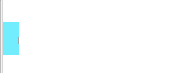
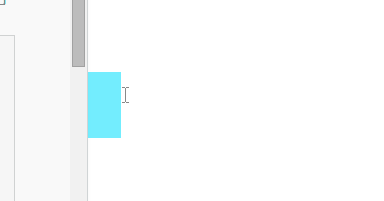
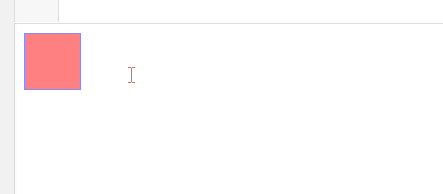
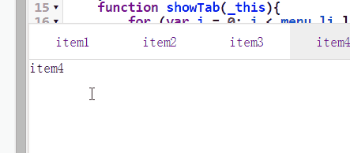
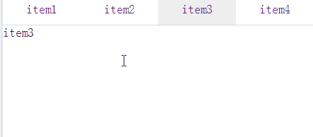
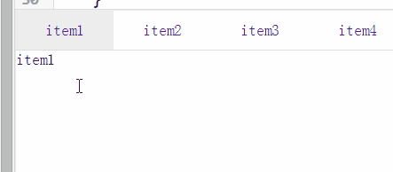
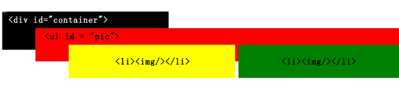
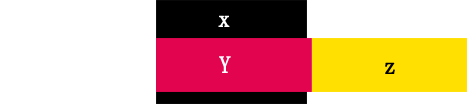

<!-- TOC -->

- [1 基础运动](#1-基础运动)
    - [1.1 课程须知](#11-课程须知)
    - [1.2 项目简介](#12-项目简介)
    - [1.3 速度动画](#13-速度动画)
    - [1.4 透明度动画](#14-透明度动画)
    - [1.5 变速运动](#15-变速运动)
- [2 复杂运动](#2-复杂运动)
    - [2.1 js获取样式](#21-js获取样式)
    - [2.2 多物体运动](#22-多物体运动)
    - [2.3 链式运动](#23-链式运动)
    - [2.4 同时运动](#24-同时运动)
- [3 Tab选项卡](#3-tab选项卡)
    - [3.1 tab选项卡之鼠标滑过切换](#31-tab选项卡之鼠标滑过切换)
    - [tab选项卡之鼠标滑过切换](#tab选项卡之鼠标滑过切换)
    - [3.2 tab选项卡之延迟切换](#32-tab选项卡之延迟切换)
    - [tab选项卡之延迟切换](#tab选项卡之延迟切换)
    - [3.3 tab选项卡之自动切换](#33-tab选项卡之自动切换)
    - [tab选项卡之自动切换](#tab选项卡之自动切换)
- [4 图片轮播实现](#4-图片轮播实现)
    - [4.1 移动icon](#41-移动icon)
    - [4.2 图片轮播](#42-图片轮播)

<!-- /TOC -->

# 1 基础运动

## 1.1 课程须知
#### 课程须知


- 您至少具备一定的 *html+css* 知识
- 您至少具备了一定的 *JavaScript* 的基本知识
- 假如以上您不会可以在汇智网找相应的课程学习

#### 课程简介


- 您可以在这里学到如何去应用JavaScript知识
- 课程将用JavaScript实现对Dom元素操作
- 课程带你用*setInterval（）*，*setTimeout()* 两个函数实现动画效果
- 你可以实现淘宝京东等电商网站的轮播图制作以及各种门户上tab选项卡制作


## 1.2 项目简介
#### 项目简介

##### 项目一

我们将用所学的动画基础实现如下图所示效果


-----------------
##### 项目二

轮播图效果

参照淘宝，京东等电商首页效果制作

-----------------
现在开始代码之旅吧


## 1.3 速度动画
#### 速度动画

##### 实现思路：

每次均匀改变left值，达到匀速运动的效果

##### 效果



-----------------
##### 实现步骤：

**对btn元素绑定点击事件**

```javascript
window.onload = function(){
var container=document.getElementById('container');
var btn=document.getElementById('btn');
btn.onclick = function(){
if(container.offsetLeft==-200){
moveOut();
}
else{
moveBack();
}
};
};
```

**编写moveOut()函数**


- *setInterval()* 函数的简单介绍 <br>
setInterval() 方法会不停地按周期调用函数，直到 clearInterval() 被调用或窗口被关闭。由 setInterval() 返回的 ID 值可用作 clearInterval() 方法的参数。
- *container.offsetLeft* 的使用 <br>
container.offsetLeft可以获取到当前container元素的left值


-----------------
**代码内容**

```javascript
var timer=null;
function moveOut(){
clearInterval(timer);
timer=setInterval(function(){
if(container.offsetLeft == 0){
clearInterval(timer);
}
else{
container.style.left=container.offsetLeft+10+'px';
}
},30);
}
```


> 根据MoveOut函数，写出MoveBack函数

## 1.4 透明度动画
#### 透明度动画

##### 实现思路：

每次均匀改变opacity值（ie的filter值），达到改变透明度的效果

##### 效果


-----------------
##### 实现步骤：

**对元素绑定鼠标移入移出事件**

```javascript
window.onload = function(){
var container=document.getElementById('container');
container.onmouseover = function(){
moveStart(10,100);
};
container.onmouseout = function(){
moveStart(-10,30);
}
};
```

**编写moveStart()函数**


- 对于*ie和Firefox*等浏览器不同处理    <br/>
在ie浏览器中透明度的设置：*filter: alpha(opacity:50);*


在其他浏览器中:*opacity: 0.5;*


- *并没有container.offseAlpha*属性 <br/>
在后续章节里将会提到用js获取属性的方法，在此处我们用var alpha代替
- 对于`clearInterval(timer);`代码段的解释<br/>
可将moveStart中的第一个`clearInterval(timer);`删除，将鼠标快速移入移出元素，你会发现元素会出现闪烁。<br/>
这是因为在进行移入移出操作不停调用moveStart，在未达到clearInterval的条件时就已经开始了下一个函数，而上一个定时器并未关闭，透明度增加和减少交替进行，就形成了闪烁的情况。


-----------------
**代码内容**

```javascript
var timer=null;
var alpha = 50;
function moveStart(oSpeed,oTarget){
clearInterval(timer);
timer=setInterval(function(){
if(oTarget === alpha){
clearInterval(timer);
}
else{
alpha += oSpeed;
container.style.filter = 'alpha(opacity:'+alpha+');'
container.style.opacity = alpha/100.0;
}
},30);
}
```


> 在右侧moveStart函数中补上`clearInterval(timer);`，消除bug

## 1.5 变速运动
#### 变速运动

##### 实现思路：

对每次的速度值进行计算，达到变速运动的效果

##### 效果



-----------------
这一节我们要让物体做变速运动，也就是说要不停改变speed值，那要怎么改变或者说计算speed值呢？<br/>

##### 速度计算代码


- `var speed=(Target-container.offsetLeft)/5;`<br/>
- 三目运算符  `speed=speed>0?Math.ceil(speed):Math.floor(speed);`<br/>
三目运算符的形式：*关系表达式 ？ 表达式1 ： 表达式2*<br>
在进行速度运算中我们用三目运算符，判断speed的值，如果为正就向上取整，如果为负就向下取整


-----------------
```javascript
function moveStart(Target)
{
clearInterval(timer);
timer=setInterval(function(){
var speed=(Target-container.offsetLeft)/5;
speed=speed>0?Math.ceil(speed):Math.floor(speed);
if(container.offsetLeft==Target){
clearInterval(timer);
}
else{
container.style.left=container.offsetLeft+speed+'px';
}
},30);
}
```


> 完善右边速度运算代码

# 2 复杂运动

## 2.1 js获取样式
### js获取样式


- 在前几个小节我们留下了一个如何获取*opacity*属性问题。<br/>
- 如果在前几个小节加上*border*属性你将会发现一个bug，因为*offsetLeft*包括*元素宽度*、*可见垂直滚动条宽度*、*左边框和右边框宽度*。当有边框时offsetLeft并不是我们想要的值。<br/>


-----------------
**如何获取样式？**


- 在Firefox、Opera、Safari等浏览器中获取样式的方式<br/>
我们使用*getComputedStyle()*这个函数获取样式值，函数第一个参数是元素对象，若是想获取*伪类元素*则应当在第二个参数上填上hover,active,link等属性，否则填null。<br/>
- 在IE中获取样式的方式<br>
在IE中每个具有style属性的元素都有一个currentStyle属性。可以通过该属性获取元素


-----------------
*注意：*<br/>


- 这两种方式都不可以返回类似 *border（含综合属性）* 的样式
- 不同浏览器表示值的方式可能不同，如在*Firefox和Safari*中返回颜色值是RGB格式的
- 以上方式均只能读取样式


-----------------
**获取样式函数**

```javascript
function getStyle(obj,attr){
if(obj.currentStyle){
return obj.currentStyle[attr];
}
else{
return getComputedStyle(obj,false)[attr];
}
}
```


> 用getStyle函数获取container的width值

## 2.2 多物体运动
#### 多物体运动

##### 实现思路：

对多个物体进行绑定事件，达到控制多个元素同时运动效果

##### 效果


-----------------
##### 获取所有的li元素，用*循环*的方式给所有li元素绑定事件

*注意:*
我们为获取到的每个li元素对象添加了*timer属性*，大家应该还记得我在前面课程中提到的关于timer的问题.若是用一个timer变量，后果是什么呢？
timer的值将是后一次onmouseover或者onmouseout触发的定时器的ID，而无法清除前面的定时器。

-----------------
```javascript
window.onload=function(){
var Larr=document.getElementsByTagName('li');
for (var i = 0;i<Larr.length; i++) {
Larr[i].timer=null;
Larr[i].onmouseover=function(){
startMove(this,300);
};
Larr[i].onmouseout=function(){
startMove(this,200);
}
};
```

<h4>函数的编写


```javascript
function startMove(_this,Target){
clearInterval(_this.timer);
_this.timer=setInterval(function(){
var speed=(Target-_this.offsetWidth)/5;
speed=speed>0?Math.ceil(speed):Math.floor(speed);
if(_this.offsetWidth===Target){
clearInterval(_this.timer);
}
else{
_this.style.width=_this.offsetWidth+speed+'px';
}
},30);
}
```


> 为右边的Larr加入timer属性


## 2.3 链式运动
##### 实现思路：

先进行某个运动，该运动*完成*后，再进行下一步运动，就达到了链式运动的效果

##### 效果


-----------------
#### 链式运动


- 在链式运动编写中呢，我们将运用到简单的 *异步* ，如果有学习了nodejs的同学，你们将见到在nodejs中常见的一种写法，用一个callback函数做参数，当前面运动执行完后我们将调用下一步要执行的运动的函数。<br/>
- 在右方回调（callback）函数中，使用this，它指向的是Window
- 这次我们运用到了第一小节写的 *getStyle函数* ，注意不同之处,由于我们我们之前的*getStyle函数*获取width返回的是带单位的字符串，因此在此我们对取得的width值转换为浮点数。<br/>


-----------------
```javascript
function startMove(obj,target,attr,fn)
{
clearInterval(timer);
timer=setInterval(function(){
var speed=(target - getStyle(obj,attr))/20;
speed = speed>0?Math.ceil(speed):Math.floor(speed);
if(getStyle(obj,attr) == target){
clearInterval(timer);
if(fn) {
fn();
}
}
else{
obj.style[attr]=getStyle(obj,attr) + speed + 'px';
}
},30)
}
function getStyle(obj,attr){
if(obj.currentStyle){
return parseFloat(obj.currentStyle[attr]);
}
else{
return parseFloat(getComputedStyle(obj,false)[attr]);
}
}
```


> 根据第二点的提示修改右方JavaScript代码框中的this

## 2.4 同时运动
#### 同时运动

##### 实现思路：

同时改变长宽或者其他属性，也就是在单属性的语句后加入改变其他属性效果语句，达到函数每一次都改变多个属性效果

##### 效果



-----------------

##### 函数编写


- 将要改变的属性以传入一个对象**{width:300,height:300,opacity:100}**为参数的方式进行传值<br/>
- 用**for循环遍历**的方式改变元素属性<br/>
- 设立**isComplete**变量，如果全部属性均已达到目标，则isComplete为true，定时器关闭<br/>
- 在判断opacity时我使用的是**getStyle(obj,attr)*100**，大家也可在getStyle函数里进行判断<br/>


-----------------
```javascript
var isComplete=false;
function startMove(obj,attrClass)
{
clearInterval(timer);
timer=setInterval(function(){
for(attr in attrClass){
if((attr === 'opacity'?getStyle(obj,attr)*100:getStyle(obj,attr))=== attrClass[attr]){
isComplete=true;
continue;
}
isComplete=false;
console.log(attr);
else if(attr === 'opacity'){
var speed=(attrClass[attr] - getStyle(obj,attr)*100)/20;
speed = speed>0?Math.ceil(speed):Math.floor(speed);
obj.style[attr]=(getStyle(obj,attr)*100+speed)/100.0;
}
else{
var speed=(attrClass[attr] - getStyle(obj,attr))/20;
speed = speed>0?Math.ceil(speed):Math.floor(speed);
obj.style[attr]=getStyle(obj,attr) + speed + 'px';
}
}
if(isComplete){
clearInterval(timer);
}
},30);
}
```


> 在右方填入相应的代码使其width和height为300px，透明度为1
</div>


# 3 Tab选项卡

## 3.1 tab选项卡之鼠标滑过切换
##tab选项卡之鼠标滑过切换

#### 同时运动

##### 实现思路：

为每个菜单选项绑定onmouseover事件，控制对应内容栏的display属性

##### 效果



-----------------
##### 编写代码之前我们需要知道


- 和前面相同我们需要通过*for*循环绑定事件
- 当鼠标滑过时我们将消除上一个选中元素的类名，并赋予它类名select，改变背景颜色
- 为每个menu_li设置ind属性，用它做索引找到与之对应的信息栏


-----------------
```javascript
function showTab(_this){
for (var i = 0; i < menu_li.length; i++) {
menu_li[i].className='';
mod[i].style.display='none';
};
_this.className='select';
mod[_this.ind].style.display='block';
}
```


> 为每个menu_li设置ind属性

## 3.2 tab选项卡之延迟切换
##tab选项卡之延迟切换

#### 同时运动

##### 实现思路：

在鼠标滑过时我们不立即执行相应的函数，而是延迟一段时间后执行，就达到了延迟切换的效果

##### 效果



-----------------
##### 编写函数之前我们应该知道


- *setTimeout*函数：setTimeout() 方法用于在指定的毫秒数后调用函数或计算表达式。用法与setInterval类似。
- 设定timer值，清除之前的定时器，避免在未达到500ms又滑过其他选项卡出现的bug
- 将this赋值给that变量，因为在setTimeout函数中的this指向window
- 为什么不使用menu_li[i]呢？因为在等待500ms的过程中循环早已做完，当500ms后我们使用到的将会是**showTab(menu_li[4])**,所以用menu_li[i]并不能达到预期的效果。


-----------------
```javascript
menu_li[i].onmouseover = function(){
if(timer){
clearTimeout(timer);
}
var that = this;
timer = setTimeout(function(){
showTab(that);
},500);
};
```


> 将this赋值给that变量

## 3.3 tab选项卡之自动切换
##tab选项卡之自动切换

#### 同时运动

##### 实现思路：

使用setInterval不断用不同的参数执行showTab函数，就能达到自动切换的效果

##### 效果



-----------------
##### 编写函数之前我们应该知道


- 我们采用index参数表示开始轮播的信息栏编号，当index等于menu_li.length时将其重置为0
- 在鼠标滑过菜单事件时我们清除定时器，当滑出时我们以滑出的li的ind属性为参数传入autoPlay使其开始轮播


-----------------
```javascript
function autoPlay(index){
clearInterval(timer);
timer=setInterval(function(){
showTab(menu_li[index]);
index++;
if(index>=menu_li.length)
{
index=0;
}
},2000);
}
```


> 右侧代码并没有开始自动切换，补上autoPlay函数让它自动切换吧

# 4 图片轮播实现

## 4.1 移动icon
#### 移动icon

这一节我们将尝试使用第二章写到的函数，制作类似淘宝中用到的移动icon


-----------------


- 从图中我们可以观察到，他运用到了同时运动和链式运动由此我们可以将两个函数整理结合起来
- 我们从下往上移动时我们直接先要将top值设置为50px


```javascript
function startMove(obj,attrClass,cb)
{
clearInterval(timer);
timer=setInterval(function(){
for(attr in attrClass){
if((attr === 'opacity'?getStyle(obj,attr)*100:getStyle(obj,attr))=== attrClass[attr])
{
isComplete=true;
continue;
}
isComplete=false;
if(attr === 'opacity')
{
var speed=(attrClass[attr] - getStyle(obj,attr)*100)/10;
speed = speed>0?Math.ceil(speed):Math.floor(speed);
obj.style[attr]=(getStyle(obj,attr)*100+speed)/100.0;
}
else
{
var speed=(attrClass[attr] - getStyle(obj,attr))/10;
speed = speed>0?Math.ceil(speed):Math.floor(speed);
obj.style[attr]=getStyle(obj,attr) + speed + 'px';
}
}
if(isComplete){
clearInterval(timer);
if(cb){
cb(obj);
}
}
},10);
}
```


> 在右方填入相应的代码使top值设置为50px，以达到相应的效果

## 4.2 图片轮播
#### 图片轮播

此处图片轮播原理：在container元素中水平放入图片，通过*overflow*属性将超出部分隐藏，然后通过js控制图片组left值达到轮播效果。

实现的html结构如下图：



实现js控制动画原理如下图：



-----------------
##### 编写相应的函数之前我们应该知道


- 我们为菜单栏加入了相应的index属性，与tab选项卡的ind属性相似，我们可以通过index找到我们想要的图片的位置
- 我们的play函数是前面的*moveStart*函数和*showTab*函数的结合，我们通过传入的*i*图片长度*计算要到达的图片的位置，通过为当前元素赋予*select*类名改变样式
- 值得注意的是我们这里采用了与*showTab*函数不同的处理方法，我们加入了一个*变量select*记录上一次改变样式的选项，取代了之前的遍历所有选项改变类名的方式
- 与自动切换的tab选项卡相同，在鼠标滑过菜单事件时我们清除定时器，当滑出时我们以滑出的li的index属性为参数传入auto使其开始轮播


```javascript
function auto(start){
clearInterval(autotimer);
var i = start;
autotimer=setInterval(function(){
console.log(i);
play(i);
i++;
if(i == img.length)
{
i=0;
}
},3000);
}
function play(i){
clearInterval(timer);
var target=-i * 490;
menu_li[select].className='';
select=i;
menu_li[select].className='select';
timer=setInterval(function(){
var speed= (target - pic.offsetLeft )/10;
speed = speed>0?Math.ceil(speed):Math.floor(speed);
if(pic.offsetLeft == target)
{
clearInterval(timer);
}
pic.style.left=pic.offsetLeft+speed+'px';
},20);
}
```

> 请大家参考我给出的play函数，自己动手写出一个play函数,再考虑能否进一步完善play函数呢？
