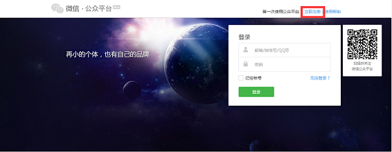
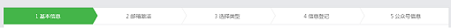
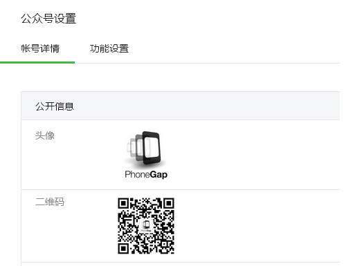
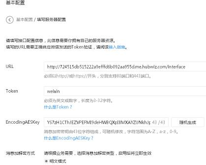
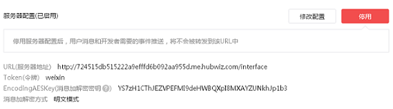
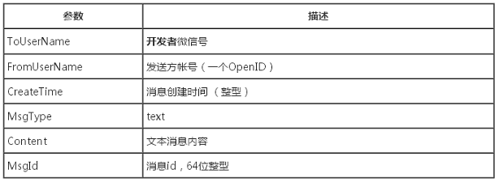
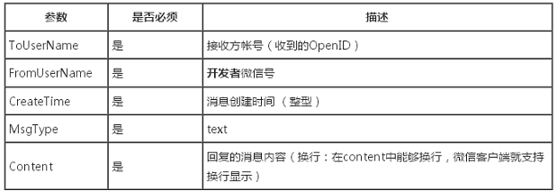

# 微信公众平台开发
<!-- TOC  -->

- [微信公众平台开发](#微信公众平台开发)
- [1 开发简介](#1-开发简介)
    - [1.1 基本原理](#11-基本原理)
    - [1.2 微信公众平台注册](#12-微信公众平台注册)
    - [1.3 nodejs环境搭建](#13-nodejs环境搭建)
- [2 签名认证](#2-签名认证)
    - [2.1 创建express框架](#21-创建express框架)
    - [2.2 设置微信服务器配置](#22-设置微信服务器配置)
    - [2.3 网址接入](#23-网址接入)
    - [2.4 参数排序](#24-参数排序)
    - [2.5 参数加密](#25-参数加密)
    - [2.6 签名对比](#26-签名对比)
- [3 收发消息](#3-收发消息)
    - [3.1 接收消息](#31-接收消息)
    - [3.2 解析消息](#32-解析消息)
    - [3.3 回复文本消息](#33-回复文本消息)

<!-- /TOC  -->

# 1 开发简介

## 1.1 基本原理
### 基本原理

我相信同学们看到本门课程名称都会产生疑问，用 *nodejs* 怎样来实现对微信公众平台的开发呢？

别的就不多说了，先来简单介绍微信公众平台的基本原理。

微信服务器就相当于一个转发服务器，终端（手机、Pad等）发起请求至微信服务器，微信服务器，然后将请求转发给自定义服务（这里就是我们的具体实现）。服务处理完毕，然后转发给微信服务器，微信服务器再将具体响应回复到终端；通信协议为： *HTTP* ；数据格式为： *XML* 。

具体的流程如下图所示：


其实，我们需要做的事情，就是对 *HTTP* 请求，做出响应。具体的请求内容，我们按照特定的 *XML* 格式去解析，处理完毕后，也要按照特定的 *XML* 格式返回。

## 1.2 微信公众平台注册
### 平台注册

要想完成对微信公众平台的开发，我们需要注册一个微信公众平台帐号。注册步骤如下：

- 打开微信公共平台的官网，<a href="https://mp.weixin.qq.com/" target="_blank">https://mp.weixin.qq.com/</a>，点击“立即注册”。

<br>
- 然后根据提示，填写基本信息，邮箱激活，选择类型，信息登记，公众号信息，完成注册。

<br>

在注册完成以后，我们要对公众号进行一些基本的设置。登录公众号，找到【公众号设置】，然后设置头像以及其它信息。



## 1.3 nodejs环境搭建
### nodejs环境搭建

我们需要在公网上找一台服务器，以便可以启动我们的 *nodejs* 的环境，启动环境后通过设置访问地址，我们就可以接收微信服务器发送的消息了，并且我们也可以向微信服务器发送消息了。

在公网的服务器中安装完成 *nodejs* 以后，我们还需要安装一些 *nodejs* 所用到的模块，如： *express* ， *node-xml* ， *jssha* 等模块。可以通过 *npm* 命令进行安装。

我们通过 *nodejs* 来实现向微信服务器消息的发送与接收，以及与微信服务器的签名认证。

在我们右面的编辑环境中已经为同学们安装了 *nodejs* 环境。我们在接下来内容中就为同学们来实现微信服务器的签名认证。

# 2 签名认证

## 2.1 创建express框架
### 创建express框架

我们在前面的课程中已经安装了 *express* 模块，并且在我们右面的环境中已经创建了一个名为 *app.js* 的文件。现在我们就在这个文件中完成 *express* 框架。如下代码：

```javascript
var express = require("express");
var path=require('path');
var app = express();
server  = require('http').Server(app);
app.set('views',__dirname);    // 设置视图
app.set('view engine', 'html');
app.engine( '.html', require( 'ejs' ).__express );
require('./index')(app);      //路由配置文件
server.listen(80,function(){
    console.log('App start,port 80.');
});
```

然后再添加一个名为 *test.html* 的文件。写入以下内容

```javascript
<!DOCTYPE html>
<html>
<head lang="en">
    <meta charset="UTF-8">
    <title>汇智网</title>
 </head>
<body>
<div><%=issuccess%></div>
</body>
</html>
```

我们还要添加一个名为 *index.js* 的文件，来实现我们的路由。点击编辑环境中的添加文件按钮，添加文件，然后我们写入以下代码，其中 *GET* 请求用来验证配置的 *URL* 合法性， *POST* 请求用来处理微信消息。

```javascript
module.exports = function(app){
　　app.get('/',function(req,res){
       res.render('test',{issuccess:"success"})
    });
    app.get('/interface',function(req,res){});
    app.post('/interface',function(req,res){});
}
```

这样我们需要的 *express* 框架就完成了，当然我们还可以添加public公共文件夹以及我们要用到的中间件。保存文件，点击【提交运行】，然后点击【访问测试】，去试试吧。记下访问测试的地址，我们将在下一节中会用到该地址。

## 2.2 设置微信服务器配置
### 微信服务器配置

我们登录微信公众平台，在开发者模式下面找到基本配置，然后修改服务器配置。如图所示：



首先 *URL* 要填写公网上我们安装 *nodejs* 接收与发送数据的路径。我们可以填写上节中【访问测试】的地址，然后加上对应的路由就可以了。

```javascript
http://724515db515222a9efffd6b092aa955d.me.hubwiz.com/interface
```

上面代码是我的访问测试的地址，然后加上前面课程中的路由，同学们要根据自己的访问测试地址与路由来填写。

 *Token* 要与我们自定义服务器端的 *token* 一致。填写完成以后，就可以点击提交了，在提交以前，我们启动 *app.js* （点击【提交运行】）。这样根据我们的路由匹配就可以验证签名是否有效了。

当配置完成以后，一定要启用配置。



## 2.3 网址接入
### 网址接入

公众平台用户提交信息后，微信服务器将发送 *GET* 请求到填写的 *URL* 上，并且带上四个参数：

<table class="table table-bordered" style="line-height:15px;" align="center" border="2">
<tbody>
<tr>
<th style="text-align:center">
                参数</th>
<th style="text-align:center">
                描述</th>
</tr>
<tr>
<td align="center">
                signature</td>
<td>
                微信加密签名</td>
</tr>
<tr>
<td align="center">
                timestamp</td>
<td>
                时间戳</td>
</tr>
<tr>
<td align="center">
                nonce</td>
<td>
                随机数</td>
</tr>
<tr>
<td align="center">
                echostr</td>
<td>
                随机字符串</td>
</tr>
</tbody>
</table>

开发者通过检验 *signature* 对请求进行校验（下面有校验方式）。若确认此次GET请求来自微信服务器，请原样返回 *echostr* 参数内容，则接入生效，否则接入失败。

 *signature* 结合了开发者填写的 *token* 参数和请求中的 *timestamp* 参数、 *nonce* 参数。

加密/校验流程：

- 将 *token* 、 *timestamp* 、 *nonce* 三个参数进行字典序排序；
- 将三个参数字符串拼接成一个字符串进行 *sha1* 加密；
- 开发者获得加密后的字符串可与 *signature* 对比，标识该请求来源于微信。

## 2.4 参数排序
### 参数排序

首先我们确认请求是来自微信服务器的get请求，那么就可以在 *index.js* 文件中进行添加代码了。然后在 *app.get('/interface',function(req,res){});* 的 *function* 中进行添加。

先来获取各个参数的值，如下代码：

```javascript
var token="weixin";
var signature = req.query.signature;
var timestamp = req.query.timestamp;
var echostr   = req.query.echostr;
var nonce     = req.query.nonce;
```

我们在这里对 *token* 进行设置，让其与微信服务器中设置的 *token* 一致。

然后对其中的 *token* 、 *timestamp* 、 *nonce* 进行排序，如下代码：

```javascript
var oriArray = new Array();
oriArray[0] = nonce;
oriArray[1] = timestamp;
oriArray[2] = token;
oriArray.sort();
```

这样我们就完成了排序。

## 2.5 参数加密
### 参数加密

在上节中我们已经对参数进行了排序，然后我们在这一节中要将参数组成一个字符串，进行 *SH-1* 加密。在加密以前要用到 *jssha* 模块，在我们的文件中要引用该模块。

```javascript
var jsSHA = require('jssha');
```

在上一节课中我们已经对参数排序完成，并存放在数组中，我们可以通过 *join* 方法来生成一个字符串，如下代码：

```javascript
var original = oriArray.join('');
```

最后对该数据进行加密，如下代码：

```javascript
var jsSHA = require('jssha');
var shaObj = new jsSHA(original, 'TEXT');
var scyptoString=shaObj.getHash('SHA-1', 'HEX');
```

好了这样就生成了我们需要的签名字符串 *scyptoString* 。

## 2.6 签名对比
### 签名对比

我们已经得到了我们想要的签名字符串 *scyptoString* ，然后我们就可以与来自微信服务器的签名进行对比了,对比通过，则我们就可以接收与发送消息了。

```javascript
 if(signature == scyptoString){
 //验证成功
 } else {
 //验证失败
 }
```

# 3 收发消息

## 3.1 接收消息
### 接收消息

在接收消息之前，我们还需要验证与微信平台的签名，前面几节已经讲过了，这里不在详述。现在就来讲解一下接收微信平台的消息。在签名认证以后，我们就可以接收消息了。在 *index.js* 的 *app.post* 方法中添加以下功能。

- 签名认证；
- 认证成功后，接收消息;
- 解析消息
- 回复消息（文本，图片……）

接收消息的代码如下：

```javascript
var post_data="";
req.on("data",function(data){post_data=data;});
req.on("end",function(){
var xmlStr=post_data.toString('utf-8',0,post_data.length);
//解析消息代码
//回发消息代码
});
```

上面代码中的 *xmlStr* 就是我们收到的微信平台发过来的消息。

## 3.2 解析消息
### 解析消息

在解析消息之前，我们需要在 *index.js* 中引入一个解析消息的模块 *node-xml* ，通过该模块来解析消息。

```javascript
var xml=require('node-xml');
```

如果我们发送给微信平台的消息为文本消息，则收到的消息格式如下：

```javascript
 <xml>
 <ToUserName><![CDATA[toUser]]></ToUserName>
 <FromUserName><![CDATA[fromUser]]></FromUserName>
 <CreateTime>1348831860</CreateTime>
 <MsgType><![CDATA[text]]></MsgType>
 <Content><![CDATA[this is a test]]></Content>
 <MsgId>1234567890123456</MsgId>
 </xml>
```



然后我们就通过 *node-xml* 模块来解析，解析的代码如下：

```javascript
// 定义解析存储变量
var ToUserName="";
var FromUserName="";
var CreateTime="";
var MsgType="";
var Content="";
var tempName="";
//开始解析消息
var parse=new xml.SaxParser(function(cb){
    cb.onStartElementNS(function(elem,attra,prefix,uri,namespaces){
         tempName=elem;
    });
    cb.onCharacters(function(chars){
        chars=chars.replace(/(^\s*)|(\s*$)/g, "");
        if(tempName=="CreateTime"){
            CreateTime=chars;
        }
    });
    cb.onCdata(function(cdata){
            if(tempName=="ToUserName"){
                ToUserName=cdata;
            }else if(tempName=="FromUserName"){
                FromUserName=cdata;
            }else if(tempName=="MsgType"){
                MsgType=cdata;
            }else if(tempName=="Content"){
                Content=cdata;
            }
            console.log(tempName+":"+cdata);
        });
   cb.onEndElementNS(function(elem,prefix,uri){
         tempName="";
   });
   cb.onEndDocument(function(){
          //按收到的消息格式回复消息
   });
});
 parse.parseString(xmlStr);
```

通过以上代码的实现，这样收到的消息就解析完成了。 大家想了解更多收到数据的格式，请查看<a href="http://mp.weixin.qq.com/wiki/17/f298879f8fb29ab98b2f2971d42552fd.html" target="_blank">微信平台的官方文档</a> 。

## 3.3 回复文本消息
### 文本消息

根据前一节中我们解析出来的内容，然后对应组织我们的发送数据包，数据包格式如下：

```javascript
<xml>
<ToUserName><![CDATA[toUser]]></ToUserName>
<FromUserName><![CDATA[fromUser]]></FromUserName>
<CreateTime>12345678</CreateTime>
<MsgType><![CDATA[text]]></MsgType>
<Content><![CDATA[你好]]></Content>
</xml>
```



关于更多被动回复数据格式请查看<a href="http://mp.weixin.qq.com/wiki/1/6239b44c206cab9145b1d52c67e6c551.html" target="_blank">微信官方文档</a>。

回复文本消息的代码如下：

```javascript
CreateTime=parseInt(new Date().getTime() / 1000);
var msg="";
if(MsgType=="text"){
   msg="谢谢关注,你说的是:"+Content;
   //组织返回的数据包
   var sendMessage='
           <xml>
            <ToUserName><![CDATA['+FromUserName+']]></ToUserName>
            <FromUserName><![CDATA['+ToUserName+']]></FromUserName>
            <CreateTime>'+CreateTime+'</CreateTime>
            <MsgType><![CDATA[text]]></MsgType>
            <Content><![CDATA['+msg+']]></Content>
        </xml>';
    res.send(sendMessage);
}
```

好了，这样我们的服务端就完成了，点击【提交运行】。现在拿起手机，扫描二维码关注我们的微信公众号，发送消息，看一看结果吧。

关于其它消息的回复，同学们按照微信官方说明组织数据包进行回复就可以了。
